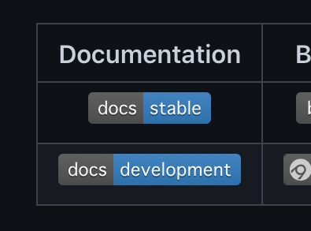

| **Documentation**                       | **Build Status**                          | **Code Coverage**               |
|:---------------------------------------:|:-----------------------------------------:|:-------------------------------:|
| [![][docs-stable-img]][docs-stable-url] | [![Build Status][travis-img]][travis-url] | [![][codecov-img]][codecov-url] |
| [![][docs-development-img]][docs-development-url] | [![Build Status][appvey-img]][appvey-url] |                                 |

## Luxor

Luxor is a Julia package for drawing simple 2D vector graphics. Think of it as a high-level easier to use interface to [Cairo.jl](https://github.com/JuliaLang/Cairo.jl), with shorter names, fewer underscores, default contexts, and simplified functions. In Luxor, the emphasis is on simplicity and ease of use.

Luxor is thoroughly procedural and static: your code issues a sequence of simple graphics 'commands' until you've completed a drawing, then the results are saved into a PDF, PNG, SVG, or EPS file.

A short tutorial can be found in the documentation, which you find by clicking on the badges above:

"stable" describes the current release; "development" contains changes that are still in the master branch and may change before the next release.

There are some Luxor-related videos on [YouTube](https://www.youtube.com/channel/UCfd52kTA5JpzOEItSqXLQxg), and some Luxor-related blog posts at [cormullion.github.io/](https://cormullion.github.io/).

Luxor is designed primarily for drawing static pictures. If you want to build animations, use [Javis.jl](https://github.com/Wikunia/Javis.jl/issues).

Luxor isn't interactive: for building interactivity, look at [Pluto.jl](https://github.com/fonsp/Pluto.jl) and [Makie](https://github.com/JuliaPlots/Makie.jl).

## How can you contribute?

If you _know any geometry_ you probably know more than me, so there are plenty of improvements to algorithms waiting to be made. There are some _TODO_ comments sprinkled through the code, but plenty more opportunities for improvement.

_Update the code_, most of which was written for Julia versions 0.2, v0.3 and 0.4 (remember when broadcasting wasn't a thing?) so there are probably many areas where the code could take more advantage of version 1.

There can always be _more tests_, as the present tests are mainly visual, showing that something works, but there should be much more testing of things that shouldn't work - inappropriate input, overlapping polygons, coincident or collinear points, anticlockwise polygons, etc.

More _systematic error-handling_ particularly of geometry errors would be a good idea, rather than sprinkling `throw(error())`s around when things look wrong.

[docs-development-img]: https://img.shields.io/badge/docs-development-blue
[docs-development-url]: http://juliagraphics.github.io/Luxor.jl/dev/

[docs-stable-img]: https://img.shields.io/badge/docs-stable-blue.svg
[docs-stable-url]: http://juliagraphics.github.io/Luxor.jl/stable/

[travis-img]: https://travis-ci.org/JuliaGraphics/Luxor.jl.svg?branch=master
[travis-url]: https://travis-ci.org/JuliaGraphics/Luxor.jl

[appvey-img]: https://ci.appveyor.com/api/projects/status/6pq9v30famcoe3dd?svg=true
[appvey-url]: https://ci.appveyor.com/project/cormullion/luxor-jl/branch/master

[codecov-img]: https://codecov.io/gh/JuliaGraphics/Luxor.jl/branch/master/graph/badge.svg
[codecov-url]: https://codecov.io/gh/JuliaGraphics/Luxor.jl
