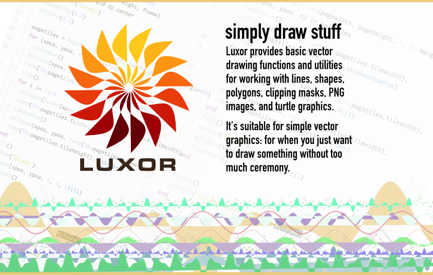

Documentation: http://cormullion.github.io/Luxor.jl/

## Luxor

Luxor provides basic vector drawing functions, and utilities for working with shapes, polygons, clipping masks, PNG images, and turtle graphics. The focus of Luxor is on simplicity: it should be easier to use than plain  [Cairo.jl](https://github.com/JuliaLang/Cairo.jl), with shorter names, fewer underscores, default contexts, and simplified functions. The idea is that you issue a sequence of simple graphics 'commands' until you've filled a drawing, then save it into a file. For a more powerful graphics environment, have a look at [Compose.jl](https://github.com/dcjones/Compose.jl). Luxor was designed to be simpler and easier to use than Compose.
