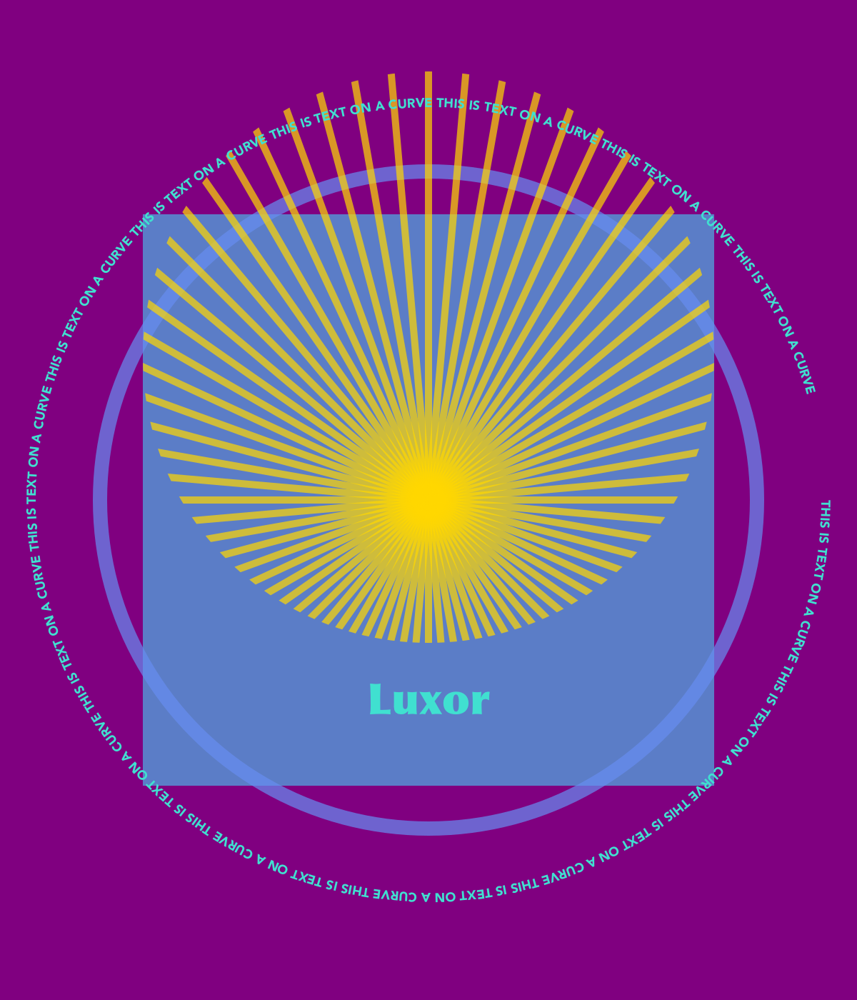
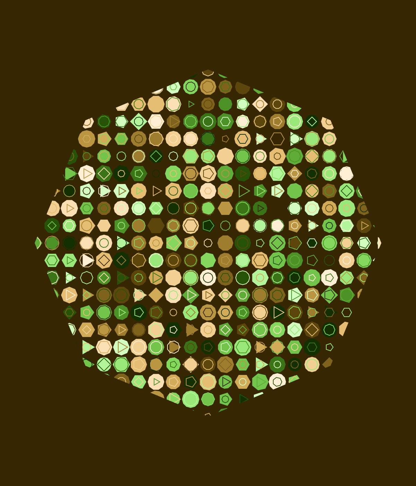

## Luxor

Luxor is the lightest dusting of syntactic sugar on Julia's Cairo graphics package (which should also be installed).

The idea of Luxor is that it's slightly easier to use than Cairo, with shorter names, fewer underscores, default contexts, and simplified functions. It's for when you just want to draw something without too much ceremony. For a much more powerful graphics environment, try [Compose.jl](http://composejl.org).

[Colors.jl](https://github.com/JuliaGraphics/Colors.jl) provides excellent color definitions and is also required.

I've only tried this on MacOS X. It will need some changes to work on Windows (but I can't test it).

### Current status ###

It's currently being updated for Julia version 0.4 and for the modified Colors.jl.

### Example usage

#### "Hello World"

    using Luxor, Colors
    Drawing(1000, 1000, "/tmp/hello-world.png")
    origin()
    sethue("red")
    fontsize(50)
    text("hello world")
    finish()
    preview()

#### General Graphics

    using Luxor, Colors
    Drawing(1200, 1400, "/tmp/basic-test.png") # or PDF filename for PDF

    origin() # move 0/0 to center
    background("purple")

    setopacity(0.7)     # opacity from 0 to 1
    sethue(0.3,0.7,0.9) # sethue sets the color but doesn't change the opacity
    setline(20) # line width

    rect(-400,-400,800,800, :fill) # or :stroke, :fillstroke, :clip
    randomhue()
    circle(0, 0, 460, :stroke)

    circle(0,-200,400,:clip)     # set a circular mask above the x axis
    sethue("gold")
    setopacity(0.7)
    setline(10)

    for i in 0:pi/36:2*pi - pi/36
        move(0, 0)
        line(cos(i) * 600, sin(i) * 600 )
        stroke()
    end

    clipreset()     # finish clipping

    fontsize(60)
    setcolor("turquoise")
    fontface("Optima-ExtraBlack")     # a Mac OS X font
    textwidth = textextents("Luxor")[5]
    # move the text by half the width
    text("Luxor", -textwidth/2, currentdrawing.height/2 - 400)

    fontsize(18)
    fontface("Avenir-Black")
    # text on curve starting on an arc
    textcurve("THIS IS TEXT ON A CURVE " ^ 14, 0, 0, 0, -10, 550)
    finish()
    preview() # on Mac OS X, opens in Preview

#### Sierpinski triangle

    using Luxor, Colors

    function draw_triangle(points::Array{Point{Float64}}, degree::Int64)
        global triangle_count, cols
        setcolor(cols[degree+1])
        poly(points, :fill)
        triangle_count += 1
    end

    get_midpoint(p1::Point,p2::Point) = Point((p1.x+p2.x) / 2, (p1.y + p2.y) / 2)

    function sierpinski(points::Array{Point{Float64}}, degree::Int64)
        draw_triangle(points, degree)
        if degree > 0
            sierpinski([points[1],
                get_midpoint(points[1], points[2]),
                get_midpoint(points[1], points[3])], degree-1)
            sierpinski([points[2],
                get_midpoint(points[1], points[2]),
                get_midpoint(points[2], points[3])], degree-1)
            sierpinski([points[3],
                get_midpoint(points[3], points[2]),
                get_midpoint(points[1], points[3])], degree-1)
        end
    end

    @time begin
        depth = 8 # 12 is ok, 20 is right out
        cols = distinguishable_colors(depth+1)
        Drawing(400, 400, "/tmp/sierpinski.pdf") # or PNG filename for PNG
        origin()
        setopacity(0.5)
        triangle_count = 0
        my_points = [Point{Float64}(-100,-50), Point{Float64}(0,100), Point{Float64}(100.0,-50.0)]
        sierpinski(my_points, depth)
        println("drew $triangle_count triangles")
    end

    finish()
    preview()

    # drew 9841 triangles
    # elapsed time: 1.738649452 seconds (118966484 bytes allocated, 2.20% gc time)

#### n-gons

    using Luxor, Colors
    Drawing(1200, 1400)

    origin()
    cols = diverging_palette(60,120, 20) # hue 60 to hue 120
    background(cols[1])
    setopacity(0.7)
    setline(2)

    ngon(0, 0, 500, 8, 0, :clip)

    for y in -500:50:500
        for x in -500:50:500
            setcolor(cols[rand(1:20)])
            ngon(x, y, rand(20:25), rand(3:12), 0, :fill)
            setcolor(cols[rand(1:20)])
            ngon(x, y, rand(10:20), rand(3:12), 0, :stroke)
        end
    end

    finish()
    preview()

#### clipping masks

    include("../examples/julia-logo.jl") # the julia logo coordinates

    currentwidth = 500 # pts
    currentheight = 500 # pts
    Drawing(currentwidth, currentheight, "/tmp/clipping-tests.pdf")

    function draw_logo_clip(x, y)
        foregroundcolors = diverging_palette(rand(0:360), rand(0:360), 200, s = 0.99, b=0.8)
        save()
        translate(x-100, y)
        julialogomask() # use julia logo as clipping mask
        clip()
        for i in 1:500
            sethue(foregroundcolors[rand(1:end)])
            circle(rand(-50:350), rand(0:300), 15, :fill)
        end
        restore()
    end

    origin()
    background("white")
    setopacity(.4)
    draw_logo_clip(0,0)

    finish()
    preview()

#### text clipping

Using a text path as a clipping region - here filled with names of Julia functions.

    using Luxor, Colors

    currentwidth = 1250 # pts
    currentheight = 800 # pts
    Drawing(currentwidth, currentheight, "/tmp/text-path-clipping.png")

    origin()
    background("darkslategray3")

    fontsize(600) # big fontsize to use for clipping
    fontface("Agenda-Black")
    str = "julia" # string to be clipped
    w, h = textextents(str)[3:4] # get width and height

    translate(-(currentwidth/2) + 50, -(currentheight/2) + h)

    textpath(str) # make text into a path
    setline(3)
    setcolor("black")
    fillpreserve() # fill but keep
    clip()  # clip

    fontface("Monaco")
    fontsize(10)
    namelist = map(x->string(x), names(Base)) # list of names in Base.

    x = -20
    y = -h
    while y < currentheight
        sethue(rand(7:10)/10, rand(7:10)/10, rand(7:10)/10)
        s = namelist[rand(1:end)]
        text(s, x, y)
        se = textextents(s)
        x += se[5] # move to the right
        if x > w
           x = -20 # next row
           y += 10
        end
    end

    finish()
    preview()

### Functions

#### Files

- `Drawing()`
 	create a drawing, defaulting to PNG format, file called "/tmp/luxor-drawing.png", 800 pixels square
- `Drawing(300,300)`
 	create a drawing 300 by 300 pixels, defaulting to PNG format, file called "/tmp/luxor-drawing.png",
- `Drawing(300,300, "/tmp/my-drawing.pdf")`
 	create a PDF drawing in the file "/tmp/my-drawing.pdf", 300 by 300 pixels
- `finish()`
 	finish the drawing
- `preview()`
 	open the file in Preview (MacOS X only)

The global variable `currentdrawing` keeps a few parameters:

    julia> fieldnames(currentdrawing)
    10-element Array{Symbol,1}:
     :width
     :height
     :filename
     :surface
     :cr
     :surfacetype
     :redvalue
     :greenvalue
     :bluevalue
     :alpha

#### Axes and backgrounds

The origin (0/0) is at the top left, x axis runs left to right, y axis runs top to bottom

- `origin()`
	move the 0/0 origin to the centre of the image
- `axes()`
	draw axes at current 0/0
- `background(color)`
	fill background with a colored rectangle

#### Shapes and lines

For these functions, the *action* argument can be `:nothing`, `:fill`, `:stroke`, `:fillstroke`, or `:clip`, defaulting to `:nothing`.

- `circle(x, y, r, action)`

- `arc(xc, yc, radius, angle1, angle2, action)` centered at `xc/yc` starting at `angle1` and ending at `angle2`.

Angles are measured from the positive x-axis to the positive y-axis in radians. So, for the default position of the axes, that's clockwise.

- `rect(xmin, ymin, w, h, action)`

There is a 'current position':

- `move(x, y)`
	move to this position

- `rmove(x, y)`
	move relative to current position by `x` and `y`

- `line(x, y)`
	draw line from current position to the `x/y` position

- `rline(x, y)`
	draw line from current position by `x` and `y`

- `curve(x1, y1, x2, y2, x3, y3)`
    a cubic Bézier spline, starting at the current position, finishing at `x3/y3`, following two control points `x1/y1` and `x2/y2`

There is a Point type (the only main type, apart from `Drawing`):

   `Point{Float64}(12.0, 13.0)`

Polygons are arrays of points.

- `poly(list::Array{Point{Float64}}, action = :nothing; close=false)` draws a polygon using array of Points. For example:

    `poly(randompointarray(0,0,200,200, 85), :stroke)`

- `randompoint(lowx, lowy, highx, highy)` returns a random point

- `randompointarray(lowx, lowy, highx, highy, n)` returns an array of random points. For example:

    `poly(randompointarray(0,0,200,200, 85), :stroke)`

Regular polygons, from triangles, pentagons, hexagons, septagons, heptagons, octagons, nonagons, decagons, and on-and-on-agons, with:

- `ngon(xc, yc, radius, sides, angle, action=:nothing)` draws a `sides`-sided polygon

Without an action, returns a poly (array of points) instead:

- `ngon(xc, yc, radius, sides, angle)`

Compare:

    ngon(0, 0, 4, 4, 0) # returns polygon
     4-element Array{Point{Float64},1}:
     Point{Float64}(2.4492935982947064e-16,4.0)
     Point{Float64}(-4.0,4.898587196589413e-16)
     Point{Float64}(-7.347880794884119e-16,-4.0)
     Point{Float64}(4.0,-9.797174393178826e-16)

    ngon(0, 0, 4, 4, 0, :close) # draws polygon

Polygons can be simplified using the Douglas-Peucker algorithm (non-recursive version):

- `simplify(polygon, tolerance)` to delete points from an array of Points within the tolerance provided

- `isinside(point, polygon)` returns true if the point is inside the polygon

#### Styles

- `setline(n)` set line width

- `setlinecap(s)` set line ends to "butt", "round", or "square"

- `setlinejoin(s)` set line joins to "miter", "round", or "bevel"

- `setdash(dashing)` set line dashing to "solid", "dotted", "dot", "dotdashed", "longdashed", "shortdashed", "dash", "dashed", "dotdotdashed", or "dotdotdotdashed"

- `fillstroke()` fill and stroke the current path

- `stroke()` stroke the current path

- `fill()` fill the current path

- `strokepreserve()` stroke the path but keep it current

- `fillpreserve()` fill the path but keep it current

`save()` and `restore()` should always be balanced in pairs. `save()` saves a copy of the current graphics settings (current axis rotation, position, scale, line and text settings, and so on). When the next `restore()` is called, all changes you've made to the graphics settings will be discarded, and they'll return to how they were when you used `save()`.

- `save()` save the graphics state

- `restore()` restore the graphics state

#### Transforms

- `scale(sx, sy)` scale by sx and sy

- `rotate(a)` rotate clockwise (positive x-axis to positive y-axis) by `a` radians around current 0/0

- `translate(tx, ty)` translate by tx/ty

The current matrix is a six number array, perhaps like this:

	[1, 0, 0, 1, 0, 0]

- `getmatrix()` gets the current matrix

- `setmatrix(a)` sets the matrix to array `a`

- `transform(a)` transform the current matrix by 'multiplying' it with matrix `a`. For example, to skew by 45 degrees in x and move by 20 in y direction:

    `transform([1, 0, tand(45), 1, 0, 20])`

#### Color and opacity

For color definitions and conversions, use Colors.jl.

The difference between the `setcolor()` and `sethue()` functions is that `sethue()` is independent of alpha opacity, so you can change the hue without changing the current opacity value (like in Mathematica).

- `setcolor(color)`

	`setcolor("gold")`

	`setcolor("darkturquoise")`

	`setcolor(convert(Colors.HSV, Colors.RGB(0.5, 1, 1)))`

- `setcolor(r, g, b, alpha)` eg:

	`setcolor(.2, .3, .4, .5)`

- `setcolor(r, g, b)`

- `sethue(color)` like `setcolor`

- `sethue(r, g, b)` like `setcolor` but doesn't change opacity

- `setopacity(alpha)` change the alpha opacity (`alpha` is between 0 and 1)

- `randomhue()` choose a random color without changing current alpha opacity

- `randomcolor()` choose a random color

#### Paths

- `newpath()`

- `newsubpath()` used for example to make holes in shapes

- `closepath()`

- `getpath()`     get the current path as an array of element types and points

- `getpathflat()` get the current path as an array of type/points with curves flattened to lines

#### Clipping

- `clip()` turn the current path into a clipping region, masking any graphics outside the path

- `clippreserve()` keep the current path, but also use it as a clipping region

- `clipreset()`

#### Text and fonts

- `text(t, x, y)` draw string `t` at `x`/`y`, or at 0/0 if `x`/`y` omitted

- `textcentred(t, x, y)` draw string `t` centred at `x`/`y` or 0/0

- `textpath(t)`
	make the string `t` into a graphic path suitable for `fill()`, `stroke()`...

- `textcurve(str, x, y, xc, yc, r)`
	draw string `str` on a circular arc of radius `r` centered at `xc/yc` starting on a line passing from `xc/yc` through `x/y`

- `fontface(fontname)`
	choose font `fontname`

- `fontsize(n)`
	set font size in points

- `textextents(str)`
	get array of dimensions of the string `str`, given current font:

	`[xb, yb, width, height, xadvance, yadvance]`
