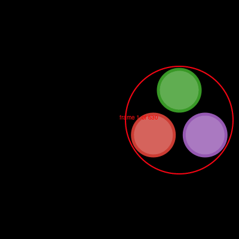

# Animation helper functions

Luxor provides some functions to help you create animations—at least, it provides some assistance in creating lots of individual frames that can later be stitched together to form a moving animation, such as a GIF or MP4.

There are four steps to creating an animation.

1 Use `Sequence` to create a Sequence object which determines the title and dimensions.

2 Define a suitable `backdrop(seq::Sequence, framenumber, framerange)` function that contains graphics functions that are used on every frame of an animation sequence. For example, this is a good place to define a constant background color.

3 Define a suitable `frame(seq::Sequence, framenumber, framerange)` function that constructs the contents of the frame numbered `framenumber`. The total `framerange` is available for possible reference inside the function.

4 Call the `animate(seq::Sequence, framerange, backdrop, frame)` function, passing in your two functions (which don't have to be called anything special, but which should have the arguments shown above). This creates all the frames in the given `framerange` and saves them in a temporary directory.

## Example

```julia
using Luxor

demo = Sequence(400, 400, "test")

function backdropf(demo, framenumber, framerange)
    background("black")
end

function framef(demo, framenumber, framerange)
    xpos = 100 * cos(framenumber/100)
    ypos = 100 * sin(framenumber/100)
    sethue(Colors.HSV(rescale(framenumber, 0, length(framerange), 0, 360), 1, 1))
    circle(xpos, ypos, 90, :stroke)
    gsave()
    translate(xpos, ypos)
    juliacircles(50)
    grestore()
    text(string("frame $framenumber of $(length(framerange))"), O)
end

animate(demo, 1:630, backdropf, framef, createanimation=true)
```



```@docs
Sequence
animate
```

## Making the animation

Building an animation such as a GIF or MOV file is best done outside Julia, using something like `ffmpeg`, with its thousands of options, which include frame-rate adjustment and color palette tweaking. The `animate` function has a go at running it on Unix platforms, and assumes that `ffmpeg` is installed. Inside `animate()`, the first pass creates a color palette, the second builds the file:

```julia
run(`ffmpeg -f image2 -i $(tempdirectory)/%10d.png -vf palettegen -y $(seq.stitle)-palette.png`)

run(`ffmpeg -framerate 30 -f image2 -i $(tempdirectory)/%10d.png -i $(seq.stitle)-palette.png -lavfi paletteuse -y /tmp/$(seq.stitle).gif`)
```

## Passing information to later frames

Sometimes you want some information to be passed from frame to frame, such as the updated position of a graphical shape. Currently, the only way to do this is to store things in the sequence's `parameters` dictionary.

For example, for a "bouncing ball" animation, you can store the current position and direction of the ball in the `Sequence.parameters` dictionary at the end of a frame, and then recall them at the start of the next frame.

``julia
function frameF(seq::Sequence, framenumber, framerange)
    pos          = seq.parameters["pos"]
    direction    = seq.parameters["direction"]
    spriteradius = seq.parameters["spriteradius"]

    # ... code to modify position, direction, and radius

    seq.parameters["pos"]          = newpos
    seq.parameters["direction"]    = newdirection
    seq.parameters["spriteradius"] = spriteradius
end
```


