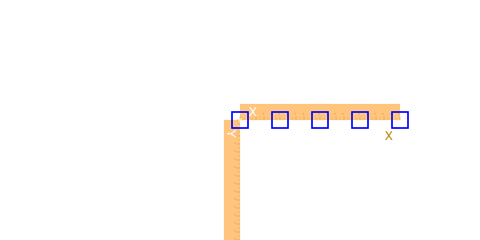
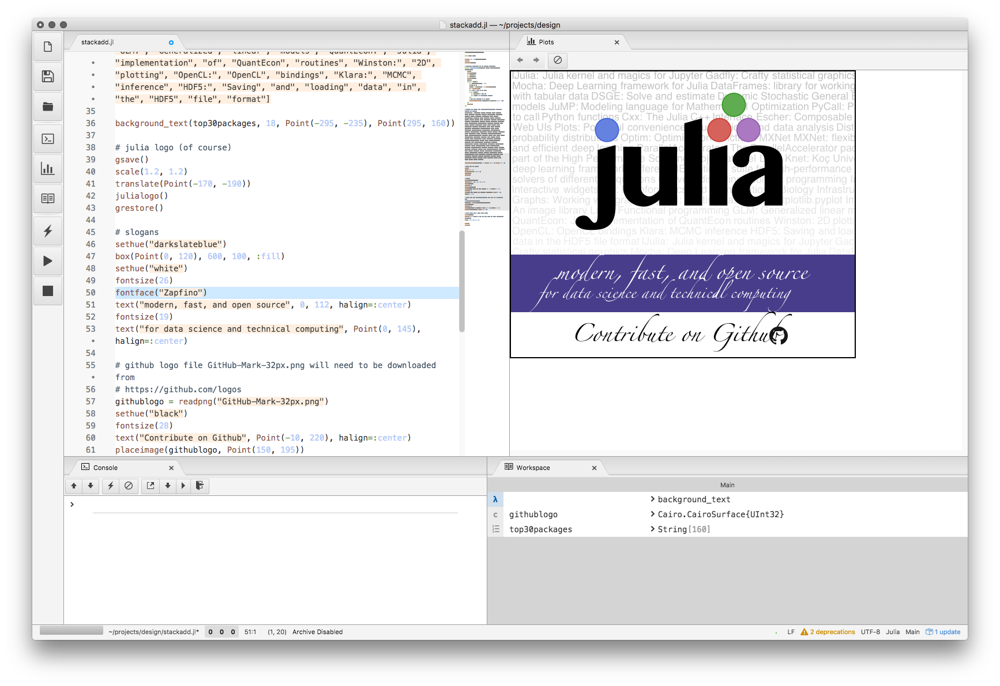

```@meta
DocTestSetup = quote
    using Luxor
    end
```

# The basics

The underlying drawing model is that you make shapes, or add points to paths, and these are filled and/or stroked, using the current *graphics state*, which specifies colors, line thicknesses, and opacity. You can modify the current drawing environment by transforming/rotating/scaling it. This affects subsequent graphics but not the ones you've already drawn.

Specify points (positions) using `Point(x, y)`. The default origin is at the top left of the drawing area, but you can reposition it at any time. Many of the drawing functions have an *action* argument. This can be `:nothing`, `:fill`, `:stroke`, `:fillstroke`, `:fillpreserve`, `:strokepreserve`, `:clip`. The default is `:nothing`.

The main defined types are `Point`, `Drawing`, and `Tiler`.  `Drawing` is how you create new drawings. You can divide up the drawing area into areas, using `Tiler`, `Partition`, and `Table`, and define grids, using `GridRect` and `GridHex`.

## Points and coordinates

The Point type holds two coordinates, `x` and `y`. For example:

```
julia> P = Point(12.0, 13.0)
Luxor.Point(12.0, 13.0)

julia> P.x
12.0

julia> P.y
13.0
```

Points are immutable, so you can't change P's x or y values directly. But it's easy to make new points based on existing ones.

Points can be added together:

```
julia> Q = Point(4, 5)
Luxor.Point(4.0, 5.0)

julia> P + Q
Luxor.Point(16.0, 18.0)
```

You can add or multiply Points and scalars:

```
julia> 10P
Luxor.Point(120.0, 130.0)

julia> P + 100
Luxor.Point(112.0, 113.0)
```

You can also make new points by mixing Points and tuples:

```
julia> P + (10, 0)
Luxor.Point(22.0, 13.0)

julia> Q * (0.5, 0.5)
Luxor.Point(2.0, 2.5)
```

You can use the letter **O** as a shortcut to refer to the current Origin, `Point(0, 0)`.

```@example
using Luxor # hide
Drawing(600, 300, "assets/figures/point-ex.png") # hide
background("white") # hide
origin() # hide
sethue("blue") # hide
axes()
box.([O + (i, 0) for i in linspace(0, 200, 5)], 20, 20, :stroke)
finish() # hide
nothing # hide
```



Angles are usually supplied in radians, measured starting at the positive x-axis turning towards the positive y-axis (which usually points 'down' the page or canvas, so 'clockwise'). (Turtle graphics conventionally let you supply angles in degrees.)

Coordinates are interpreted as PostScript points, where a point is 1/72 of an inch.

Because Julia allows you to combine numbers and variables directly, you can supply units with dimensions and have them converted to points (assuming the current scale is 1:1):

- inch (`in` is unavailable, being used by `for` syntax)
- cm   (centimeters)
- mm   (millimeters)

For example:

```
rect(Point(20mm, 2cm), 5inch, (22/7)inch, :fill)
```

## Drawings

### Drawings and files

To create a drawing, and optionally specify the filename and type, and dimensions, use the `Drawing` constructor function.

```@docs
Drawing
```

To finish a drawing and close the file, use `finish()`, and, to launch an external application to view it, use `preview()`.

If you're using Jupyter (IJulia), `preview()` tries to display PNG and SVG files in the next notebook cell.


If you're using Juno, then PNG and SVG files should appear in the Plots pane.



```@docs
finish
preview
```

The global variable `currentdrawing` (of type Drawing) stores some parameters related to the current drawing:

```
julia> fieldnames(typeof(currentdrawing))
10-element Array{Symbol,1}:
:width
:height
:filename
:surface
:cr
:surfacetype
:redvalue
:greenvalue
:bluevalue
:alpha
```
## Quick drawings with macros

The `@svg`, `@png`, and `@pdf` macros are designed to let you quickly create graphics without having to provide the usual boiler-plate functions. For example, the Julia code:

```
@svg circle(O, 20, :stroke) 50 50
```

expands to

```
Drawing(50, 50, "luxor-drawing.png")
origin()
background("white")
sethue("black")
circle(O, 20, :stroke)
finish()
preview()
```

They just save a bit of typing. You can omit the width and height (defaulting to 600 by 600). For multiple lines, use either:

```
@svg begin
        setline(10)
        sethue("purple")
        circle(O, 20, :fill)
     end
```

or

```
@svg (setline(10);
      sethue("purple");
      circle(O, 20, :fill);
     )
```

```@docs
@svg
@png
@pdf
```

### Drawings in memory

You can choose to store the drawing in memory. The advantage to this is that in-memory drawings are quicker, and can be passed as Julia data. This syntax for the `Drawing()` function:

    Drawing(width, height, surfacetype, [filename])

lets you supply `surfacetype` as a symbol (`:svg` or `:png`). This creates a new drawing of the given surface type and stores the image only in memory if no `filename` is supplied. In a Jupyter notebook you can use Interact.jl to provide faster manipulations:

```
using Interact

function makecircle(r)
    d = Drawing(300, 300, :svg)
    sethue("black")
    origin()
    setline(0.5)
    hypotrochoid(150, 100, r, :stroke)
    finish()
    return d
end

@manipulate for r in 5:150
    makecircle(r)
end
```

## The drawing surface

The origin (0/0) starts off at the top left: the x axis runs left to right across the page, and the y axis runs top to bottom down the page.

The `origin()` function moves the 0/0 point to the center of the drawing. It's often convenient to do this at the beginning of a program. You can use functions like `scale()`, `rotate()`, and `translate()` to change the coordinate system.

`background()` fills the drawing with a color, covering any previous contents. By default, PDF drawings have a white background, whereas PNG drawings have no background so that the background appears transparent in other applications. If there is a current clipping region, `background()` fills just that region. In the next example, the first `background()` fills the entire drawing with magenta, but the calls in the loop fill only the active clipping region, a table cell defined by the `Table` iterator:

```@example
using Luxor # hide
Drawing(600, 400, "assets/figures/backgrounds.png") # hide
background("magenta")
origin()
table = Table(5, 5, 100, 50)
for (pos, n) in table
    box(pos,
        table.colwidths[table.currentcol],
        table.rowheights[table.currentrow],
        :clip)
    background(randomhue()...)
    clipreset()
end
finish() # hide
nothing # hide
```


The `axes()` function draws a couple of lines and text labels in light gray to indicate the position and orientation of the current axes.

```@example
using Luxor # hide
Drawing(400, 400, "assets/figures/axes.png") # hide
background("gray80")
origin()
axes()
finish() # hide
nothing # hide
```


```@docs
background
axes
origin
```

## Save and restore

`gsave()` saves a copy of the current graphics settings (current axis rotation, position, scale, line and text settings, color, and so on). When the next `grestore()` is called, all changes you've made to the graphics settings will be discarded, and the previous settings are restored, so things return to how they were when you last used `gsave()`. `gsave()` and `grestore()` should always be balanced in pairs.

You can also use the `@layer` macro to enclose graphics commands:

```
@svg begin
    circle(O, 100, :stroke)
    @layer (sethue("red"); rule(O); rule(O, pi/2))
    circle(O, 200, :stroke)
end
```

or

```
@svg begin
    circle(O, 100, :stroke)
    @layer begin
        sethue("red")
        rule(O)
        rule(O, pi/2)
    end
    circle(O, 200, :stroke)
end
```

```@docs
gsave
grestore
```
