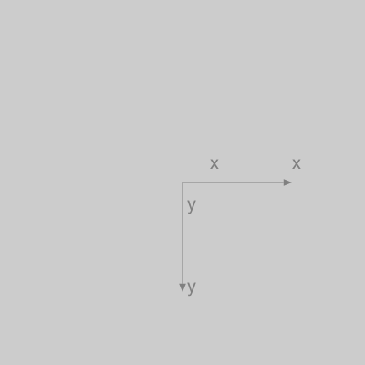
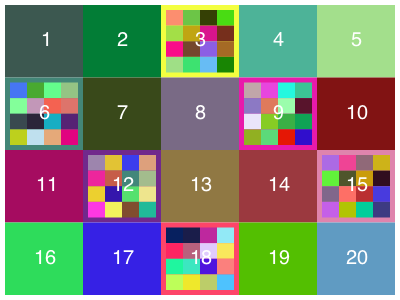
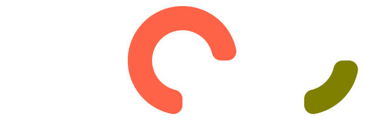
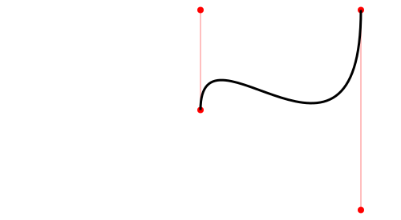
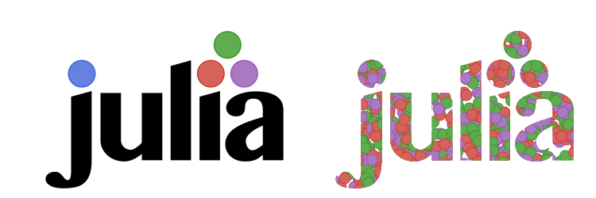
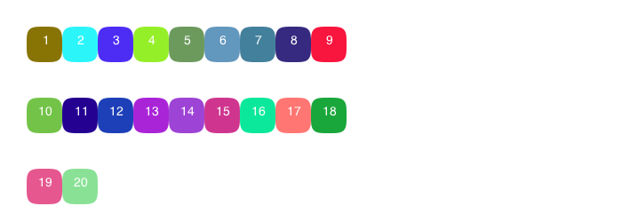
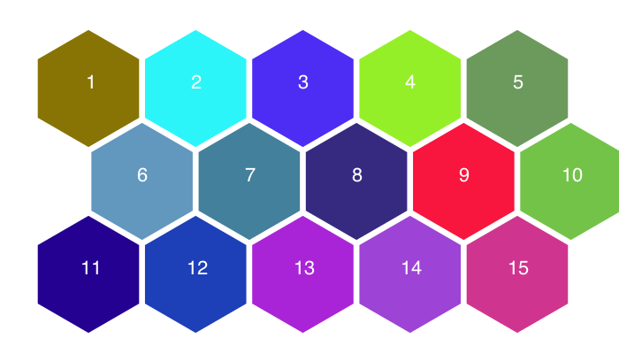

```@meta
DocTestSetup = quote
    using Luxor
    end
```

# The basics

The underlying drawing model is that you make shapes, or add points to paths, and these are filled and/or stroked, using the current *graphics state*, which specifies colors, line thicknesses, and opacity. You can modify the drawing space by transforming/rotating/scaling it, which affects subsequent graphics but not the ones you've already added.

Many of the drawing functions have an *action* argument. This can be `:nothing`, `:fill`, `:stroke`, `:fillstroke`, `:fillpreserve`, `:strokepreserve`, `:clip`. The default is `:nothing`.

Positions are specified either by x and y coordinates or a `Point(x, y)`. The default origin is at the top left of the drawing area.

Angles are mostly supplied in radians, measured starting at the positive x-axis turning towards the positive y-axis (which usually points 'down' the page or canvas, so 'clockwise').

Coordinates are interpreted as PostScript points, where a point is 1/72 of an inch.

Because Julia allows you to combine numbers and variables directly, you can supply units with dimensions and have them converted to points (assuming the current scale is 1:1):

- inch (`in` is unavailable, being used by `for` syntax)
- cm   (centimeters)
- mm   (millimeters)

For example:

    rect(Point(20mm, 2cm), 5inch, (22/7)inch, :fill)

## Types

The main defined types are `Point`, `Drawing`, and `Tiler`. The Point type holds two coordinates, `x` and `y`:

```
Point(12.0, 13.0)
```

It's immutable, so you want to avoid trying to change the x or y coordinate directly. You can use the letter **O** as a shortcut to refer to the current Origin, `Point(0, 0)`.

`Drawing` is how you create new drawings. And you can divide up the drawing area into tiles, using `Tiler`.

## Drawings and files

To create a drawing, and optionally specify the filename and type, and dimensions, use the `Drawing` constructor function.

```@docs
Drawing
```

To finish a drawing and close the file, use `finish()`, and, to launch an external application to view it, use `preview()`.

If you're using Jupyter (IJulia), `preview()` displays PNG files in the notebook.


```@docs
finish
preview
```

The global variable `currentdrawing` (of type Drawing) stores some parameters related to the current drawing:

```
julia> fieldnames(currentdrawing)
10-element Array{Symbol,1}:
:width
:height
:filename
:surface
:cr
:surfacetype
:redvalue
:greenvalue
:bluevalue
:alpha
```

## The drawing surface

The origin (0/0) starts off at the top left: the x axis runs left to right across the page, and the y axis runs top to bottom down the page.

The `origin()` function moves the 0/0 point to the center of the drawing. It's often convenient to do this at the beginning of a program. You can use functions like `scale()`, `rotate()`, and `translate()` to change the coordinate system.

`background()` fills the drawing with a color, covering any previous contents. By default, PDF drawings have a white background, whereas PNG drawings have no background so that the background appears transparent in other applications. If there is a current clipping region, `background()` fills just that region. In the next example, the first `background()` filled the entire drawing, but the calls in the loop fill only the active clipping region, a tile defined by the `Tiler` iterator:

```@example
using Luxor # hide
Drawing(600, 400, "assets/figures/backgrounds.png") # hide
background("magenta")
origin() # hide
tiles = Tiler(600, 400, 5, 5, margin=30)
for (pos, n) in tiles
    box(pos, tiles.tilewidth, tiles.tileheight, :clip)
    background(randomhue()...)
    clipreset()
end
finish() # hide
nothing # hide
```


The `axes()` function draws a couple of lines and text labels in light gray to indicate the position and orientation of the current axes.

```@example
using Luxor # hide
Drawing(400, 400, "assets/figures/axes.png") # hide
background("gray80")
origin()
axes()
finish() # hide
nothing # hide
```



```@docs
background
axes
origin
```

## Tiles

The drawing area (or any other area) can be divided into rectangular tiles (as rows and columns) using the `Tiler` iterator, which returns the center point and tile number of each tile.

In this example, every third tile is divided up into subtiles and colored:

```@example
using Luxor # hide
Drawing(400, 300, "assets/figures/tiler.png") # hide
background("white") # hide
origin() # hide
srand(1) # hide
fontsize(20) # hide
tiles = Tiler(400, 300, 4, 5, margin=5)
for (pos, n) in tiles
    randomhue()
    box(pos, tiles.tilewidth, tiles.tileheight, :fill)
    if n % 3 == 0
        gsave()
        translate(pos)
        subtiles = Tiler(tiles.tilewidth, tiles.tileheight, 4, 4, margin=5)
        for (pos1, n1) in subtiles
            randomhue()
            box(pos1, subtiles.tilewidth, subtiles.tileheight, :fill)
        end
        grestore()
    end
    sethue("white")
    textcentred(string(n), pos + Point(0, 5))
end
finish() # hide
nothing # hide
```



```@docs
Tiler
```

## Save and restore

`gsave()` saves a copy of the current graphics settings (current axis rotation, position, scale, line and text settings, color, and so on). When the next `grestore()` is called, all changes you've made to the graphics settings will be discarded, and they'll return to how they were when you last used `gsave()`. `gsave()` and `grestore()` should always be balanced in pairs.

```@docs
gsave
grestore
```

## Simple shapes

Functions for making shapes include `rect()`, `box()`, `circle()`, `ellipse()`, `squircle()`, `arc()`, `carc()`, `curve()`, `sector()`, and `pie()`. There's also `ngon()` and `star()`, listed under Polygons, below.

## Rectangles and boxes


```@docs
rect
box
polybbox
```

## Circles, ellipses, and other curvey things

There are various ways to make circles, including by center and radius, or passing through two points:

```@example
using Luxor # hide
Drawing(400, 200, "assets/figures/circles.png") # hide
background("white") # hide
origin() # hide
setline(2) # hide
p1 = O
p2 = Point(100, 0)
sethue("red")
circle(p1, 40, :fill)
sethue("green")
circle(p1, p2, :stroke)
sethue("black")
arrow(O, Point(0, -40))
map(p -> circle(p, 4, :fill), [p1, p2])
finish() # hide
nothing # hide
```


Or passing through three points. The `center3pts()` function returns the center position and radius of a circle passing through three points:

```@example
using Luxor # hide
Drawing(400, 200, "assets/figures/center3.png") # hide
background("white") # hide
origin() # hide
setline(3) # hide
sethue("black")
p1 = Point(0, -50)
p2 = Point(100, 0)
p3 = Point(0, 65)
map(p -> circle(p, 4, :fill), [p1, p2, p3])
sethue("orange") # hide
circle(center3pts(p1, p2, p3)..., :stroke)
finish() # hide
nothing # hide
```


With `ellipse()` you can place ellipses (and circles) by defining the center point and the width and height.

```@example
using Luxor # hide
Drawing(500, 300, "assets/figures/ellipses.png") # hide
background("white") # hide
fontsize(11) # hide
srand(1) # hide
origin() # hide
tiles = Tiler(500, 300, 5, 5)
width = 20
height = 25
for (pos, n) in tiles
    randomhue()
    ellipse(pos, width, height, :fill)
    sethue("black")
    label = string(round(width/height, 2))
    textcentered(label, pos.x, pos.y + 25)
    width += 2
end
finish() # hide
nothing # hide
```


It's also possible to make polygons that are approximations to ellipses with two focal points and a distance.

```@example
using Luxor # hide
Drawing(500, 450, "assets/figures/ellipses_1.png") # hide
origin() # hide
background("white") # hide
sethue("gray30") # hide
setline(1) # hide
f1 = Point(-100, 0)
f2 = Point(100, 0)
ellipsepoly = ellipse(f1, f2, 170, :none, vertices=true)
[ begin
    setgray(rescale(c, 150, 1, 0, 1))
    poly(offsetpoly(ellipsepoly, c), close=true, :fill);
    rotate(pi/20)
  end
     for c in 150:-10:1 ]
finish() # hide
nothing # hide
```


```@docs
circle
ellipse
```

`circlepath()` constructs a circular path from Bèzier curves, which allows you to use circles as paths.

```@example
using Luxor # hide
Drawing(600, 250, "assets/figures/circle-path.png") # hide
origin() # hide
background("white") # hide
sethue("black") # hide
setline(4)
tiles = Tiler(600, 250, 1, 5)
for (pos, n) in tiles
    randomhue()
    circlepath(pos, tiles.tilewidth/2, :path)
    newsubpath()
    circlepath(pos, rand(5:tiles.tilewidth/2 - 1), :fill, reversepath=true)
end
finish() # hide
nothing # hide
```


```@docs
circlepath
```

A sector (strictly an "annular sector") has an inner and outer radius, as well as start and end angles.

```@example
using Luxor # hide
Drawing(600, 200, "assets/figures/sector.png") # hide
background("white") # hide
origin() # hide
sethue("tomato")
sector(50, 90, pi/2, 0, :fill)
sethue("olive")
sector(Point(O.x + 200, O.y), 50, 90, 0, pi/2, :fill)
finish() # hide
nothing # hide
```


You can also supply a value for a corner radius. The same sector is drawn but with rounded corners.

```@example
using Luxor # hide
Drawing(600, 200, "assets/figures/sectorrounded.png") # hide
background("white") # hide
origin() # hide
sethue("tomato") 
sector(50, 90, pi/2, 0, 15, :fill)
sethue("olive") 
sector(Point(O.x + 200, O.y), 50, 90, pi/2, 0, 15, :fill)
finish() # hide
nothing # hide
```



```@docs
sector
```

A pie (or wedge) has start and end angles.

```@example
using Luxor # hide
Drawing(400, 300, "assets/figures/pie.png") # hide
background("white") # hide
origin() # hide
sethue("magenta") # hide
pie(0, 0, 100, pi/2, pi, :fill)
finish() # hide
nothing # hide
```


```@docs
pie
```

A *squircle* is a cross between a square and a circle. You can adjust the squariness and circularity of it to taste:

```@example
using Luxor # hide
Drawing(600, 250, "assets/figures/squircle.png") # hide
background("white") # hide
origin() # hide
fontsize(20) # hide
setline(2)
tiles = Tiler(600, 250, 1, 3)
for (pos, n) in tiles
    sethue("lavender")
    squircle(pos, 80, 80, rt=[0.3, 0.5, 0.7][n], :fillpreserve)
    sethue("grey20")
    stroke()
    textcentered("rt = $([0.3, 0.5, 0.7][n])", pos)
end
finish() # hide
nothing # hide
```


```@docs
squircle
```

Or for a simple rounded rectangle, smooth the corners of a box, like so:

```@example
using Luxor # hide
Drawing(600, 250, "assets/figures/round-rect.png") # hide
origin() # hide
background("white") # hide
sethue("black") # hide
setline(4)
polysmooth(box(O, 200, 150, vertices=true), 10, :stroke)
finish() # hide
nothing # hide
```


## The current position

There is a 'current position' which you can set with `move()`, and can use implicitly in functions like `line()`, `text()`, `arc()` and `curve()`.

```@docs
move
rmove
```

## Lines

Use `line()` and `rline()` to draw straight lines.

```@docs
line
rline
```

You can use `rule()` to draw a line across the entire drawing through a point, at an angle to the current x-axis. 

`rule()` returns two points that are probably outside the drawing area. Use `line()`, for example, to draw a straight line joining them.

```@example
using Luxor # hide
Drawing(700, 200, "assets/figures/rule.png") # hide

srand(42) # hide
background("white") # hide
sethue("black") # hide
setline(1) # hide

y = 10
for x in logspace(0, 2.75, 40)
    circle(Point(x, y), 2, :fill)
    line(rule(Point(x, y), -pi/2)..., :stroke)
    y += 2
end

finish() # hide
nothing # hide
```


```@docs
rule
```

## Arcs and curves

There are a few standard arc-drawing commands, such as `curve()`, `arc()`, `carc()`, and `arc2r()`. 

`curve()` constructs Bèzier curves from control points:

```@example
using Luxor # hide
Drawing(500, 275, "assets/figures/curve.png") # hide
origin() # hide
background("white") # hide

setline(.5)
pt1 = Point(0, -125)
pt2 = Point(200, 125)
pt3 = Point(200, -125)

sethue("red")
map(p -> circle(p, 4, :fill), [O, pt1, pt2, pt3])

line(O, pt1, :stroke)
line(pt2, pt3, :stroke)

sethue("black")
setline(3)

move(O)
curve(pt1, pt2, pt3)
stroke()
finish()  # hide
nothing # hide
```



`arc2r()` draws a circular arc that joins two points:  

```@example
using Luxor # hide
Drawing(700, 200, "assets/figures/arc2r.png") # hide
origin() # hide
srand(42) # hide
background("white") # hide
tiles = Tiler(700, 200, 1, 6)
for (pos, n) in tiles
    c1, pt2, pt3 = ngon(pos, rand(10:50), 3, rand(0:pi/12:2pi), vertices=true)
    sethue("black")
    map(pt -> circle(pt, 4, :fill), [c1, pt3])
    sethue("red")
    circle(pt2, 4, :fill)
    randomhue()
    arc2r(c1, pt2, pt3, :stroke)
end
finish() # hide
nothing # hide
```


```@docs
arc
arc2r
carc
carc2r
curve
```

## Geometry tools ##

You can find the midpoint between two points using `midpoint()`.

The following code places a small pentagon at the midpoint of each side of a larger pentagon:

```@example
using Luxor # hide
Drawing(700, 220, "assets/figures/midpoint.png") # hide
origin() # hide
background("white") # hide
sethue("red")
ngon(O, 100, 5, 0, :stroke)

sethue("darkgreen")
p5 = ngon(O, 100, 5, 0, vertices=true)

for i in eachindex(p5)
    pt1 = p5[mod1(i, 5)]
    pt2 = p5[mod1(i + 1, 5)]
    midp = midpoint(pt1, pt2)
    ngon(midp, 20, 5, 0, :fill)
end
finish() # hide
nothing # hide
```


A more general function, `between()`, finds for a value `x` the corresponding point on a line defined by two points, normalized to the range 0 and 1. So `midpoint(p1, p2)` and `between(p1, p2, 0.5)` should return the same point.

```@example
using Luxor # hide
Drawing(700, 150, "assets/figures/betweenpoint.png") # hide
origin() # hide
background("white") # hide
sethue("red")
p1 = Point(-150, 0)
p2 = Point(150, 40)
line(p1, p2)
stroke()
for i in -0.5:0.1:1.5
    randomhue()
    circle(between(p1, p2, i), 5, :fill)
end
finish() # hide
nothing # hide
```


Values less than 0.0 and greater than 1.0 appear to work well too, placing the point on the line if extended.

```@docs
midpoint
between
```

`center3pts()` finds the radius and center point of a circle passing through three points which you can then use with functions such as `circle()` or `arc2r()`.

```@docs
center3pts
```

`intersection()` finds the intersection of two lines.

```@example
using Luxor # hide
Drawing(700, 220, "assets/figures/intersection.png") # hide
origin() # hide
background("white") # hide
sethue("darkmagenta") # hide
pt1, pt2, pt3, pt4 = ngon(O, 100, 5, vertices=true)
line(pt1, pt2, :stroke)
line(pt3, pt4, :stroke)
flag, ip =  intersection(pt1, pt2, pt3, pt4)
if flag
    circle(ip, 5, :fill)
end
finish() # hide
nothing # hide
```


`intersection_line_circle()` finds the intersection of a line and a circle. There can be 0, 1, or 2 intersections.

```@example
using Luxor # hide
Drawing(700, 220, "assets/figures/intersection_line_circle.png") # hide
origin() # hide
background("white") # hide
sethue("chocolate2") # hide
l1 = Point(-100.0, -75.0)
l2 = Point(300.0, 100.0)
rad = 100
cpoint = Point(0, 0)
line(l1, l2, :stroke)
sethue("darkgreen") # hide
circle(cpoint, rad, :stroke)
nints, ip1, ip2 =  intersection_line_circle(l1, l2, cpoint, rad)
sethue("black")
if nints == 2
    circle(ip1, 8, :stroke)
    circle(ip2, 8, :stroke)
end
finish() # hide
nothing # hide
```


```@docs
intersection
intersection_line_circle
```
`getnearestpointonline()` finds perpendiculars.

```@example
using Luxor # hide
Drawing(700, 200, "assets/figures/perpendicular.png") # hide
origin() # hide
background("white") # hide
sethue("darkmagenta") # hide
end1, end2, pt3 = ngon(O, 100, 3, vertices=true)
map(pt -> circle(pt, 5, :fill), [end1, end2, pt3])
line(end1, end2, :stroke)
arrow(pt3, getnearestpointonline(end1, end2, pt3))
finish() # hide
nothing # hide
```


```@docs
getnearestpointonline
pointlinedistance
slope
rescale
perpendicular
@polar
```

## Arrows

You can draw lines or arcs with arrows at the end with `arrow()`. For straight arrows, supply the start and end points. For arrows as circular arcs, you provide center, radius, and start and finish angles. You can optionally provide dimensions for the `arrowheadlength` and `arrowheadangle` of the tip of the arrow (angle in radians between side and center). The default line weight is 1.0, equivalent to `setline(1)`), but you can specify another.

```@example
using Luxor # hide
Drawing(400, 250, "assets/figures/arrow.png") # hide
background("white") # hide
origin() # hide
sethue("steelblue4") # hide
setline(2) # hide
arrow(O, Point(0, -65))
arrow(O, Point(100, -65), arrowheadlength=20, arrowheadangle=pi/4, linewidth=.3)
arrow(O, 100, pi, pi/2, arrowheadlength=25,   arrowheadangle=pi/12, linewidth=1.25)
finish() # hide
nothing # hide
```


```@docs
arrow
```

## Paths

A path is a sequence of lines and curves. A path can have subpaths, which can form holes.

The `getpath()` function gets the current path as an array of elements, lines and curves. 

`getpathflat()` gets the current path as an array of lines with all curves flattened to line segments.

This example uses `getpathflat()` to create a path from the outlines of the letter "N" and stores it in the `pathdata`. Then elements of this path that contain exactly two points are used to create a polygon, which is then drawn and outlined.

```@example
using Luxor # hide
Drawing(400, 250, "assets/figures/get-path.png") # hide
background("white") # hide
background("white") # hide
origin() # hide
setline(0.75) # hide
sethue("black") # hide
fontsize(220) # hide
translate(-textextents("N")[3]/2, textextents("N")[4]/2) # hide
textpath("N")
pathdata = getpathflat()
outline = Point[]
for i in pathdata[1:end-1]
    if length(i.points) == 2
        x = i.points[1]
        y = i.points[2]
        push!(outline, Point(x, y))
    end
end
poly(outline, :stroke, close=true)
for i in 5:5:35
    poly(offsetpoly(outline, i), :stroke, close=true)
end
finish() # hide
nothing # hide
```


```@docs
newpath
newsubpath
closepath
getpath
getpathflat
```

## Julia graphics

A couple of functions in Luxor provide you with instant access to the Julia logo, and the three colored circles:

```@example
using Luxor # hide
Drawing(750, 250, "assets/figures/julia-logo.png")  # hide
srand(42) # hide
origin()  # hide
background("white") # hide

for (pos, n) in Tiler(750, 250, 1, 2)
    gsave()
    translate(pos - Point(150, 100))
    if n == 1
        julialogo()
    elseif n == 2
        julialogo(action=:clip)
        for i in 1:500
            gsave()
            translate(rand(0:400), rand(0:250))
            juliacircles(10)
            grestore()
        end
        clipreset()
    end
    grestore()
end
finish() # hide
nothing # hide
```



```@docs
julialogo
juliacircles
```

## Miscellaneous

### Hypotrochoids

`hypotrochoid()` makes hypotrochoids. The results are polygons, so you can either draw them directly, or pass them on for further polygon fun.

```@example
using Luxor # hide
Drawing(500, 300, "assets/figures/hypotrochoid.png")  # hide
origin()
background("grey15")
sethue("antiquewhite")
setline(1)
p = hypotrochoid(100, 25, 55, :stroke, stepby=pi/325, vertices=true)
for i in 0:3:15
poly(offsetpoly(p, i), :stroke, close=true)
end
finish() # hide
nothing # hide
```


```@docs
hypotrochoid
```

### Grids

If you have to position items regularly, you might find a use for a grid. Luxor provides a simple grid utility. Grids are lazy: they'll supply the next point on the grid when you need it.

Define a rectangular grid with `GridRect`, and a hexagonal grid with `GridHex`.

```@example
using Luxor # hide
Drawing(700, 250, "assets/figures/grids.png")  # hide
background("white") # hide
fontsize(14) # hide
translate(50, 50) # hide
grid = GridRect(O, 40, 80, (10 - 1) * 40)
for i in 1:20
    randomhue()
    p = nextgridpoint(grid)
    squircle(p, 20, 20, :fill)
    sethue("white")
    text(string(i), p, halign=:center)
end
finish() # hide
nothing # hide
```




```@example
using Luxor # hide
Drawing(700, 400, "assets/figures/grid-hex.png")  # hide
background("white") # hide
fontsize(22) # hide
translate(100, 100) # hide
radius = 70
grid = GridHex(O, radius, 600)

arrow(O, Point(O.x + (sqrt(3) * radius)/2, 0))

for i in 1:15
    randomhue()
    p = nextgridpoint(grid)
    ngon(p, radius-5, 6, pi/2, :fillstroke)
    sethue("white")
    text(string(i), p, halign=:center)
end
finish() # hide
nothing # hide
```



```@docs
GridRect
GridHex
nextgridpoint
```
