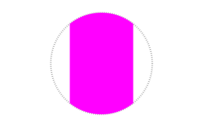
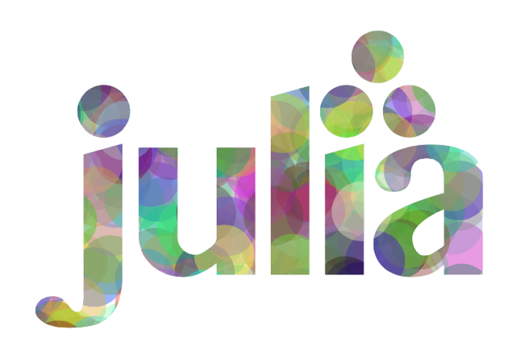

```@meta
DocTestSetup = quote
    using Luxor, Colors
    end
```
# Clipping

Use `clip()` to turn the current path into a clipping region, masking any graphics outside the path. `clippreserve()` keeps the current path, but also uses it as a clipping region. `clipreset()` resets it. `:clip` is also an action for drawing functions like `circle()`.

```@example
using Luxor # hide
Drawing(400, 250, "assets/figures/simpleclip.png") # hide
background("white") # hide
origin() # hide
setline(3) # hide
sethue("grey50")
setdash("dotted")
circle(O, 100, :stroke)
circle(O, 100, :clip)
sethue("magenta")
box(O, 125, 200, :fill)
finish() # hide
nothing # hide
```


```@docs
clippreserve
clipreset
```

This example uses the built-in function that draws the Julia logo. The `clip` action lets you use the shapes as a mask for clipping subsequent graphics, which in this example are randomly-colored circles:



```julia
function draw(x, y)
    foregroundcolors = Colors.diverging_palette(rand(0:360), rand(0:360), 200, s = 0.99, b=0.8)
    gsave()
    translate(x-100, y)
    julialogo(action=:clip)
    for i in 1:500
        sethue(foregroundcolors[rand(1:end)])
        circle(rand(-50:350), rand(0:300), 15, :fill)
    end
    grestore()
end

currentwidth = 500 # pts
currentheight = 500 # pts
Drawing(currentwidth, currentheight, "/tmp/clipping-tests.pdf")
origin()
background("white")
setopacity(.4)
draw(0, 0)
finish()
preview()
```
