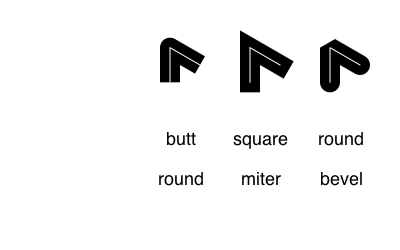
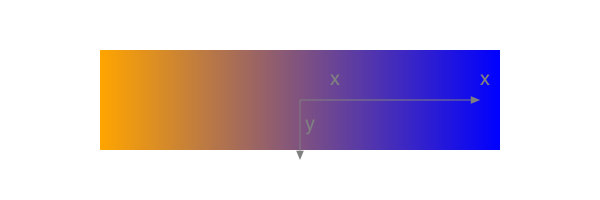
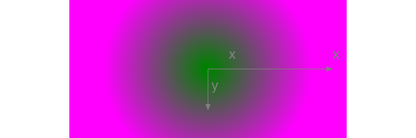
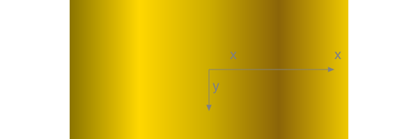
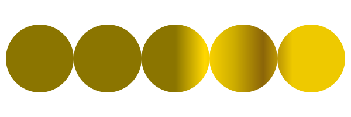
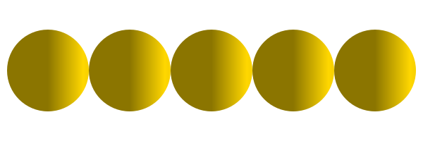
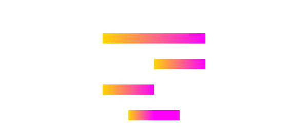
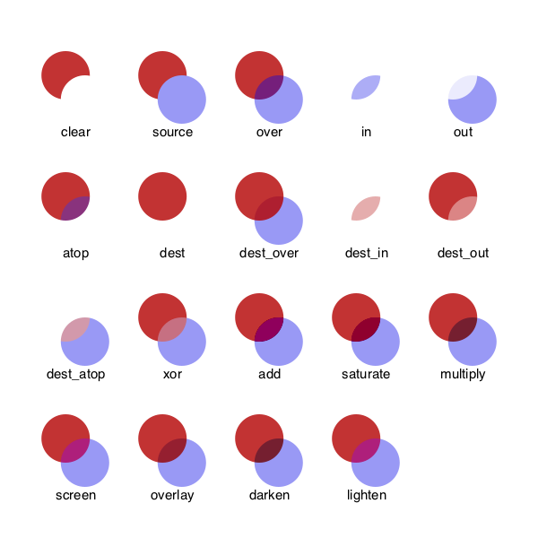
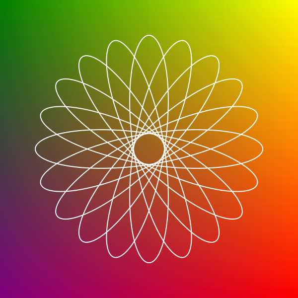
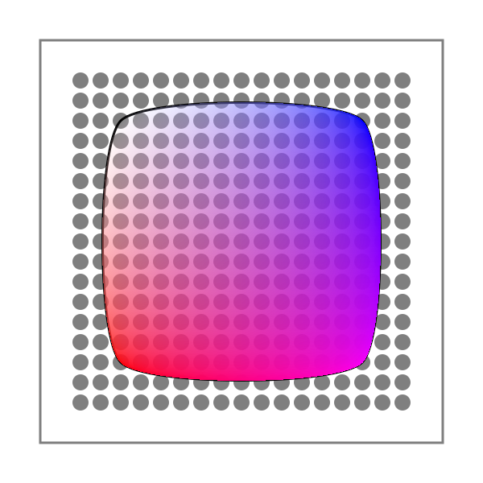

```@meta
DocTestSetup = quote
    using Luxor, Colors
    end
```
# Colors and styles

## Color and opacity

For color definitions and conversions, you can use Colors.jl.

`setcolor()` and `sethue()` apply a single solid or transparent color to shapes.

`setblend()` applies a smooth transition between two or more colors.

`setmesh()` applies a color mesh.

The difference between the `setcolor()` and `sethue()` functions is that `sethue()` is independent of alpha opacity, so you can change the hue without changing the current opacity value.

Named colors, such as "gold", or "lavender", can be found in Colors.color_names.

```@example
using Luxor, Colors # hide
Drawing(800, 800, "assets/figures/colors.svg") # hide

origin() # hide
background("white") # hide
fontface("AvenirNextCondensed-Regular") # hide
fontsize(8)
cols = sort(collect(Colors.color_names))
ncols = 15
nrows = convert(Int, ceil(length(cols) / ncols))
table = Table(nrows, ncols, 800/ncols, 800/nrows)
gamma = 2.2
for n in 1:length(cols)
    col = cols[n][1]
    r, g, b = sethue(col)
    box(table[n], table.colwidths[1], table.rowheights[1], :fill)
    luminance = 0.2126 * r^gamma + 0.7152 * g^gamma + 0.0722 * b^gamma
    (luminance > 0.5^gamma) ? sethue("black") : sethue("white")
    text(string(cols[n][1]), table[n], halign=:center, valign=:middle)
end
finish() # hide

nothing #hide
```


(To make the label stand out against the background, the luminance is calculated, then used to choose the label's color.)

```@docs
sethue
setcolor
setgray
setopacity
randomhue
randomcolor
setblend
```

## Line styles

There are `set-` functions for controlling subsequent lines' width, end shapes, join behavior, and dash patterns:

```@example
using Luxor # hide
Drawing(400, 250, "assets/figures/line-ends.png") # hide
background("white") # hide
origin() # hide
translate(-100, -60) # hide
fontsize(18) # hide
for l in 1:3
    sethue("black")
    setline(20)
    setlinecap(["butt", "square", "round"][l])
    textcentred(["butt", "square", "round"][l], 80l, 80)
    setlinejoin(["round", "miter", "bevel"][l])
    textcentred(["round", "miter", "bevel"][l], 80l, 120)
    poly(ngon(Point(80l, 0), 20, 3, 0, vertices=true), :strokepreserve, close=false)
    sethue("white")
    setline(1)
    strokepath()
end
finish() # hide
nothing # hide
```



```@example
using Luxor # hide
Drawing(600, 250, "assets/figures/dashes.png") # hide
background("white") # hide
origin() # hide
fontsize(14) # hide
sethue("black") # hide

patterns = ["solid", "dotted", "dot", "dotdashed", "longdashed",
  "shortdashed", "dash", "dashed", "dotdotdashed", "dotdotdotdashed"]
setline(12)

table = Table(fill(20, length(patterns)), [50, 300])
text.(patterns, table[:, 1], halign=:right, valign=:middle)

for p in 1:length(patterns)
    setdash(patterns[p])
    pt = table[p, 2]
    line(pt - (150, 0), pt + (150, 0), :stroke)
end
finish() # hide
nothing # hide
```


```@docs
setline
setlinecap
setlinejoin
setdash
fillstroke
strokepath
fillpath
strokepreserve
fillpreserve
paint
do_action
```

Soon you'll be able to define dash patterns in Luxor. For now:

```julia
dashes = [50.0,  # ink
          10.0,  # skip
          10.0,  # ink
          10.0   # skip
          ]
offset = -50.0
Cairo.set_dash(get_current_cr()(), dashes, offset)
```

## Blends

A blend is a color gradient. Use `setblend()` to select a blend in the same way that you'd use `setcolor()` and `sethue()` to select a solid color.

You can make linear or radial blends. Use `blend()` in either case.

To create a simple linear blend between two colors, supply two points and two colors to `blend()`:

```@example
using Luxor # hide
Drawing(600, 200, "assets/figures/color-blends-basic.png") # hide
origin() # hide
background("white") # hide
orangeblue = blend(Point(-200, 0), Point(200, 0), "orange", "blue")
setblend(orangeblue)
box(O, 400, 100, :fill)
rulers()
finish() # hide
nothing # hide
```



And for a radial blend, provide two point/radius pairs, and two colors:

```@example
using Luxor # hide
Drawing(600, 200, "assets/figures/color-blends-radial.png") # hide
origin() # hide
background("white") # hide
greenmagenta = blend(Point(0, 0), 5, Point(0, 0), 150, "green", "magenta")
setblend(greenmagenta)
box(O, 400, 200, :fill)
rulers()
finish() # hide
nothing # hide
```


You can also use `blend()` to create an empty blend. Then you use `addstop()` to define the locations of specific colors along the blend, where `0` is the start, and `1` is the end.

```@example
using Luxor # hide
Drawing(600, 200, "assets/figures/color-blends-scratch.png") # hide
origin() # hide
background("white") # hide
goldblend = blend(Point(-200, 0), Point(200, 0))
addstop(goldblend, 0.0,  "gold4")
addstop(goldblend, 0.25, "gold1")
addstop(goldblend, 0.5,  "gold3")
addstop(goldblend, 0.75, "darkgoldenrod4")
addstop(goldblend, 1.0,  "gold2")
setblend(goldblend)
box(O, 400, 200, :fill)
rulers()
finish() # hide
nothing # hide
```



When you define blends, the location of the axes (eg the current workspace as defined by `translate()`, etc.), is important. In the first of the two following examples, the blend is selected before the axes are moved with `translate(pos)`. The blend 'samples' the original location of the blend's definition.

```@example
using Luxor # hide
Drawing(600, 200, "assets/figures/color-blends-translate-1.png") # hide
origin() # hide
background("white") # hide
goldblend = blend(Point(0, 0), Point(200, 0))
addstop(goldblend, 0.0,  "gold4")
addstop(goldblend, 0.25, "gold1")
addstop(goldblend, 0.5,  "gold3")
addstop(goldblend, 0.75, "darkgoldenrod4")
addstop(goldblend, 1.0,  "gold2")
setblend(goldblend)
tiles = Tiler(600, 200, 1, 5, margin=10)
for (pos, n) in tiles
    gsave()
    setblend(goldblend)
    translate(pos)
    ellipse(O, tiles.tilewidth, tiles.tilewidth, :fill)
    grestore()
end
finish() # hide
nothing # hide
```



Outside the range of the original blend's definition, the same color is used, no matter how far away from the origin you go (there are Cairo options to change this). But in the next example, the blend is relocated to the current axes, which have just been moved to the center of the tile. The blend refers to `0/0` each time, which is at the center of shape.

```@example
using Luxor # hide
Drawing(600, 200, "assets/figures/color-blends-translate-2.png") # hide
origin() # hide
background("white") # hide
goldblend = blend(Point(0, 0), Point(200, 0))
addstop(goldblend, 0.0,  "gold4")
addstop(goldblend, 0.25, "gold1")
addstop(goldblend, 0.5,  "gold3")
addstop(goldblend, 0.75, "darkgoldenrod4")
addstop(goldblend, 1.0,  "gold2")
setblend(goldblend)
tiles = Tiler(600, 200, 1, 5, margin=10)
for (pos, n) in tiles
    gsave()
    translate(pos)
    setblend(goldblend)
    ellipse(O, tiles.tilewidth, tiles.tilewidth, :fill)
    grestore()
end
finish() # hide
nothing # hide
```


```@docs
blend
addstop
```

### Using `blendadjust()`

You can use `blendadjust()` to modify the blend so that objects scaled and positioned after the blend was defined are rendered correctly.

```@example
using Luxor # hide
Drawing(600, 250, "assets/figures/blend-adjust.png") # hide
origin() # hide
background("white") # hide
setline(20)

# first line
blendgoldmagenta = blend(Point(-100, 0), Point(100, 0), "gold", "magenta")
setblend(blendgoldmagenta)
line(Point(-100, -50), Point(100, -50))
strokepath()

# second line
blendadjust(blendgoldmagenta, Point(50, 0), 0.5, 0.5)
line(O, Point(100, 0))
strokepath()

# third line
blendadjust(blendgoldmagenta, Point(-50, 50), 0.5, 0.5)
line(Point(-100, 50), Point(0, 50))
strokepath()

# fourth line
gsave()
translate(0, 100)
scale(0.5, 0.5)
setblend(blendgoldmagenta)
line(Point(-100, 0), Point(100, 0))
strokepath()
grestore()

finish() # hide
nothing # hide
```



The blend is defined to span 200 units, horizontally centered at 0/0. The top line is also 200 units long and centered horizontally at 0/0, so the blend is rendered exactly as you'd hope.

The second line is only half as long, at 100 units, centered at 50/0, so `blendadjust()` is used to relocate the blend's center to the point 50/0 and scale it by 0.5 (`100/200`).

The third line is also 100 units long, centered at -50/0, so again `blendadjust()` is used to relocate the blend's center and scale it.

The fourth line shows that you can translate and scale the axes instead of adjusting the blend, if you use `setblend()` again in the new scene.

```@docs
blendadjust
```

## Blending (compositing) operators

Graphics software provides ways to modify how the virtual "ink" is applied to existing graphic elements. In PhotoShop and other software products the compositing process is done using [blend modes](https://en.wikipedia.org/wiki/Blend_modes).

Use `setmode()` to set the blending mode of subsequent graphics.

```@example
using Luxor # hide
Drawing(600, 600, "assets/figures/blendmodes.png") # hide
origin()
# transparent, no background
fontsize(15)
setline(1)
tiles = Tiler(600, 600, 4, 5, margin=30)
modes = length(Luxor.blendingmodes)
setcolor("black")
for (pos, n) in tiles
    n > modes && break
    gsave()
    translate(pos)
    box(O, tiles.tilewidth-10, tiles.tileheight-10, :clip)

    # calculate points for circles
    diag = (Point(-tiles.tilewidth/2, -tiles.tileheight/2),
            Point(tiles.tilewidth/2,  tiles.tileheight/2))
    upper = between(diag, 0.4)
    lower = between(diag, 0.6)

    # first red shape uses default blend operator
    setcolor(0.7, 0, 0, .8)
    circle(upper, tiles.tilewidth/4, :fill)

    # second blue shape shows results of blend operator
    setcolor(0, 0, 0.9, 0.4)
    blendingmode = Luxor.blendingmodes[mod1(n, modes)]
    setmode(blendingmode)
    circle(lower, tiles.tilewidth/4, :fill)

    clipreset()
    grestore()

    gsave()
    translate(pos)
    text(Luxor.blendingmodes[mod1(n, modes)], O.x, O.y + tiles.tilewidth/2, halign=:center)
    grestore()
end
finish() # hide
nothing # hide
```



Notice in this example that clipping was used to restrict the area affected by the blending process.

In Cairo these blend modes are called *operators*. A source for a more detailed explanation can be found [here](https://www.cairographics.org/operators/).

You can access the list of modes with the unexported symbol `Luxor.blendingmodes`.

```@docs
setmode
getmode
```

## Meshes

A mesh provides smooth shading between three or four colors across a region defined by lines or curves.

To create a mesh, use the `mesh()` function and save the result as a mesh object. To use a mesh, supply the mesh object to the `setmesh()` function.

The `mesh()` function accepts either an array of Bézier paths or a polygon.

This basic example obtains a polygon from the drawing area using `box(BoundingBox()...` and uses the four corners of the mesh and the four colors in the array to build the mesh. The `paint()` function fills the drawing.

```@example
using Luxor, Colors # hide
Drawing(600, 600, "assets/figures/mesh-basic.png") # hide
origin() # hide

garishmesh = mesh(
    box(BoundingBox(), vertices=true),
    ["purple", "green", "yellow", "red"])

setmesh(garishmesh)

paint()

setline(2)
sethue("white")
hypotrochoid(180, 81, 130, :stroke)
finish() # hide
nothing # hide
```



The next example uses a Bézier path conversion of a square as the outline of the mesh. Because the box to be filled is larger than the mesh's outlines, not all the box is filled.

```@example
using Luxor, Colors # hide
Drawing(600, 600, "assets/figures/mesh1.png") # hide
origin() # hide
background("white") # hide
setcolor("grey50")
circle.([Point(x, y) for x in -200:25:200, y in -200:25:200], 10, :fill)

bp = makebezierpath(box(O, 300, 300, vertices=true), smoothing=.4)
setline(3)
sethue("black")

drawbezierpath(bp, :stroke)
mesh1 = mesh(bp, [
    Colors.RGBA(1, 0, 0, 1),   # bottom left, red
    Colors.RGBA(1, 1, 1, 0.0), # top left, transparent
    Colors.RGB(0, 0, 1),      # top right, blue
    Colors.RGB(1, 0, 1)        # bottom right, purple
    ])
setmesh(mesh1)
box(O, 500, 500, :fillpreserve)
sethue("grey50")
strokepath()

finish() # hide
nothing # hide
```



The second example uses a polygon defined by `ngon()` as the outline of the mesh. The mesh is drawn when the path is stroked.

```@example
using Luxor # hide
Drawing(600, 600, "assets/figures/mesh2.png") # hide
origin() # hide
background("white") # hide
pl = ngon(O, 250, 3, pi/6, vertices=true)
mesh1 = mesh(pl, [
    "purple",
    "green",
    "yellow"
    ])
setmesh(mesh1)
setline(180)
poly(pl, :strokepreserve, close=true)
setline(5)
sethue("black")
strokepath()
finish() # hide
nothing # hide
```


```@docs
mesh
setmesh
```
