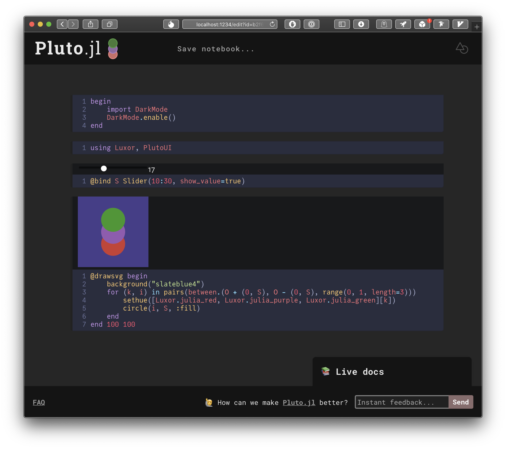

```@meta
DocTestSetup = quote
    using Luxor, Colors
    end
```
# Simple examples

## The obligatory "Hello World"

Here's the "Hello world":


```julia
using Luxor
Drawing(1000, 1000, "hello-world.png")
origin()
background("black")
sethue("red")
fontsize(50)
text("hello world")
finish()
preview()
```

`Drawing(1000, 1000, "hello-world.png")` defines the width, height, location, and type of the finished image. [`origin`](@ref) moves the 0/0 point to the centre of the drawing surface (by default it's at the top left corner). Thanks to `Colors.jl` we can specify colors by name as well as by numeric value: [`background("black")`](@ref) defines the color of the background of the drawing. `text("helloworld")` draws the text. It's placed at the current 0/0 point and left-justified if you don't specify otherwise. [`finish`](@ref) completes the drawing and saves the PNG image in the file. [`preview`](@ref) tries to display the saved file, perhaps using another application (eg Preview on macOS).

The macros `@png`, `@svg`, `@pdf`, `@draw`, and `@imagematrix` provide shortcuts for making and previewing graphics without you having to provide the usual set-up and finish instructions:

```julia
# using Luxor

@png begin
        fontsize(50)
        circle(Point(0, 0), 150, :stroke)
        text("hello world", halign=:center, valign=:middle)
     end
```


```julia
@svg begin
    sethue("red")
    randpoint = Point(rand(-200:200), rand(-200:200))
    circle(randpoint, 2, :fill)
    sethue("black")
    foreach(f -> arrow(f, between(f, randpoint, .1), arrowheadlength=6),
        first.(collect(Table(fill(20, 15), fill(20, 15)))))
end
```


The `@draw` and `drawsvg` macros are useful if you work in
Juno/VS Code IDEs or a notebook environment such as Jupyter
or Pluto and don't need to always save your work in files.
They create a PNG or SVG format drawing in memory, rather
than saved in a file. It's displayed in the plot pane or in
an adjacent cell.

```julia
@draw begin
    setopacity(0.85)
    steps = 20
    gap   = 2
    for (n, θ) in enumerate(range(0, step=2π/steps, length=steps))
        sethue([Luxor.julia_green,
            Luxor.julia_red,
            Luxor.julia_purple,
            Luxor.julia_blue][mod1(n, 4)])
        sector(Point(0, 0), 50, 250 + 2n, θ, θ + 2π/steps - deg2rad(gap), :fill)
    end
end
```




## The Julia logos

Luxor contains built-in functions that draw the Julia logo, either in color or a single color, and the three Julia circles.

```@example
using Luxor
Drawing(600, 400, "../assets/figures/julia-logos.png")
origin()
background("white")

for θ in range(0, step=π/8, length=16)
    gsave()
    scale(0.2)
    rotate(θ)
    translate(350, 0)
    julialogo(action=:fill, bodycolor=randomhue())
    grestore()
end

gsave()
scale(0.3)
juliacircles()
grestore()

translate(150, -150)
scale(0.3)
julialogo()
finish()

# preview()
nothing # hide
```


The [`gsave`](@ref) function saves the current drawing environment temporarily, and any subsequent changes such as the [`scale`](@ref) and [`rotate`](@ref) operations are discarded when you call the next [`grestore`](@ref) function.

Use the extension to specify the format: for example, change `julia-logos.png` to `julia-logos.svg` or `julia-logos.pdf` or `julia-logos.eps` to produce SVG, PDF, or EPS format output.

## Something a bit more complicated: a Sierpinski triangle

Here's a version of the Sierpinski recursive triangle, clipped to a circle.


```julia
# Subsequent examples will omit these setup and finishing functions:
#
# using Luxor, Colors
# Drawing()
# background("white")
# origin()

function triangle(points, degree)
    sethue(cols[degree])
    poly(points, :fill)
end

function sierpinski(points, degree)
    triangle(points, degree)
    if degree > 1
        p1, p2, p3 = points
        sierpinski([p1, midpoint(p1, p2),
                        midpoint(p1, p3)], degree-1)
        sierpinski([p2, midpoint(p1, p2),
                        midpoint(p2, p3)], degree-1)
        sierpinski([p3, midpoint(p3, p2),
                        midpoint(p1, p3)], degree-1)
    end
end

function draw(n)
    circle(Point(0, 0), 75, :clip)
    points = ngon(Point(0, 0), 150, 3, -π/2, vertices=true)
    sierpinski(points, n)
end

depth = 8 # 12 is ok, 20 is right out (on my computer, at least)
cols = distinguishable_colors(depth) # from Colors.jl
draw(depth)

# finish()
# preview()
```

The Point type is an immutable composite type containing `x` and `y` fields that specify a 2D point.

## A simple numberline

```@example
using Luxor # hide

@drawsvg begin
    background("white")
    fontsize(14)
    setline(1)
    ht = 10

    map(f -> begin
                pt = between(O - (200, 0), O + (200, 0), f)
                if f * 100 % 50 == 0
                    ht = 10
                    text(string(f), pt + (0, 30), halign=:center)
                else
                    ht = 4
                end
                line(pt + polar(ht, π/2), pt + polar(ht, -π/2), :stroke)
            end,
    0:0.05:1.0)

    arrow(O - (220, 0), O + (220, 0))
end 800 200
```
