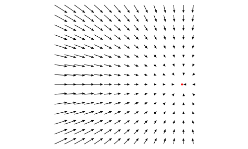

# Examples

## The obligatory "Hello World"

Here's the "Hello world":


```julia
using Luxor
Drawing(1000, 1000, "hello-world.png")
origin()
background("black")
sethue("red")
fontsize(50)
text("hello world")
finish()
preview()
```

`Drawing(1000, 1000, "hello-world.png")` defines the width, height, location, and type of the finished image. `origin()` moves the 0/0 point to the centre of the drawing surface (by default it's at the top left corner). Thanks to `Colors.jl` we can specify colors by name as well as by numeric value: `background("black")` defines the color of the background of the drawing. `text("helloworld")` draws the text. It's placed at the current 0/0 and left-justified if you don't specify otherwise. `finish()` completes the drawing and saves the image in the file. `preview()` tries to open the saved file using some other application (eg Preview on macOS).

The macros `@png`, `@svg`, and `@pdf` provide shortcuts for making and previewing graphics without having to provide the set-up and finish instructions:

```julia
# using Luxor

@png begin
        fontsize(50)
        circle(O, 150, :stroke)
        text("hello world", halign=:center, valign=:middle)
     end
```


```julia
@svg begin
    sethue("red")
    randpoint = Point(rand(-200:200), rand(-200:200))
    circle(randpoint, 2, :fill)
    sethue("black")
    foreach(f -> arrow(f, between(f, randpoint, .1), arrowheadlength=6),
        first.(collect(Table(fill(20, 15), fill(20, 15)))))
end
```


## The Julia logos

Luxor contains two functions that draw: the Julia logo, either in color or a single color; and the three Julia circles.

```@example
using Luxor
Drawing(600, 400, "assets/figures/julia-logos.png")
origin()
background("white")
for theta in range(0, pi/8, 16)
    gsave()
    scale(0.25)
    rotate(theta)
    translate(250, 0)
    randomhue()
    julialogo(action=:fill, color=false)
    grestore()
end

gsave()
scale(0.3)
juliacircles()
grestore()

translate(200, -150)
scale(0.3)
julialogo()
finish()
nothing # hide
```


The `gsave()` function saves the current drawing parameters, and any subsequent changes such as the `scale()` and `rotate()` operations are discarded by the next `grestore()` function.

Use the extension to specify the format: for example change "julia-logos.png" to "julia-logos.svg" or "julia-logos.pdf" or "julia-logos.eps", to produce different formats.

## Something a bit more complicated: a Sierpinski triangle

Here's a version of the Sierpinski recursive triangle, clipped to a circle.


```julia
# Subsequent examples will omit these setup and finishing functions:
#
# using Luxor, Colors
# Drawing()
# background("white")
# origin()

function triangle(points, degree)
    sethue(cols[degree])
    poly(points, :fill)
end

function sierpinski(points, degree)
    triangle(points, degree)
    if degree > 1
        p1, p2, p3 = points
        sierpinski([p1, midpoint(p1, p2),
                        midpoint(p1, p3)], degree-1)
        sierpinski([p2, midpoint(p1, p2),
                        midpoint(p2, p3)], degree-1)
        sierpinski([p3, midpoint(p3, p2),
                        midpoint(p1, p3)], degree-1)
    end
end

function draw(n)
    circle(O, 75, :clip)
    my_points = ngon(O, 150, 3, -pi/2, vertices=true)
    sierpinski(my_points, n)
end

depth = 8 # 12 is ok, 20 is right out (on my computer, at least)
cols = distinguishable_colors(depth)
draw(depth)

# finish()
# preview()
```

The main type (apart from the Drawing) is the Point, an immutable composite type containing `x` and `y` fields.

## Working in Jupyter

If you want to work interactively, you can use an environment such as a Jupyter notebook, and load Luxor at the start of a session. The first drawing will take a few seconds, because the Cairo graphics engine needs to warm up. Subsequent drawings are then much quicker. (This is true of much graphics and plotting work, of course. And if you're working in the REPL, after your first drawing subsequent drawings will be much quicker.)


## More examples

### Maps

Luxor can read polygons from shapefiles, so you can create simple maps. For example, here's part of a map of the world built from a single shapefile, together with the locations of most airports read in from a text file and overlaid.


The latitude and longitude coordinates are converted directly to drawing coordinates. The latitude coordinates have to be negated because y-coordinates in Luxor typically increase down the page, whereas latitude values increase as you travel North.

This is the full map:


You'll need to install the [Shapefile.jl](https://github.com/JuliaGeo/Shapefile.jl) package before running the code:

```julia
using Shapefile, Luxor
include(Pkg.dir("Luxor") * "/src/readshapefiles.jl")
function drawairportmap(outputfilename, countryoutlines, airportdata)
    Drawing(4000, 2000, outputfilename)
    origin()
    scale(10, 10)
    setline(1.0)
    fontsize(0.075)
    gsave()
    setopacity(0.25)
    for shape in countryoutlines.shapes
        randomhue()
        pgons, bbox = convert(Array{Luxor.Point, 1}, shape)
        for pgon in pgons
            poly(pgon, :fill)
        end
    end
    grestore()
    sethue("black")
    for airport in airportdata
        city, country, lat, long = split(chomp(airport), ",")
        location = Point(parse(long), -parse(lat)) # flip y-coordinate
        circle(location, .01, :fill)
        text(string(city), location.x, location.y - 0.02)
    end
    finish()
    preview()
end

worldshapefile = Pkg.dir("Luxor") * "/docs/src/assets/examples/outlines-of-world-countries.shp"
airportdata = readlines(Pkg.dir("Luxor") * "/docs/src/assets/examples/airports.csv")
worldshapes = open(worldshapefile) do f
    read(f, Shapefile.Handle)
end
drawairportmap("/tmp/airport-map.pdf", worldshapes, airportdata)
```

[link to Julia source](assets/examples/make-airport-world-map.jl) |
[link to PDF map](assets/examples/airport-map.pdf)

### Sector chart


Sector charts look cool but they aren't always good at their job. This chart takes the raw benchmark scores from the [Julia website](http://julialang.org) and tries to render them literally as radiating sectors. The larger the sector, the slower the performance, so it's difficult to see the Julia scores sometimes...!

[link to PDF original](assets/figures/sector-chart.pdf) | [link to Julia source](assets/examples/sector-chart.jl)

### Ampersands

Here are a few ampersands collected together, mainly of interest to typomaniacs and fontophiles. It was necessary to vary the font size of each font, since they're naturally different.


[link to PDF original](assets/figures/iloveampersands.pdf) | [link to Julia source](assets/examples/iloveampersands.jl)

### Moon phases

Looking upwards again, this moon phase chart shows the calculated phase of the moon for every day in a year.


[link to PDF original](assets/figures/2017-moon-phase-calendar.pdf) | [link to github repository](https://github.com/cormullion/Spiral-moon-calendar)

### Misc images

Sometimes you just want to take a line for a walk:


