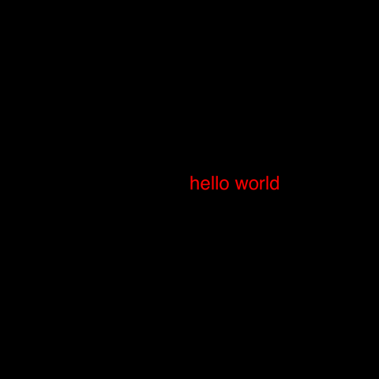
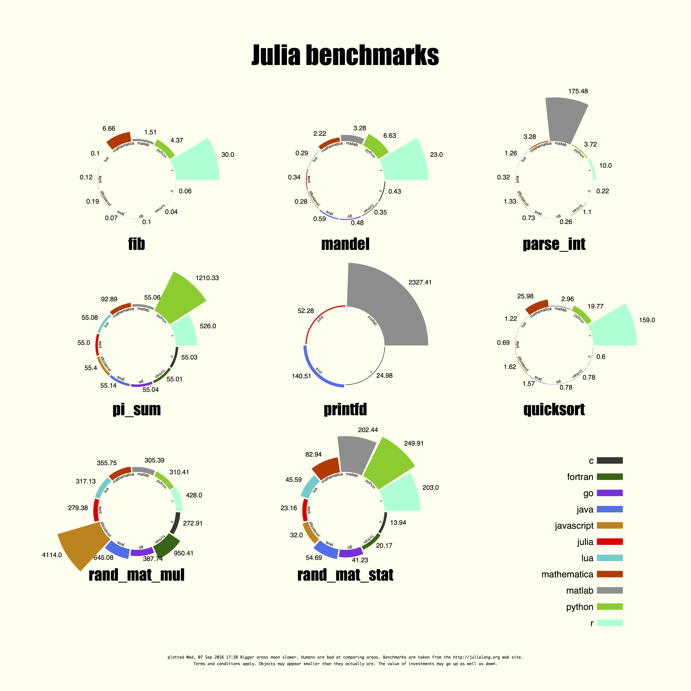
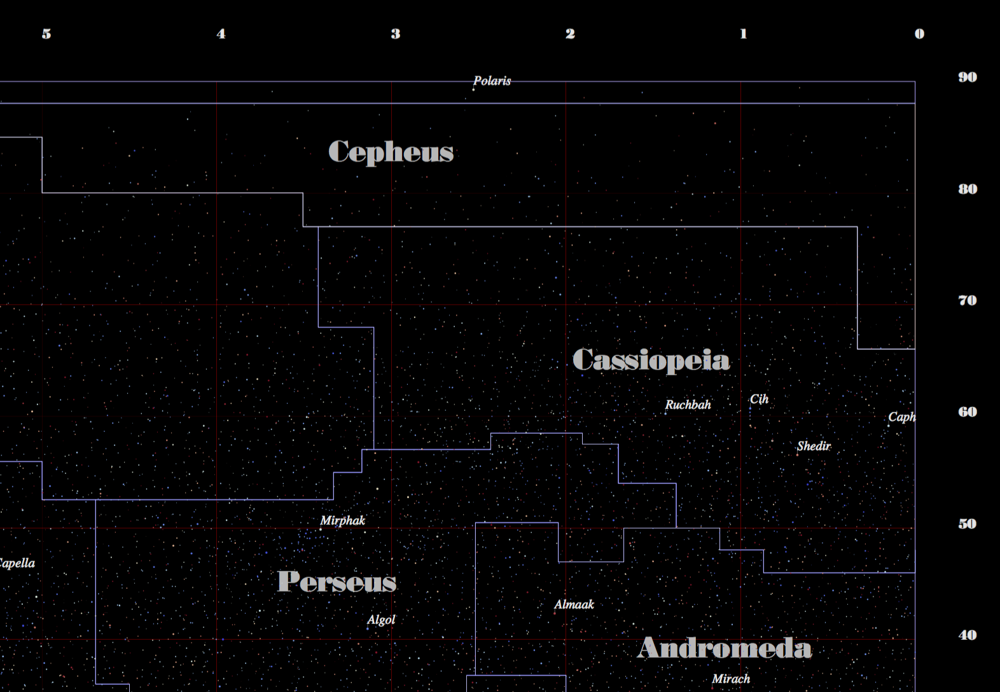
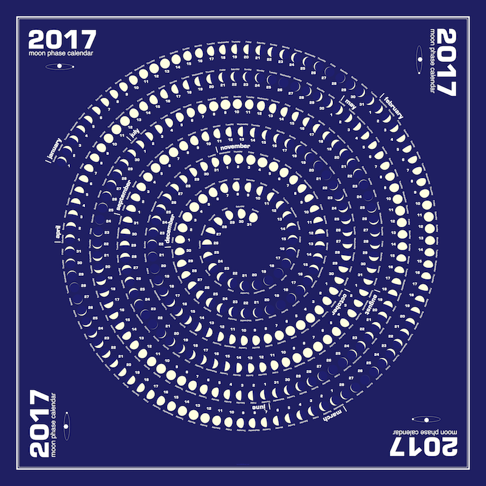

## The obligatory "Hello World"

Here's the "Hello world":



```julia
using Luxor, Colors
Drawing(1000, 1000, "hello-world.png")
origin()
sethue("red")
fontsize(50)
text("hello world")
finish()
preview()
```

The `Drawing(1000, 1000, "hello-world.png")` line defines the size of the image and the location of the finished image when it's saved. `origin()` moves the 0/0 point to the centre of the drawing surface (by default it's at the top left corner). Because we're `using Colors`.jl, we can specify colors by name. `text()` places text. It's placed at the current 0/0 if you don't specify otherwise. `finish()` completes the drawing and saves the image in the file. `preview()` tries to open the saved file using some other application (eg on MacOS X, Preview).

## More examples

Here are a few more examples.

### Sector chart



Sector charts look cool but they aren't always good at their job. This chart takes the raw benchmark scores from the [Julia website](http://julialang.org) and tries to render them literally as radiating sectors. The larger the sector, the slower the performance, so it's difficult to see the Julia scores sometimes...!

[link to PDF original](figures/sector-chart.pdf) | [link to Julia source](examples/sector-chart.jl)

### Star chart

Looking further afield, here's a straightforward chart rendering stars from the Astronexus HYG database catalog available on [github](https://github.com/astronexus/HYG-Database) and read into a DataFrame. There are a lot of challenges with representing so many stars—sizes, colors, constellation boundaries. It takes about 4 seconds to load the data, and 7 seconds to draw it— about 120,000 stars, using still-to-be-optimized code.

A small detail:



A more complete version:


[link to PDF original](figures/star-chart.pdf) | [link to Julia source](examples/star-chart.jl)

### Moon phases

Still looking upwards, this moon phase chart shows the calculated phase of the moon for every day in a year.



[link to PDF original](figures/2017-moon-phase-calendar.pdf) | [link to github repository](https://github.com/cormullion/Spiral-moon-calendar)
