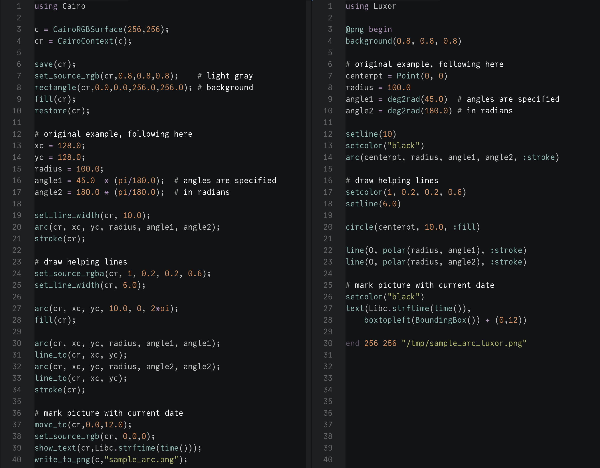
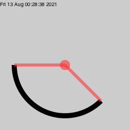

# Luxor and Cairo

The aim of Luxor is to provide an easy to use
"scripting-like" interface to Cairo.jl.

!!! note

    Luxor.jl doesn't implement every function provided in
    Cairo.jl. Cairo.jl doesn't implement every function
    provided by the Cairo API.

As an example of the difference between Luxor and Cairo,
compare the two scripts below. Below left is one of
the original example files in the Cairo.jl repository. On the
right is a fairly literal conversion into a Luxor script.



They both produce this image:



For convenience, and to provide a simpler interface, Luxor
introduces `Point`s and dispenses with `Context`s.

Both Cairo and Luxor use the same coordinate system (although the
Luxor `@-` macros position the `0/0` origin at the center of the
canvas). So although Cairo has to calculate the midpoint of
the drawing in line 13, Luxor has to calculate the position
of the top left corner in line 28.

A slighty more Luxor-idiomatic version of the code would be:

```
using Luxor

@png begin
    background(0.8, 0.8, 0.8)

    setline(10)
    setcolor("black")
    arc(centerpt, 100, π/4, π, :stroke)

    setcolor(1, 0.2, 0.2, 0.6)
    setline(6.0)

    circle(centerpt, 10.0, :fill)

    poly([polar(100, π), O, polar(100, π/4)], :stroke)

    setcolor("black")
    text(Libc.strftime(time()), boxtopleft(BoundingBox()) + (0,12))

end 256 256 "/tmp/sample_arc_luxor_2.png"
```

If you want to know more about how drawing in Cairo (and
by extension, Luxor) works, refer to the [Cairo
documentation](https://cairographics.org/documentation/).
