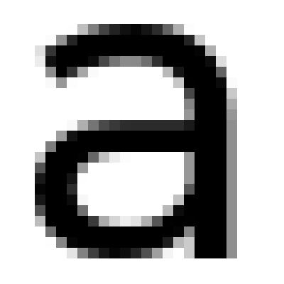

# Perfect pixels and anti-aliasing

## Antialiasing

The process of converting precise graphic shapes to a grid of
pixels is automatically performed by Luxor/Cairo when you
save the drawing as a PNG file. If you make an SVG or PDF
drawing, this process is carried out by the application you
use to view or display the file.

It's usually better to defer the conversion as long as
possible. Eventually - unless you're using a pen plotter or
laser cutter - your smooth outlines will have to be
converted ("rasterized") to a grid of colored pixels for
their final journey to the analogue world.

The smoothing process includes "anti-aliasing". You can, to
some extent, adjust the amount of anti-aliasing used when
you make drawings in Luxor.

```@setup draw_matrix
using Luxor, Colors
function make_matrix(;
        antialias=0)
    d = Drawing(20, 20, :image)
    setantialias(antialias)
    origin()
    setcolor("red")
    circle(Point(0, 0), 5, :fill)
    mat = image_as_matrix()
    finish()
    return mat
end

function drawmatrix(A;
        cellsize = (10, 10))
    table = Table(size(A)..., cellsize...)
    for i in CartesianIndices(A)
        r, c = Tuple(i)
        sethue(A[r, c])
        box(table, r, c, :fill)
        sethue("black")
        box(table, r, c, :stroke)
    end
end

function draw(antialias)
    mat = make_matrix(antialias=antialias)
    @drawsvg begin
        background("black")
        drawmatrix(mat, cellsize = 1 .* size(mat))
        c = length(unique(color.(mat)))
        sethue("white")
        fontsize(8)
        text("number of colors used: $c", boxbottomcenter(BoundingBox() * 0.9), halign=:center)
    end 300 300
end
```

The [`setantialias`](@ref) function lets you set the anti-aliasing amount to a constant between 0 and 6. The Cairo documentation describes the different values as follows:

| Value  | Name                      | Description     |
|:-----  |:----                      |:----            |
|0       |`CAIRO_ANTIALIAS_DEFAULT`  |Use the default anti-aliasing for the subsystem and target device|
|1       |`CAIRO_ANTIALIAS_NONE`     |Use a bilevel alpha mask|
|2       |`CAIRO_ANTIALIAS_GRAY`     |Perform single-color anti-aliasing (using shades of gray for black text on a white background, for example)|
|3       |`CAIRO_ANTIALIAS_SUBPIXEL` |Perform anti-aliasing by taking advantage of the order of subpixel elements on devices such as LCD panels|
|4       |`CAIRO_ANTIALIAS_FAST`     |Hint that the backend should perform some anti-aliasing but prefer speed over quality|
|5       |`CAIRO_ANTIALIAS_GOOD`     |The backend should balance quality against performance|
|6       |`CAIRO_ANTIALIAS_BEST`     |Hint that the backend should render at the highest quality, sacrificing speed if necessary|

To show the anti-aliasing in action, the following code draws a red circle:

```
Drawing(20, 20, :image)
setantialias(0)
origin()
setcolor("red")
circle(Point(0, 0), 5, :fill)
mat = image_as_matrix()
finish()
```

This matrix can then be redrawn larger to show the effects of anti-aliasing better. Here's the default anti-aliasing value of 0:

```@example draw_matrix
draw(0) # hide
```

and you can see that Luxor used 18 different colors to render this red circle.

Here’s the result of the bilevel mask (value 1 or “none”) setting:

```@example draw_matrix
draw(1) # hide
```

and Luxor used just two colors to draw the circle.

The other values produce the same effects as the default (0), apart from 4 ("speed over quality"):

```@example draw_matrix
draw(4) # hide
```

which uses 12 rather than 16 colors.

The anti-aliasing process can vary according to the OS and device you're using. The [Cairo documentation](https://www.cairographics.org/manual/cairo-cairo-t.html) stresses this more than once:

> The value is a hint, and a particular backend may or may not support a particular value. [...] The values make no guarantee on how the backend will perform its rasterisation (if it even rasterises!) [...] The interpretation of `CAIRO_ANTIALIAS_DEFAULT` is left entirely up to the backend [...]

## Text

The anti-aliasing described above does not apply to text.

Text rendering is much more platform-dependent than graphics; Windows, MacOS, and Linux all have their own methods for rendering and rasterizing fonts, and currently Cairo.jl doesn't provide an interface to the underlying font rendering APIs.

Consider the following code, which makes an image of the letter "a" and redraws it larger:

```julia
using Luxor

function make_matrix()
    Drawing(40, 40, :image)
    background(1, 1, 1, 1)
    setantialias(0)
    origin()
    setcolor(0, 0, 0, 1)
    fontsize(40)
    text("a", halign=:center, valign=:middle)
    matrix = image_as_matrix()
    finish()
    return matrix
end

function draw()
    matrix = make_matrix()
    @png begin
        background(0, 0, 0, 1)
        table = Table(size(matrix)..., (15, 15))
        for i in CartesianIndices(matrix)
            r, c = Tuple(i)
            setcolor(matrix[r, c])
            box(table, r, c, :fillstroke)
        end
    end 400 400 "alias-test.png"
end
```

The output varies depending on the computer, OS, and rendering settings.

MacOS standard rendering:


Linux Gnome standard anti-aliasing:



On Windows systems, and on some Linux desktops, text can be
displayed using a _subpixel_ rendering process, which switches the red, green, and blue components of pixels on or off where they meet the edges of text in an attempt to provide a “smoother” appearance.

Linux KDE RGB anti-aliasing:


Windows Cleartype anti-aliasing:


In addition, Windows and some Linux systems use
_font hinting_, a process in which the outlines of text glyphs
are shifted so as to align better on the rectangular grid of
pixels.

If you want text to be rendered precisely (and in the
specified color) it might be worth investigating Luxor’s
[`textoutlines`](@ref) function, which converts text to
vector-based outlines.
