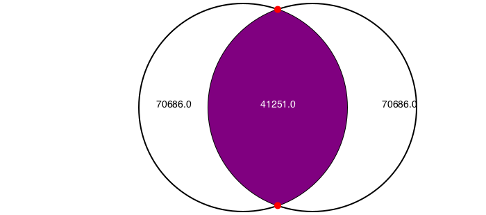
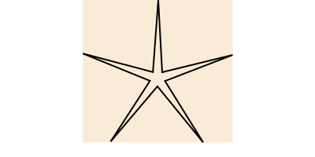
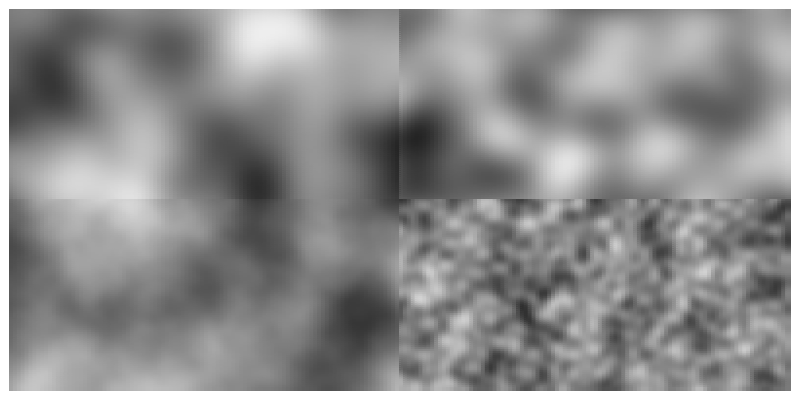

```@meta
DocTestSetup = quote
    using Luxor, Colors, Random
    end
```

# Geometry tools

## Lines and distances

You can find the midpoint between two points using `midpoint()`.

The following code places a small pentagon (using `ngon()`) at the midpoint of each side of a larger pentagon:

```@example
using Luxor # hide
Drawing(700, 220, "assets/figures/midpoint.png") # hide
origin() # hide
background("white") # hide
sethue("red")
ngon(O, 100, 5, 0, :stroke)

sethue("darkgreen")
p5 = ngon(O, 100, 5, 0, vertices=true)

for i in eachindex(p5)
    pt1 = p5[mod1(i, 5)]
    pt2 = p5[mod1(i + 1, 5)]
    ngon(midpoint(pt1, pt2), 20, 5, 0, :fill)
end
finish() # hide
nothing # hide
```


A more general function, `between()`, finds for a value `x` between 0 and 1 the corresponding point on a line defined by two points. So `midpoint(p1, p2)` and `between(p1, p2, 0.5)` should return the same point.

```@example
using Luxor # hide
Drawing(700, 150, "assets/figures/betweenpoint.png") # hide
origin() # hide
background("white") # hide
sethue("red")
p1 = Point(-150, 0)
p2 = Point(150, 40)
line(p1, p2)
strokepath()
for i in -0.5:0.1:1.5
    randomhue()
    circle(between(p1, p2, i), 5, :fill)
end
finish() # hide
nothing # hide
```


Values less than 0.0 and greater than 1.0 appear to work well too, placing the point on the line if extended.

```@docs
midpoint
between
```

`center3pts()` finds the radius and center point of a circle passing through three points which you can then use with functions such as `circle()` or `arc2r()`.


`getnearestpointonline()` finds perpendiculars.

```@example
using Luxor # hide
Drawing(700, 200, "assets/figures/perpendicular.png") # hide
origin() # hide
background("white") # hide
sethue("darkmagenta") # hide
end1, end2, pt3 = ngon(O, 100, 3, vertices=true)
circle.([end1, end2, pt3], 5, :fill)
line(end1, end2, :stroke)
arrow(pt3, getnearestpointonline(end1, end2, pt3))
finish() # hide
nothing # hide
```


```@docs
distance
getnearestpointonline
pointlinedistance
slope
perpendicular
dotproduct
@polar
polar
ispointonline
```

## Intersections

`intersectionlines()` finds the intersection of two lines.

```@example
using Luxor # hide
Drawing(700, 220, "assets/figures/intersection.png") # hide
background("white") # hide
origin() # hide

sethue("black")
P1, P2, P3, P4 = ngon(O, 100, 5, vertices=true)
label.(["P1", "P2", "P3", "P4"], :N, [P1, P2, P3, P4])
line(P1, P2, :stroke)
line(P4, P3, :stroke)

flag, ip =  intersectionlines(P1, P2, P4, P3)
if flag
    circle(ip, 5, :fill)
end

finish() # hide
nothing # hide
```


`intersectionlinecircle()` finds the intersection of a line and a circle. There can be 0, 1, or 2 intersection points.

```@example
using Luxor # hide
Drawing(700, 220, "assets/figures/intersection_line_circle.png") # hide
origin() # hide
background("white") # hide
sethue("chocolate2") # hide
l1 = Point(-100.0, -75.0)
l2 = Point(300.0, 100.0)
rad = 100
cpoint = Point(0, 0)
line(l1, l2, :stroke)
sethue("darkgreen") # hide
circle(cpoint, rad, :stroke)
nints, ip1, ip2 =  intersectionlinecircle(l1, l2, cpoint, rad)
sethue("black")
if nints == 2
    circle(ip1, 8, :stroke)
    circle(ip2, 8, :stroke)
end
finish() # hide
nothing # hide
```


`intersection2circles()` finds the area of the intersection of two circles, and `intersectioncirclecircle()` finds the points where they cross.

This example shows the areas of two circles, and the area of their intersection.

```@example
using Luxor # hide
Drawing(700, 310, "assets/figures/intersection2circles.png") # hide
origin() # hide
background("white") # hide
fontsize(14) # hide
sethue("black") # hide

c1 = (O, 150)
c2 = (O + (100, 0), 150)

circle(c1... , :stroke)
circle(c2... , :stroke)

sethue("purple")
circle(c1... , :clip)
circle(c2... , :fill)
clipreset()

sethue("black")

text(string(150^2 * π |> round), c1[1] - (125, 0))
text(string(150^2 * π |> round), c2[1] + (100, 0))
sethue("white")
text(string(intersection2circles(c1..., c2...) |> round),
     midpoint(c1[1], c2[1]), halign=:center)

sethue("red")
flag, C, D = intersectioncirclecircle(c1..., c2...)
if flag
    circle.([C, D], 5, :fill)
end
finish() # hide
nothing # hide
```


```@docs
intersectionlines
intersectionlinecircle
intersection2circles
intersectioncirclecircle
```

## Arrows

You can draw lines or arcs with arrows at the end with `arrow()`. For straight arrows, supply the start and end points. For arrows as circular arcs, you provide center, radius, and start and finish angles. You can optionally provide dimensions for the `arrowheadlength` and `arrowheadangle` of the tip of the arrow (angle in radians between side and center). The default line weight is 1.0, equivalent to `setline(1)`), but you can specify another.

```@example
using Luxor # hide
Drawing(400, 250, "assets/figures/arrow.png") # hide
background("white") # hide
origin() # hide
sethue("steelblue4") # hide
setline(2) # hide
arrow(O, Point(0, -65))
arrow(O, Point(100, -65), arrowheadlength=20, arrowheadangle=pi/4, linewidth=.3)
arrow(O, 100, π, π/2, arrowheadlength=25,   arrowheadangle=pi/12, linewidth=1.25)
finish() # hide
nothing # hide
```


```@docs
arrow
```

## Bounding boxes

The `BoundingBox` type allows you to use rectangular extents to organize and interact with the 2D drawing area. A `BoundingBox` holds two points, the opposite corners of a bounding box.

You can make a BoundingBox from the current drawing, two points, a text string, an existing polygon, or by modifying an existing one.

`BoundingBox()` without arguments defines an extent that encloses the drawing (assuming that the origin is at the center of the drawing—see `origin()`). Use `centered=false` if the drawing origin is still at the top left corner.

This example draws circles at three points: at two of the drawing's corners and the midway point between them:

```@example
using Luxor # hide
Drawing(700, 400, "assets/figures/bbox.png") # hide
background("white") # hide

origin()

bb = BoundingBox()
setline(10)
sethue("orange")

circle(bb[1], 150, :stroke) # first corner

circle(bb[2], 150, :stroke) # second corner

circle(midpoint(bb...), 150, :stroke) # midpoint

sethue("blue")
circle.([bb[1], midpoint(bb[1:2]), bb[2]], 130, :fill)

sethue("red")
circle.([first(bb), midpoint(bb...), last(bb)], 100, :fill)

finish() # hide
nothing # hide
```


You can make a bounding box from a polygon:

```@example
using Luxor # hide
Drawing(400, 200, "assets/figures/bboxpoly.png") # hide
background("white") # hide
origin() # hide

p = star(O, 100, 5, 0.1, π/3.3, vertices=true)
sethue("antiquewhite")
box(BoundingBox(p), :fill)

sethue("black")
poly(p, :stroke, close=true)

finish() # hide
nothing # hide
```



The resulting bounding box objects can be passed to `box()` or `poly()` to be drawn.

Pass a bounding box to `midpoint()` to find its center point. The functions `boxbottom()`, `boxheight()`, `boxtop()`, `boxaspectratio()`, `boxdiagonal()`, and  `boxwidth()` return information about a bounding box.

To convert a bounding box `b` into a box, use `box(b, vertices=true)` or `convert(Vector{Point}, BoundingBox())`.

You can also do some arithmetic on bounding boxes. In the next example, the bounding box is created from the text "good afternoon". The bounding box is filled with purple, then increased by 40 units on all sides (blue), also scaled by 1.3 (green), and also shifted by `(0, 100)` (orange).

```@example
using Luxor # hide
Drawing(500, 300, "assets/figures/bbox2.png") # hide
background("white") # hide
origin() # hide

translate(-130,0)
fontsize(40)
str = "good afternoon"
sethue("purple")
box(BoundingBox(str), :fill)
sethue("white")
text(str)

sethue("blue")
modbox = BoundingBox(str) + 40 # add 40 units to all sides
poly(modbox, :stroke, close=true)

sethue("green")
modbox = BoundingBox(str) * 1.3
poly(modbox, :stroke, close=true)

sethue("orange")
modbox = BoundingBox(str) + (0, 100)
poly(modbox, :fill, close=true)

finish() # hide
nothing # hide
```


You can find the union and intersection of BoundingBoxes, and also find whether a point lies inside one. The following code creates, shrinks, and shifts two bounding boxes (colored yellow and pink), and then draws: their union (a bounding box that includes both), in black outline; and their intersection (a bounding box of their common areas), in red. Then some random points are created and drawn differently depending on whether they're inside the intersection or outside.

```@example
using Luxor, Random # hide
Drawing(600, 400, "assets/figures/bbox3.png") # hide
background("white") # hide
Random.seed!(42) # hide

origin()
setopacity(0.75)
setline(8)

bbox1 = BoundingBox()/2 - (50, 30)
sethue("yellow")
box(bbox1, :fill)

bbox2 = BoundingBox()/2  + (50, 30)
sethue("pink")
box(bbox2, :fill)

sethue("black")
box(bbox1 + bbox2, :stroke)

sethue("red")
bothboxes = intersectboundingboxes(bbox1, bbox2)
box(bothboxes, :fill)

for i in 1:500
    pt = randompoint(bbox1 + bbox2...)
    if isinside(pt, bothboxes)
        sethue("white")
        circle(pt, 3, :fill)
    else
        sethue("black")
        circle(pt, 2, :fill)
    end
end

finish() # hide
nothing # hide
```


```@docs
boxaspectratio
boxdiagonal
boxwidth
boxheight
intersectboundingboxes
boxbottomleft
boxbottomright
boxmiddlecenter
boxmiddleleft
boxmiddleright
boxtopcenter
boxtopleft
boxtopright
```

## Noise

For artistic graphics you might prefer noisy input values to purely random ones. Use the `noise()` function to obtain smoothly changing random values corresponding to input coordinates. The returned values wander slowly rather than jump about everywhere.

In this example, the gray value varies gradually as the `noise()` function returns values between 0 and 1 depending on the location of the two input values `pos.x` and `pos.y`.

The top two quadrants use a lower value for the `detail` keyword argument, an integer specifying how many "octaves" of noise you want. You can see that the detail level is low.

The left two quadrants use a lower value for the `persistence` keyword argument, a floating point number specifying how quickly the amplitude diminishes for each successive level of detail. There is more fine detail when the persistence is higher, particularly when the `detail` setting is also high.

```@example
using Luxor, Colors # hide
Drawing(800, 400, "assets/figures/noise.png") # hide

background("white") # hide
origin() # hide

tiles = Tiler(800, 400, 200, 200)
sethue("black")
for (pos, n) in tiles
    freq = 0.005
    pos.y < 0 ? d = 2 : d = 4
    pos.x < 0 ? pers = 0.35 : pers = 1.25
    ns = noise(freq * pos.x, freq * pos.y, detail=d, persistence=pers)
    setgray(ns)
    box(pos, tiles.tilewidth, tiles.tileheight, :fillstroke)
end

finish() # hide
nothing # hide
```



```@docs
noise
seednoise
```
