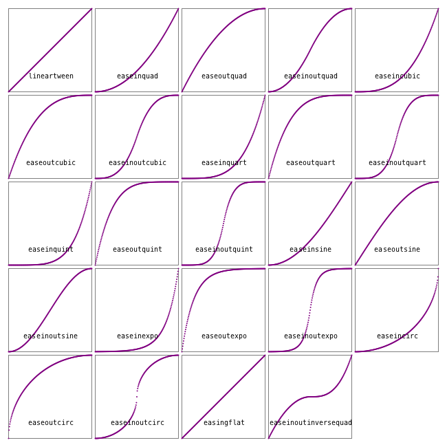
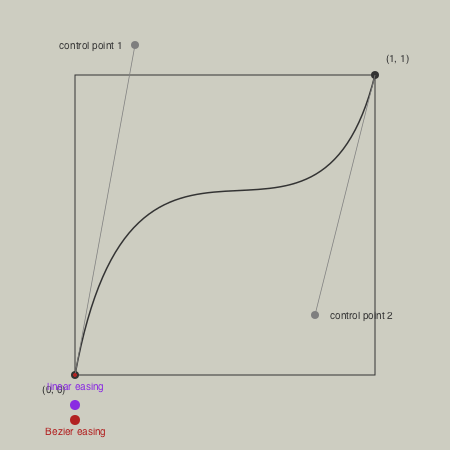

```@meta
DocTestSetup = quote
    using Luxor, Colors
    end
```
# Animation helper functions

Luxor provides some functions to help you create animations—at least, it provides some assistance in creating lots of individual frames that can later be stitched together to form a moving animation, such as a GIF or MP4.

There are four steps to creating an animation.

1 Use `Movie` to create a Movie object which determines the title and dimensions.

2 Define some functions that draw the graphics for specific frames.

3 Define one or more Scenes that call these functions for specific frames.

4 Call the `animate(movie::Movie, scenes)` function, passing in the scenes. This creates all the frames and saves them in a temporary directory. Optionally, you can ask for `ffmpeg` (if it's installed) to make an animated GIF for you.

## Example

```julia
demo = Movie(400, 400, "test")

function backdrop(scene, framenumber)
    background("black")
end

function frame(scene, framenumber)
    sethue(Colors.HSV(framenumber, 1, 1))
    eased_n = scene.easingfunction(framenumber, 0, 1, scene.framerange.stop)
    circle(polar(100, -π/2 - (eased_n * 2π)), 80, :fill)
    text(string("frame $framenumber of $(scene.framerange.stop)"),
        Point(O.x, O.y-190),
        halign=:center)
    text(scene.opts,
        boxbottomcenter(BoundingBox()),
        halign=:center,
        valign=:bottom)
end

animate(demo, [
    Scene(demo, backdrop, 0:359),
    Scene(demo, frame, 0:359,
        easingfunction=easeinoutcubic,
        optarg="made with Julia")
    ],
    creategif=true)
```


In this example, the movie uses two scenes, each specifying a function to draw frames from 0 to 359. For each frame numbered 0 to 359, the graphics are drawn by both the `backdrop` and `frame` functions, in that order. A drawing is automatically created (in PNG format) and centered ([`origin`](@ref)) so you can start drawing immediately. The [`finish`](@ref) function is automatically called when all the drawing functions in the scenes have completed, and the process starts afresh for the next frame. The second scene, calling the `frame` function, shows how you can pass optional information to the function.

## Making the animation

For best results, you'll have to learn how to use something like `ffmpeg`, with its hundreds of options, which include codec selection, framerate adjustment and color palette tweaking. The `creategif` option for the `animate` function makes an attempt at running `ffmpeg` and assumes that it's already installed. Inside [`animate`](@ref), the first pass creates a GIF color palette, the second builds the file:

```julia
run(`ffmpeg -f image2 -i $(tempdirectory)/%10d.png -vf palettegen
    -y $(seq.stitle)-palette.png`)

run(`ffmpeg -framerate 30 -f image2 -i $(tempdirectory)/%10d.png
    -i $(seq.stitle)-palette.png -lavfi paletteuse -y /tmp/$(seq.stitle).gif`)
```

Many movie editing programs, such as Final Cut Pro, will also let you import sequences of still images into a movie timeline.

### Passing information to the frame() function

If you want to pass information to the frame function, such as an array of values, try these:

```
function frame(scene, framenumber, datapoints)
...
end

somedata = Datapoints[...]

animate(demo, [
    Scene(demo, (s, f) -> frame(s, f, somedata),
        0:100,
        optarg=somedata)
    ],
    creategif=true,
    pathname="...")
```

## Easing functions

Transitions for animations often use non-constant and non-linear motions, and these are usually provided by *easing* functions. Luxor defines some of the basic easing functions and they're listed in the (unexported) array `Luxor.easingfunctions`. Each scene can have one easing function.

Most easing functions have names constructed like this:

```
ease[in|out|inout][expo|circ|quad|cubic|quart|quint]
```

and there's an [`easingflat`](@ref) linear transition.

```@example
using Luxor # hide
function draweasingfunction(f, pos, w, h)
    @layer begin
        translate(pos)
        setline(0.5)
        sethue("black")
        box(O, w, h, :stroke)
        sethue("purple")
        for i in 0:0.005:1.0
            circle(Point(-w/2, h/2) + Point(w * i, -f(i, 0, h, 1)), 1, :fill)
        end
        sethue("black")
        text(replace(string(f), "Luxor." => ""), Point(0, h/2 - 20), halign=:center)
    end
end

Drawing(650, 650, "../assets/figures/easingfunctions.png") # hide
background("white") # hide
origin() # hide
t = Tiler(650, 650, 5, 5)
margin=5
fontsize(10)
fontface("Menlo")
for (pos, n) in t
    n > length(Luxor.easingfunctions) && continue
    draweasingfunction(Luxor.easingfunctions[n], pos,
        t.tilewidth-margin, t.tileheight-margin)
end

finish() # hide
nothing # hide
```

In these graphs, the horizontal axis is time (between 0 and 1), and the vertical axis is the parameter value (between 0 and 1).



One way to use an easing function in a frame-making function is like this:

```julia
function moveobject(scene, framenumber)
    background("white")
    ...
    easedframenumber = scene.easingfunction(framenumber, 0, 1, scene.framerange.stop)
    ...
```

This takes the current frame number, compares it with the end frame number of the scene, then adjusts it.

In the next example, the purple dot has sinusoidal easing motion, the green has cubic, and the red has quintic. They all traverse the drawing in the same time, but have different accelerations and decelerations.


```julia
fastandfurious = Movie(400, 100, "easingtests")
backdrop(scene, framenumber) =  background("black")
function frame1(scene, framenumber)
    sethue("purple")
    eased_n = scene.easingfunction(framenumber, 0, 1, scene.framerange.stop)
    circle(Point(-180 + (360 * eased_n), -20), 10, :fill)
end
function frame2(scene, framenumber)
    sethue("green")
    eased_n = scene.easingfunction(framenumber, 0, 1, scene.framerange.stop)
    circle(Point(-180 + (360 * eased_n), 0), 10, :fill)
end
function frame3(scene, framenumber)
    sethue("red")
    eased_n = scene.easingfunction(framenumber, 0, 1, scene.framerange.stop)
    circle(Point(-180 + (360 * eased_n), 20), 10, :fill)
end
animate(fastandfurious, [
    Scene(fastandfurious, backdrop, 0:200),
    Scene(fastandfurious, frame1,   0:200, easingfunction=easeinsine),
    Scene(fastandfurious, frame2,   0:200, easingfunction=easeinoutcubic),
    Scene(fastandfurious, frame3,   0:200, easingfunction=easeinoutquint)
    ],
    creategif=true)
```

Here's the definition of one of the easing functions:

```
function easeoutquad(t, b, c, d)
    t /= d
    return -c * t * (t - 2) + b
end
```

Here:

- `t` is the current time (framenumber) of the transition

- `b` is the beginning value of the property

- `c` is the change between the beginning and destination value of the property

- `d` is the total length of the transition

The [`easeinoutbezier`](@ref) function accepts two additional arguments, two normalized control points of a normalized Bezier curve from Point(0, 0) to Point(1, 1). You can use these to define the shape of a custom easing transition. The Bezier curve's `y` coordinate determines the acceleration. [?]



|List of easing functions|
|:---	                 |
|easingflat|
|lineartween|
|easeinquad|
|easeoutquad|
|easeinoutquad|
|easeincubic|
|easeoutcubic|
|easeinoutcubic|
|easeinquart|
|easeoutquart|
|easeinoutquart|
|easeinquint|
|easeoutquint|
|easeinoutquint|
|easeinsine|
|easeoutsine|
|easeinoutsine|
|easeinexpo|
|easeoutexpo|
|easeinoutexpo|
|easeincirc|
|easeoutcirc|
|easeinoutcirc|
|easeinoutinversequad|
|easeinoutbezier|
