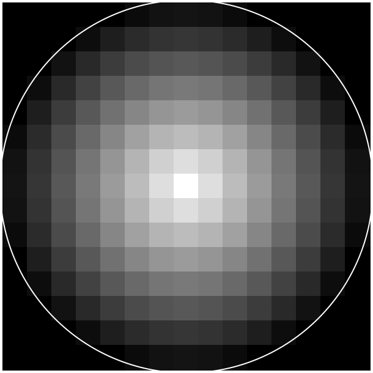
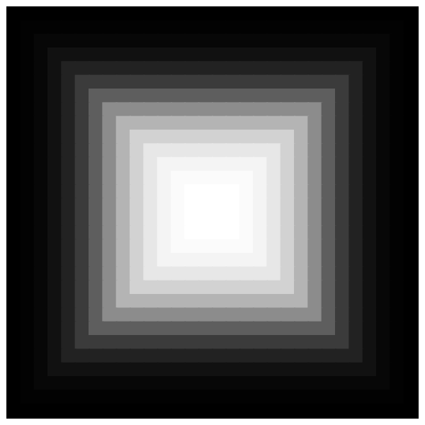

```@meta
DocTestSetup = quote
    using Luxor, Colors
    end
```
# Colors and styles

## Color and opacity

For color definitions and conversions, you can use
[Colors.jl](https://github.com/JuliaGraphics/Colors.jl).

[`setcolor`](@ref) and [`sethue`](@ref) will apply a single
solid or transparent color to new graphics.

[`setblend`](@ref) will apply a smooth transition between
two or more colors to new graphics.

[`setmesh`](@ref) will apply a color mesh to new graphics.

The difference between the [`setcolor`](@ref) and
[`sethue`](@ref) functions is that [`sethue`](@ref) doesn't
change alpha opacity (transparency), so you can change the
hue without changing the current alpha opacity
(transparency) value.

Named colors, such as "gold", or "lavender", can be found in
`Colors.color_names` dictionary.

```@example
using Luxor, Colors # hide
Drawing(800, 800, "../assets/figures/colors.svg") # hide

origin() # hide
background("white") # hide
fontface("AvenirNextCondensed-Regular") # hide
fontsize(8)
cols = sort(collect(Colors.color_names))
ncols = 15
nrows = convert(Int, ceil(length(cols) / ncols))
table = Table(nrows, ncols, 800/ncols, 800/nrows)
gamma = 2.2
for n in 1:length(cols)
    col = cols[n][1]
    r, g, b = sethue(col)
    box(table[n], table.colwidths[1], table.rowheights[1], action=:fill)
    luminance = 0.2126 * r^gamma + 0.7152 * g^gamma + 0.0722 * b^gamma
    (luminance > 0.5^gamma) ? sethue("black") : sethue("white")
    text(string(cols[n][1]), table[n], halign=:center, valign=:middle)
end
finish() # hide

nothing #hide
```


(To make the label stand out against the background, the
luminance is calculated, then used to choose the label's
color.)

## Line styles

There are `set-` functions for controlling subsequent lines'
width, end shape, join behavior, and dash pattern:

```@example
using Luxor # hide
Drawing(400, 250, "../assets/figures/line-ends.png") # hide
background("white") # hide
origin() # hide
translate(-100, -60) # hide
fontsize(18) # hide
for l in 1:3
    sethue("black")
    setline(20)
    setlinecap(["butt", "square", "round"][l])
    textcentred(["butt", "square", "round"][l], 80l, 80)
    setlinejoin(["round", "miter", "bevel"][l])
    textcentred(["round", "miter", "bevel"][l], 80l, 120)
    poly(ngon(Point(80l, 0), 20, 3, 0, vertices=true), action=:strokepreserve, close=false)
    sethue("white")
    setline(1)
    strokepath()
end
finish() # hide
nothing # hide
```


```@example
using Luxor # hide
Drawing(600, 250, "../assets/figures/dashes.png") # hide
background("white") # hide
origin() # hide
fontsize(14) # hide
sethue("black") # hide

patterns = ["solid", "dotted", "dot", "dotdashed", "longdashed",
  "shortdashed", "dash", "dashed", "dotdotdashed", "dotdotdotdashed"]
setline(12)

table = Table(fill(20, length(patterns)), [50, 300])
text.(patterns, table[:, 1], halign=:right, valign=:middle)

for p in 1:length(patterns)
    setdash(patterns[p])
    pt = table[p, 2]
    line(pt - (150, 0), pt + (150, 0), :stroke)
end
finish() # hide
nothing # hide
```


To define more complicated dash patterns, pass a vector to [`setdash`](@ref).

```julia
dashes = [50.0,  # ink
          10.0,  # skip
          10.0,  # ink
          10.0   # skip
          ]
setdash(dashes)
```

```@example
using Luxor # hide
Drawing(600, 180, "../assets/figures/moredashes.svg") # hide
background("white") # hide
origin() # hide
function dashing()
    fontsize(12) # hide
    sethue("black") # hide
    setline(8)
    setlinecap("butt")
    patterns = [10, 4, 50, 25, 14, 100]
    table = Table(fill(20, length(patterns)), [40, 325])
    for p in 1:length(patterns)
        setdash(patterns)
        pt = table[p, 2]
        text(string(patterns), table[p, 1], halign=:right, valign=:middle)        
        line(pt - (150, 0), pt + (200, 0), :stroke)
        patterns = circshift(patterns, 1)
        pop!(patterns)
    end
end

dashing()

finish() # hide
nothing # hide
```


Notice that odd-numbered patterns flip the ink and skip numbers each time through.

## Gradient blends

In Luxor, a blend is a smoothly changing color gradient.

Use [`setblend`](@ref) to select a blend in the same way
that you'd use [`setcolor`](@ref) and [`sethue`](@ref) to
select a solid color.

You can make linear or radial blends. Use [`blend`](@ref) in either case.

The current blend affects subsequent stroked and filled graphics.

To create a simple linear blend between two colors, supply two points and two colors to [`blend`](@ref):

```@example
using Luxor # hide
Drawing(600, 200, "../assets/figures/color-blends-basic.png") # hide
origin() # hide
background("white") # hide
orangeblue = blend(Point(-200, 0), Point(200, 0), "orange", "blue")
setblend(orangeblue)
box(O, 400, 100, action = :fill)
rulers()

translate(0, -70)
rule(O) # stroked line

finish() # hide
nothing # hide
```


And for a radial blend, provide two point/radius pairs and two colors:

```@example
using Luxor # hide
Drawing(600, 200, "../assets/figures/color-blends-radial.png") # hide
origin() # hide
background("white") # hide
greenmagenta = blend(Point(0, 0), 5, Point(0, 0), 150, "green", "magenta")
setblend(greenmagenta)
box(O, 400, 200, action = :fill)
rulers()
finish() # hide
nothing # hide
```


You can also use [`blend`](@ref) to create an empty blend. Then you use [`addstop`](@ref) to define the locations of specific colors along the blend, where `0` is the start, and `1` is the end.

```@example
using Luxor # hide
Drawing(600, 200, "../assets/figures/color-blends-scratch.png") # hide
origin() # hide
background("white") # hide
goldblend = blend(Point(-200, 0), Point(200, 0))
addstop(goldblend, 0.0,  "gold4")
addstop(goldblend, 0.25, "gold1")
addstop(goldblend, 0.5,  "gold3")
addstop(goldblend, 0.75, "darkgoldenrod4")
addstop(goldblend, 1.0,  "gold2")
setblend(goldblend)
box(O, 400, 200, action = :fill)
rulers()
finish() # hide
nothing # hide
```


When you define blends, the location of the x/y axes (eg the current workspace as defined by [`translate`](@ref), etc.), is important. In the first of the two following examples, the blend is selected before the axes are moved with `translate(pos)`. The blend 'samples' the original location of the blend's definition.

```@example
using Luxor # hide
Drawing(600, 200, "../assets/figures/color-blends-translate-1.png") # hide
origin() # hide
background("white") # hide
goldblend = blend(Point(0, 0), Point(200, 0))
addstop(goldblend, 0.0,  "gold4")
addstop(goldblend, 0.25, "gold1")
addstop(goldblend, 0.5,  "gold3")
addstop(goldblend, 0.75, "darkgoldenrod4")
addstop(goldblend, 1.0,  "gold2")
setblend(goldblend)
tiles = Tiler(600, 200, 1, 5, margin=10)
for (pos, n) in tiles
    gsave()
    setblend(goldblend)
    translate(pos)
    ellipse(O, tiles.tilewidth, tiles.tilewidth, action = :fill)
    grestore()
end
finish() # hide
nothing # hide
```


By default, outside the range of the original blend's definition, the same color is used, no matter how far away from the origin you go. But in the next example, the blend is relocated to the current axes, which have just been moved to the center of the tile. The blend refers to `0/0` each time, which is at the center of shape.

```@example
using Luxor # hide
Drawing(600, 200, "../assets/figures/color-blends-translate-2.png") # hide
origin() # hide
background("white") # hide
goldblend = blend(Point(0, 0), Point(200, 0))
addstop(goldblend, 0.0,  "gold4")
addstop(goldblend, 0.25, "gold1")
addstop(goldblend, 0.5,  "gold3")
addstop(goldblend, 0.75, "darkgoldenrod4")
addstop(goldblend, 1.0,  "gold2")
setblend(goldblend)
tiles = Tiler(600, 200, 1, 5, margin=10)
for (pos, n) in tiles
    gsave()
    translate(pos)
    setblend(goldblend)
    ellipse(O, tiles.tilewidth, tiles.tilewidth, action = :fill)
    grestore()
end
finish() # hide
nothing # hide
```


### Using [`blendadjust`](@ref)

You can use [`blendadjust`](@ref) to modify the blend so that objects scaled and positioned after the blend was defined are rendered correctly.

```@example
using Luxor # hide
Drawing(600, 250, "../assets/figures/blend-adjust.png") # hide
origin() # hide
background("white") # hide
setline(20)

# first line
blendgoldmagenta = blend(Point(-100, 0), Point(100, 0), "gold", "magenta")
setblend(blendgoldmagenta)
line(Point(-100, -50), Point(100, -50))
strokepath()

# second line
blendadjust(blendgoldmagenta, Point(50, 0), 0.5, 0.5)
line(O, Point(100, 0))
strokepath()

# third line
blendadjust(blendgoldmagenta, Point(-50, 50), 0.5, 0.5)
line(Point(-100, 50), Point(0, 50))
strokepath()

# fourth line
gsave()
translate(0, 100)
scale(0.5, 0.5)
setblend(blendgoldmagenta)
line(Point(-100, 0), Point(100, 0))
strokepath()
grestore()

finish() # hide
nothing # hide
```


The blend is defined to span 200 units, horizontally
centered at 0/0. The top line is also 200 units long and
centered horizontally at 0/0, so the blend is rendered
exactly as you'd hope.

The second line is only half as long, at 100 units, centered
at 50/0, so [`blendadjust`](@ref) is used to relocate the
blend's center to the point 50/0 and scale it by 0.5
(`100/200`).

The third line is also 100 units long, centered at -50/0, so
again [`blendadjust`](@ref) is used to relocate the blend's
center and scale it.

The fourth line shows that you can translate and scale the
axes instead of adjusting the blend, if you use
[`setblend`](@ref) again in the new scene.

### Blend extensions

Use `setblendextend()` to control what happens when the
shape you're drawing occupies an area larger than the blend
you're using. In this example, the four possible modes are
used to draw the same 150 unit radius circle using a much
smaller 30 unit radial blend that starts at orange, and
passes through green, to blue. If the blend is smaller than
the shape, then a mode of "none" won't fill the entire
shape, just the area inside the boundary of the blend.

```@example
using Luxor, Colors # hide

function drawcircle_with_mode(extendmode)
    setdash("dot")
    circle(O, 150, :stroke)
    a_blend = blend(O, 0,  O, 30, "orange", "midnightblue")
    addstop(a_blend, 0.5, "green")
    setblend(a_blend)
    setblendextend(a_blend, extendmode)    
    circle(O, 150, action = :fill)
    sethue("black")
    text(string(extendmode), Point(0, -tiles.tileheight/2), halign=:center)
end

d = Drawing(800, 800, :png) # hide
origin() # hide
background("grey40") # hide
tiles = Tiler(750, 750, 2, 2) # hide
fontsize(30) # hide

@layer begin
    translate(first(tiles[1]))
    drawcircle_with_mode("none")
end

@layer begin
    translate(first(tiles[2]))
    drawcircle_with_mode("repeat")
end

@layer begin
    translate(first(tiles[3]))
    drawcircle_with_mode("reflect")
end

@layer begin
    translate(first(tiles[4]))
    drawcircle_with_mode("pad")
end
finish() # hide
d # hide
```

## Compositing operators

Graphics software provides ways to modify how the virtual
"ink" is applied to previously-drawn graphic elements. In
PhotoShop and other software, the compositing process is
done using what are called [blend
modes](https://en.wikipedia.org/wiki/Blend_modes).

Use [`setmode`](@ref) to set the blending/compositing mode
of subsequent graphics.

The following examples place a blue circle with 0.7 opacity
on top of a red circle.

```@example
using Luxor # hide
d = Drawing(600, 600, :png) # hide
origin()
# transparent, no background
fontsize(15)
setline(1)
tiles = Tiler(600, 600, 4, 5, margin=30)
modes = length(Luxor.blendingmodes)
setcolor("black")
for (pos, n) in tiles
    n > modes && break
    gsave()
    translate(pos)
    box(O, tiles.tilewidth-10, tiles.tileheight-10, :clip)

    # calculate points for circles
    diag = (Point(-tiles.tilewidth/2, -tiles.tileheight/2),
            Point(tiles.tilewidth/2,  tiles.tileheight/2))
    upper = between(diag, 0.45)
    lower = between(diag, 0.55)

    # first red shape uses default blend operator
    setcolor(0.7, 0, 0, .7)
    circle(upper, tiles.tilewidth/4, action = :fill)

    # second blue shape shows results of blend operator
    setcolor(0, 0, 0.9, 0.7)
    blendingmode = Luxor.blendingmodes[mod1(n, modes)]
    setmode(blendingmode)
    circle(lower, tiles.tilewidth/4, action = :fill)

    clipreset()
    grestore()

    gsave()
    translate(pos)
    sethue("antiquewhite")
    txt = Luxor.blendingmodes[mod1(n, modes)]
    pos = O + (0, tiles.tilewidth/2)
    box(pos, textextents(txt)[3] + 5, 25, action = :fill)
    sethue("black")
    text(txt, pos, halign=:center, valign=:middle)
    grestore()
end
finish() # hide
d # hide
```

Notice in this example that clipping was used to restrict
the area affected by the blending process.

In Cairo, these blend modes are called *operators*. For a
more detailed explanation, refer to [the Cairo
documentation](https://www.cairographics.org/operators/).

You can access the list of modes with the unexported symbol
`Luxor.blendingmodes`.

## Meshes

A mesh provides smooth shading between three or four colors
across a region defined by lines or curves.

To create a mesh, use the [`mesh`](@ref) function and assign
the resulting mesh object to a variable. To use a mesh, pass
the mesh object variable to the [`setmesh`](@ref) function.

The [`mesh`](@ref) function accepts either an array of
Bézier paths or a polygon.

This basic example obtains a polygon from the drawing area
using `box(BoundingBox()...` and uses the four corners of
the mesh and the four colors in the array to build the mesh.
The [`paint`](@ref) function fills the drawing.

```@example
using Luxor, Colors # hide
Drawing(600, 600, "../assets/figures/mesh-basic.png") # hide
origin() # hide

garishmesh = mesh(
    box(BoundingBox(), vertices=true),
    ["purple", "green", "yellow", "red"])

setmesh(garishmesh)

paint()

setline(2)
sethue("white")
hypotrochoid(180, 81, 130, :stroke)
finish() # hide
nothing # hide
```


The next example uses a Bézier path conversion of a square
as the outline of the mesh. Because the box to be filled is
larger than the mesh's outlines, not all the box is filled.

```@example
using Luxor, Colors # hide
Drawing(600, 600, "../assets/figures/mesh1.png") # hide
origin() # hide
background("white") # hide
setcolor("grey50")
circle.([Point(x, y) for x in -200:25:200, y in -200:25:200], 10, action = :fill)

bp = makebezierpath(box(O, 300, 300, vertices=true), smoothing=.4)
setline(3)
sethue("black")

drawbezierpath(bp, :stroke)
mesh1 = mesh(bp, [
    Colors.RGBA(1, 0, 0, 1),   # bottom left, red
    Colors.RGBA(1, 1, 1, 0.0), # top left, transparent
    Colors.RGB(0, 0, 1),      # top right, blue
    Colors.RGB(1, 0, 1)        # bottom right, purple
    ])
setmesh(mesh1)
box(O, 500, 500, action = :fillpreserve)
sethue("grey50")
strokepath()

finish() # hide
nothing # hide
```


The second example uses a polygon defined by [`ngon`](@ref)
as the outline of the mesh. The mesh is drawn when the path
is stroked.

```@example
using Luxor # hide
Drawing(600, 600, "../assets/figures/mesh2.png") # hide
origin() # hide
background("white") # hide
pl = ngon(O, 250, 3, π/6, vertices=true)
mesh1 = mesh(pl, [
    "purple",
    "green",
    "yellow"
    ])
setmesh(mesh1)
setline(180)
poly(pl, :strokepreserve, close=true)
setline(5)
sethue("black")
strokepath()
finish() # hide
nothing # hide
```


So far these meshes have contained a single defined area - a
single 'patch'. It's possible to construct a mesh that
consists of more than one patch. The following example uses
[`add_mesh_patch`](@ref) to build a single mesh consisting of
100 smaller patches, which are placed next to each other but
don't always define the same colors at identical control
points.

```@example
using Luxor, Colors, Random # hide

d = Drawing(500, 500, :png) # hide
origin() # hide
Random.seed!(1) # hide
tiles = Tiler(500, 500, 10, 10, margin=0)

the_mesh = mesh(rect(first(tiles[1]), 10, 10), ["red"])

col1 = RGB(rand(), rand(), rand())
col2 = RGB(rand(), rand(), rand())
col3 = RGB(rand(), rand(), rand())
col4 = RGB(rand(), rand(), rand())
for (pos, n) in tiles
    bx = box(
        pos - (tiles.tilewidth/2, tiles.tileheight/2),
        pos + (tiles.tilewidth/2, tiles.tileheight/2),
        vertices = true)
    add_mesh_patch(the_mesh, bx,
        Random.shuffle!([col1, col2, col3, col4]))
end
setmesh(the_mesh)
paint()
finish() # hide
d # hide
```

The next example constructs a conical mesh from many
triangular patches, where each patch shows a different area
of the HSB color space. Any graphic drawn after `setmesh()`, such as the hypotrochoid, is drawn using the mesh.

```@example
using Luxor, Colors

@drawsvg begin
    radius = 300
    L = 300
    mesh1 = mesh([Point(0, 0), polar(radius, 0), polar(radius, 2π/100)], [RGBA(0, 0, 0, 0)])
    sethue("red")
    for θ in range(0, 2π, length=L)
        t = [O, O + polar(radius, θ), O + polar(radius, θ + 2π/L)]
        add_mesh_patch(mesh1, t,
            [
            HSB(rescale(θ, 0, 2π, 0, 360), 0.9, 1),
            HSB(rescale(θ, 0, 2π, 0, 360), 0.9, 1),
            HSB(rescale(θ, 0, 2π, 0, 360), 0.9, 1),
            ])
    end
    setmesh(mesh1)
    hypotrochoid(350, 155, 100, :stroke)
end
```

## Masks

A simple mask function lets you use a circular or
rectangular shape to control graphics that are drawn over
it. [`mask`](@ref) takes a position and a shape, and returns
a value between 0 and 1 for that position, depending on its
position relative to the shape.

In the first example, the gray color of each tile is
determined by its location relative to the center of the
masking circle `(O, bw/2)`; the value is `1.0` at the
center, and `0.0` at the circumference. The value could be
used to control opacity, shape, or anything else that is
relevant to graphics at a particular position.

```@example
using Luxor # hide
Drawing(610, 610, "../assets/figures/mask.png") # hide
origin() # hide
println("generating mask.png now...")
tiles = Tiler(600, 600, 15, 15, margin=0)
bw = boxwidth(BoundingBox())
for (pos, n) in tiles
    setgray(mask(pos, O, bw/2))
    box(pos, tiles.tilewidth, tiles.tileheight, action = :fillstroke)
end

sethue("white")
circle(O, bw/2, :stroke)
finish() # hide
nothing # hide
```



The second example uses the distance of each tile relative to the rectangle `O, bw, bw` to determine the gray color.

```@example
using Luxor # hide
Drawing(600, 600, "../assets/figures/mask1.png") # hide
origin() # hide

tiles = Tiler(600, 600, 30, 30)

bw = boxwidth(BoundingBox())
bh = boxheight(BoundingBox())
for (pos, n) in tiles
    mv = mask(pos, O, bw, bh, easingfunction=easeinoutcubic)
    setgray(mv)
    box(pos, tiles.tilewidth, tiles.tileheight, action = :fillstroke)
end

finish() # hide
nothing # hide
```


