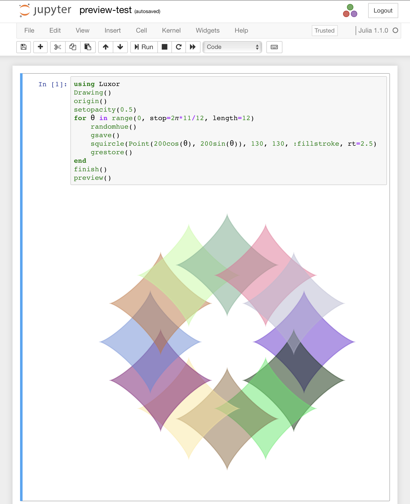
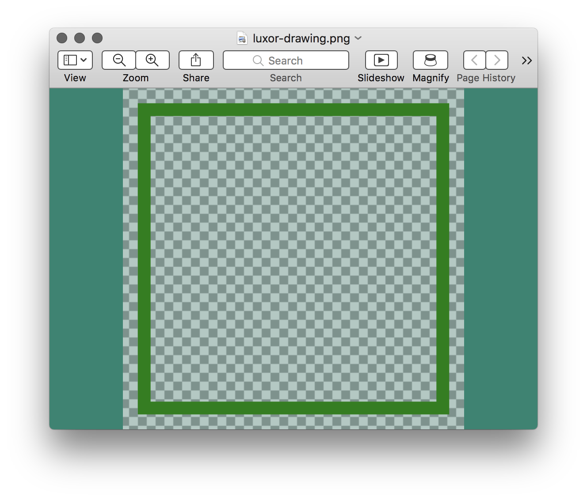
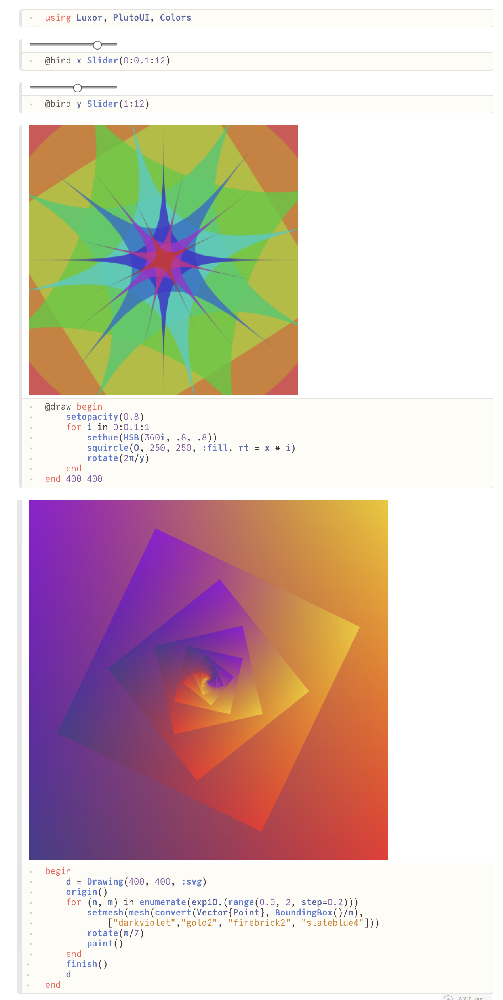
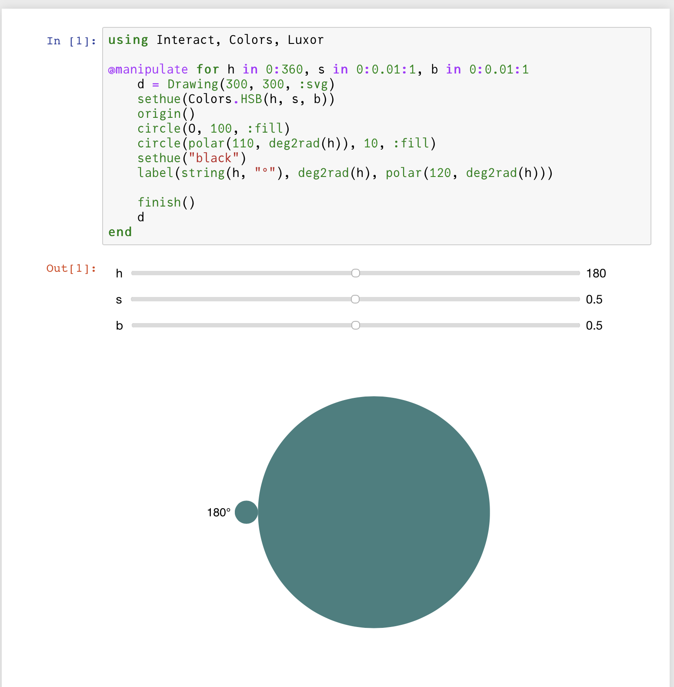

# Create a Drawing

In Luxor you always work with a current drawing, so the first thing to do is to create one.

To create a drawing, and optionally specify the filename, type, and dimensions, use the [`Drawing`](@ref) constructor function.

To finish a drawing and close the file, use [`finish`](@ref), and, if the drawing doesn't appear in your notebook, you can launch an external application to view it using [`preview`](@ref).

The `@draw`, `@svg`, `@png`, and `@pdf` macros are designed to let you quickly create graphics without having to provide the usual boiler-plate functions.

!!! note

    The macros are shortcuts, designed to make it quick and easy to get started. For full control over all parameters, use [`Drawing`](@ref).

## Drawings and files

To create a drawing, and optionally specify the filename, type, and dimensions, use the `Drawing` constructor function.

To finish a drawing and close the file, use [`finish`](@ref), and, to launch an external application to view it, use [`preview`](@ref).



If you're using Juno or VS Code, then PNG and SVG files should appear in the Plots pane. In a Pluto notebook, output appears above the cell. In a notebook environment, output appears in the next notebook cell.


!!! note

    SVGs are text based, and can get quite big. Up to a certain size, SVGs will be previewable as easily and quickly as PNGs. But very large drawings in SVG format won't necessarily  be displayed.

## Quick drawings with macros

The `@draw`, `@svg`, `@png`, and `@pdf` macros are designed to let you quickly create graphics without having to provide the usual boiler-plate functions. For example, the Julia code:

```julia
@svg circle(Point(0, 0), 20, :stroke) 50 50
```

expands to

```julia
Drawing(50, 50, "luxor-drawing-(timestamp).svg")
origin()
background("white")
sethue("black")
circle(Point(0, 0), 20, :stroke)
finish()
preview()
```

They're just short-cuts - designed to save a bit of typing. You can omit the width and height (thus defaulting to 600 by 600, except for `@imagematrix`), and you don't have to specify a filename (you'll get time-stamped files in the current working directory). For multiple lines, use either:

```julia
@svg begin
    setline(10)
    sethue("purple")
    circle(Point(0, 0), 20, :fill)
end
```

or (less nicely):

```julia
@svg (setline(10);
      sethue("purple");
      circle(Point(0, 0), 20, :fill)
     )
```

The `@draw` macro creates a PNG drawing in-memory (not saved in a file). You should see it displayed if you're working in a suitable environment (Juno, VSCode, Jupyter, Pluto). There's also a `@drawsvg` macro.

If you don't specify a size, the defaults are usually 600 by 600. If you don't specify a file name, files created with the macros are placed in your current working directory as `luxor-drawing-` followed by a time stamp. You don't even have to specify the suffix:

```
@svg juliacircles(150) 400 400 "test" # saves in "test.svg"
```

If you want to create drawings with transparent backgrounds, or use variables to specify filenames, you have to use the longer form, rather than the macros:

```julia
Drawing()
background(1, 1, 1, 0)
origin()
setline(30)
sethue("green") # assumes current opacity
box(BoundingBox() - 50, :stroke)
finish()
preview()
```



You can obtain the raw SVG code of a drawing using `@savesvg`.

## Drawings in memory

You can choose to store the drawing in memory. The advantage is that in-memory drawings are quicker, and can be passed as Julia data. It's useful in some environments to not have to worry about writing files. This syntax for the [`Drawing`](@ref) function:

```
Drawing(width, height, surfacetype, [filename])
```

lets you supply `surfacetype` as a symbol (`:svg` or `:png`). This creates a new drawing of the given surface type and stores the image only in memory if no `filename` is supplied. The `@draw` macro creates PNG files in memory.

You can specify `:image` as the surface type. This allows you to copy the current drawing into a 2D matrix (using [`image_as_matrix`](@ref)). See the Images chapter for more information.

Use [`svgstring`](@ref) to obtain the SVG source for a finished SVG drawing. If you're using a notebook environment such as Pluto...

## Interactive drawings

### Using Pluto

Pluto notebooks typically display the final result of a piece of code in a cell. So there are various ways you can organize your drawing code. For example:

```
using Luxor, PlutoUI, Colors

@bind x Slider(0:0.1:12)

@bind y Slider(1:12)

@draw begin
	setopacity(0.8)
	for i in 0:0.1:1
		sethue(HSB(360i, .8, .8))
		squircle(O, 50, 50, :fill, rt = x * i)
		rotate(2π/y)
	end
end 100 100
```

or

```
begin
    d = Drawing(800, 800, :svg)
    origin()
	for (n, m) in enumerate(exp10.(range(0.0, 2, step=0.2)))
		setmesh(mesh(convert(Vector{Point}, BoundingBox()/m),
			["darkviolet","gold2", "firebrick2", "slateblue4"]))
    	rotate(π/7)
    	paint()
	end
    finish()
	d
end
```



### Using Jupyter notebooks (IJulia and Interact)

Currently, you should use an in-memory SVG drawing to display graphics if you're using Interact.jl. This example provides an HSB color widget.

```julia
using Interact, Colors, Luxor
@manipulate for h in 0:360, s in 0:0.01:1, b in 0:0.01:1
    d = Drawing(300, 300, :svg)
    sethue(Colors.HSB(h, s, b))
    origin()
    circle(Point(0, 0), 100, :fill)  
    circle(polar(110, deg2rad(h)), 10, :fill)
    sethue("black")
    label(string(h, "°"), deg2rad(h), polar(120, deg2rad(h)))
        finish()
    d
end
```


