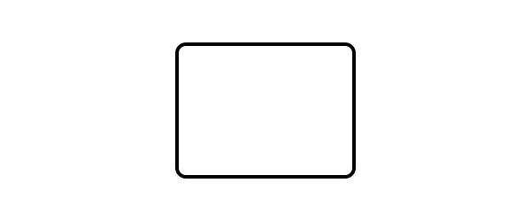
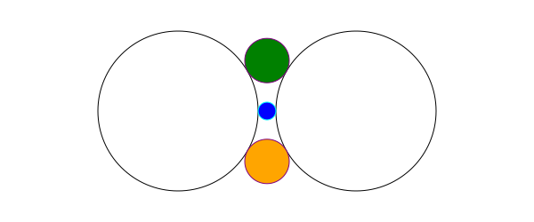
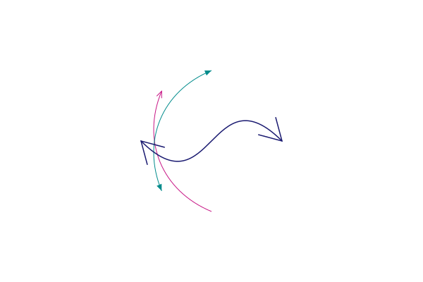
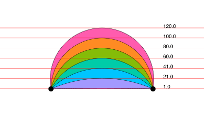
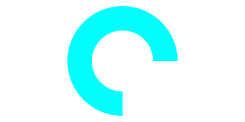
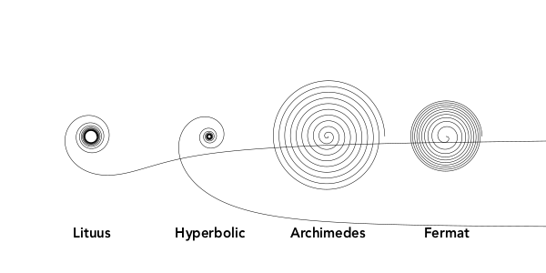
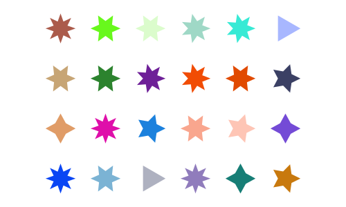
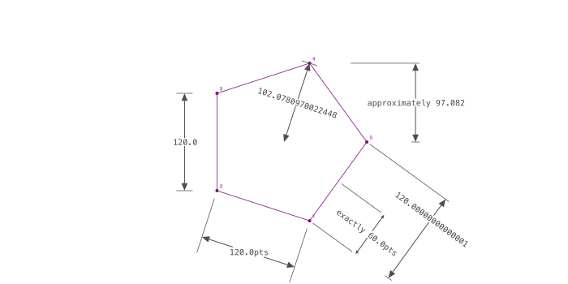
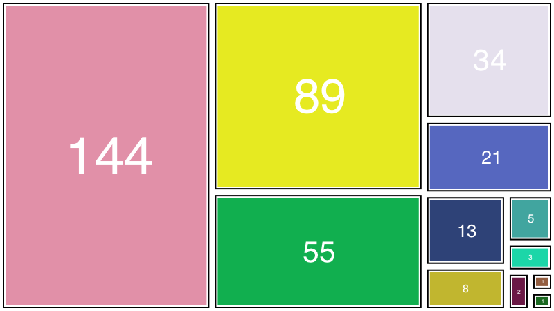

```@meta
DocTestSetup = quote
    using Luxor, Colors, Random
    end
```
# Simple graphics

In Luxor, there are different ways of working with graphical
items. You can either draw them immediately, ie place them
on the drawing, and they're then fixed. Or you can construct
geometric objects containing lists of points for further
processing. Watch out for a `vertices=true` option, which
returns coordinate data rather than drawing a shape.

## Rectangles and boxes

Simple rectangle and box shapes can be made in different ways.

```@example
using Luxor # hide
Drawing(800, 220, "../assets/figures/basicrects.png") # hide
background("antiquewhite") # hide
origin() # hide
rulers()
sethue("grey40")
rect(Point(0, 0), 100, 100, :stroke)
sethue("blue")
box(Point(0, 0), 100, 100, action=:stroke)
finish() # hide
nothing # hide
```


[`rect`](@ref) rectangles are positioned by a corner, a box made with [`box`](@ref) can be defined either by its center and dimensions, or by two opposite corners.

```@setup boxrect
using Luxor
d = @drawsvg begin
    background("antiquewhite")
    panes = Table(fill(100, 1), fill(200, 4))

    fontsize(14)
    fontface("JuliaMono-Bold")
    @layer begin
        translate(panes[1])
        p1 = Point(-70, -70)
        p2 = Point(70, 70)
        box(p1, p2, :stroke)
        text("box(p1, p2", boxbottomcenter(BoundingBox(box(O, 140, 140)) + (0, 20)), halign=:center)
        sethue("purple")
        circle.((p1, p2), 8, :fill)
        label.(["p1", "p2"], [:N, :S], [p1, p2], offset=20)
    end
    @layer begin
        translate(panes[2])
        p = Point(0, 0)
        box(p, 140, 140, :stroke)
        text("box(p, w, h", boxbottomcenter(BoundingBox(box(O, 140, 140)) + (0, 20)), halign=:center)
        sethue("purple")
        circle(p, 8, :fill)
        label("p", :S, p, offset=20)
        corners = box(BoundingBox(box(p, 140, 140))...)
        arrow(corners[2] + (0, -15), corners[3] + (0, -15), decorate = () -> text("w", O + (0, -10)))
        arrow(corners[2] + (-15, 0), corners[1] + (-15, 0), decorate = () -> text("h", O + (0, 10), angle=-π/2))                
    end
    @layer begin
        translate(panes[3])
        pt = Point(-70, -70)
        rect(pt, 140, 140, :stroke)
        text("rect(pt, w, h", boxbottomcenter(BoundingBox(box(O, 140, 140)) + (0, 20)), halign=:center)
        sethue("purple")
        circle(pt, 8, :fill)
        label("pt", :SE, pt, offset=20)
        corners = box(BoundingBox(box(O, 140, 140))...)
        arrow(corners[2] + (0, -15), corners[3] + (0, -15), decorate = () -> text("w", O + (0, -10)))
        arrow(corners[2] + (-15, 0), corners[1] + (-15, 0), decorate = () -> text("h", O + (0, 10), angle=-π/2))
    end
    @layer begin
        translate(panes[4])
        sethue("purple")
        s = star(O, 70, 5, 0.5, 0, :stroke)
        sethue("black")
        box(BoundingBox(s), :stroke)
        text("BoundingBox(poly...)", boxbottomcenter(BoundingBox(box(O, 140, 140)) + (0, 20)), halign=:center)
    end
end 800 250
```

```@example boxrect
d # hide
```

If you want the coordinates of the corners of a box, rather than draw one immediately, use:

```julia
box(centerpoint, width, height, vertices=true)
```

or

```julia
box(corner1,  corner2, vertices=true)
```    

[`box`](@ref) is also able to draw some of the other Luxor objects, such as BoundingBoxes and Table cells, and usually also returns the coordinates of the corners.

```julia
box(Point(0, 0), 100, 100)
```

```
4-element Array{Point,1}:
 Point(-50.0, 50.0)
 Point(-50.0, -50.0)
 Point(50.0, -50.0)
 Point(50.0, 50.0)
```

To draw a box/rectangle with rounded corners, supply one or
four values for corner radius.

```@example
using Luxor # hide
Drawing(800, 250, "../assets/figures/round-rect-1.png") # hide
origin() # hide
background("antiquewhite") # hide
setline(6)
sethue("black") # hide
box(O, 200, 150, 10, :stroke) # 1 value for all corners
sethue("purple")
box(O, 260, 220, [0, 15, 40, 80], :stroke) # different for each
finish() # hide
nothing # hide
```


Or you could smooth the sharp corners of a box, like so:

```@example
using Luxor # hide
Drawing(800, 250, "../assets/figures/round-rect.png") # hide
origin() # hide
background("antiquewhite") # hide
sethue("black") # hide
setline(4)
polysmooth(box(O, 200, 150, vertices=true), 10, :stroke)
finish() # hide
nothing # hide
```



The [`squircle`](@ref) function makes nicer shapes.

## Triangles, pentagons, and regular polygons

For regular polygons, pentagons, and so on, see the section on [Polygons and paths](@ref).

## Circles and ellipses

There are various ways to make circles, including by center and radius, or passing through two or three points:

```@example
using Luxor # hide
Drawing(800, 200, "../assets/figures/circles.png") # hide
background("antiquewhite") # hide

origin() # hide
setline(3) # hide
sethue("black")
p1 = Point(0, -50)
p2 = Point(100, 0)
p3 = Point(0, 65)
map(p -> circle(p, 4, :fill), [p1, p2, p3])
sethue("orange")
circle(center3pts(p1, p2, p3)..., :stroke)

sethue("red")
p1 = Point(0, 30)
p2 = Point(20, -40)
p3 = Point(50, 5)
circle.((p1, p2, p3), 3, :stroke)
circle(p1, p2, p3, :stroke)

finish() # hide
nothing # hide
```


The [`center3pts`](@ref) function returns the center position and radius of a circle passing through three points:

```@example
using Luxor, Random # hide
Drawing(800, 200, "../assets/figures/center3.png") # hide
background("antiquewhite") # hide
origin() # hide
setline(3) # hide
sethue("black")
p1 = Point(0, -50)
p2 = Point(100, 0)
p3 = Point(0, 65)
map(p -> circle(p, 4, :fill), [p1, p2, p3])
sethue("orange")
circle(center3pts(p1, p2, p3)..., :stroke)
finish() # hide
nothing # hide
```


With [`ellipse`](@ref) you can place ellipses and circles by defining the center point and the width and height.

```@example
using Luxor, Random # hide
Drawing(800, 300, "../assets/figures/ellipses.png") # hide
background("antiquewhite") # hide
fontsize(11) # hide
Random.seed!(1) # hide
origin() # hide
tiles = Tiler(500, 300, 5, 5)
width = 20
height = 25
for (pos, n) in tiles
    global width, height
    randomhue()
    ellipse(pos, width, height, :fill)
    sethue("black")
    label = string(round(width/height, digits=2))
    textcentered(label, pos.x, pos.y + 25)
    width += 2
end
finish() # hide
nothing # hide
```


[`ellipse`](@ref) can also construct polygons that are approximations to ellipses. You supply two focal points and a length which is the sum of the distances of a point on the perimeter to the two focii.

```@example
using Luxor, Random # hide
Drawing(800, 220, "../assets/figures/ellipses_1.png") # hide
origin() # hide
background("antiquewhite") # hide

Random.seed!(42) # hide
sethue("black") # hide
setline(1) # hide
fontface("Menlo")

f1 = Point(-100, 0)
f2 = Point(100, 0)

circle.([f1, f2], 3, :fill)

epoly = ellipse(f1, f2, 250, vertices=true)
poly(epoly, :stroke,  close=true)

pt = epoly[rand(1:end)]

poly([f1, pt, f2], :stroke)

label("f1", :W, f1, offset=10)
label("f2", :E, f2, offset=10)

label(string(round(distance(f1, pt), digits=1)), :SE, midpoint(f1, pt))
label(string(round(distance(pt, f2), digits=1)), :SW, midpoint(pt, f2))

label("ellipse(f1, f2, 250)", :S, Point(0, 75))

finish() # hide
nothing # hide
```


The advantage of this method is that there's a `vertices=true` option, allowing further scope for polygon manipulation.

```@example
using Luxor # hide
Drawing(800, 450, "../assets/figures/ellipses_2.png") # hide
origin() # hide
background("antiquewhite") # hide
sethue("gray30") # hide
setline(1) # hide
f1 = Point(-100, 0)
f2 = Point(100, 0)
ellipsepoly = ellipse(f1, f2, 170, :none, vertices=true)
[ begin
    setgray(rescale(c, 150, 1, 0, 1))
    poly(offsetpoly(ellipsepoly, c), close=true, :fill);
    rotate(π/20)
  end
     for c in 150:-10:1 ]
finish() # hide
nothing # hide
```


The [`ellipseinquad`](@ref) function constructs an ellipse that fits in a four-sided quadrilateral.

```@example
using Luxor # hide
Drawing(800, 600, "../assets/figures/ellipseinquad.png") # hide
origin() # hide
background("antiquewhite") # hide
sethue("gray30") # hide
setline(1) # hide

pg = ngon(O, 250, 6, π/6, vertices=true)

top = vcat(O, pg[[3, 4, 5]])
left = vcat(O, pg[[1, 2, 3]])
right = vcat(O, pg[[5, 6, 1]])
sethue("red")
poly(top, :fill, close=true)

sethue("green")
poly(left, :fill, close=true)

sethue("blue")
poly(right, :fill, close=true)

sethue("orange")
ellipseinquad.((top, left, right), :fill)

finish() # hide
nothing # hide
```


[`circlepath`](@ref) constructs a circular path from Bézier curves, which allows you to use circles as paths.

```@example
using Luxor # hide
Drawing(800, 250, "../assets/figures/circle-path.png") # hide
origin() # hide
background("antiquewhite") # hide
sethue("black") # hide
setline(4)
tiles = Tiler(600, 250, 1, 5)
for (pos, n) in tiles
    randomhue()
    circlepath(pos, tiles.tilewidth/2, :path)
    newsubpath()
    circlepath(pos, rand(5:tiles.tilewidth/2 - 1), :fill, reversepath=true)
end
finish() # hide
nothing # hide
```


## Circles and tangents

Functions to find tangents to circles include:

- [`pointcircletangent`](@ref) finds a point on a circle that lies on line through another point
- [`circlecircleoutertangents`](@ref) finds the points that lie on outer tangents to two circles
- [`circlecircleinnertangents`](@ref) finds the points that lie on inner tangents to two circles
- [`circletangent2circles`](@ref) makes circles of a particular radius tangential to two circles
- [`circlepointtangent`](@ref) makes circles of a particular radius passing through a point and tangential to another circle

```@example
using Luxor # hide
Drawing(800, 250, "../assets/figures/point-circle-tangents.png") # hide
origin() # hide
background("antiquewhite") # hide
setline(1) # hide
sethue("black") # hide


point = Point(-150, 0)
circlecenter = Point(150, 0)
circleradius = 80

circle.((point, circlecenter), 5, :fill)
circle(circlecenter, circleradius, :stroke)
pt1, pt2 = pointcircletangent(point, circlecenter, circleradius)
circle.((pt1, pt2), 5, :fill)

sethue("grey65")
rule(point, slope(point, pt1))
rule(point, slope(point, pt2))

finish() # hide
nothing # hide
```


```@example
using Luxor # hide
Drawing(800, 250, "../assets/figures/circle-circle-outer-tangents.png") # hide
origin() # hide
background("antiquewhite") # hide
setline(1) # hide
sethue("black") # hide

circle1center = Point(-150, 0)
circle1radius = 60
circle2center = Point(150, 0)
circle2radius = 80

circle.((circle1center, circle2center), 5, :fill)
circle(circle1center, circle1radius, :stroke)
circle(circle2center, circle2radius, :stroke)

p1, p2, p3, p4 = circlecircleoutertangents(
    circle1center, circle1radius,
    circle2center, circle2radius)

sethue("orange")
rule(p1, slope(p1, p2))
rule(p3, slope(p3, p4))

finish() # hide
nothing # hide
```


Finding the inner tangents requires a separate function.

```@example
using Luxor # hide
Drawing(800, 250, "../assets/figures/circle-circle-inner-tangents.png") # hide
origin() # hide
background("antiquewhite") # hide
setline(1) # hide
sethue("black") # hide

circle1center = Point(-150, 0)
circle1radius = 60
circle2center = Point(150, 0)
circle2radius = 80

circle.((circle1center, circle2center), 5, :fill)
circle(circle1center, circle1radius, :stroke)
circle(circle2center, circle2radius, :stroke)

p1, p2, p3, p4 = circlecircleinnertangents(
    circle1center, circle1radius,
    circle2center, circle2radius)

label.(("p1", "p2", "p3", "p4"), :n, (p1, p2, p3, p4))
sethue("orange")
rule(p1, slope(p1, p2))
rule(p3, slope(p3, p4))

sethue("purple")
circle.((p1, p2, p3, p4), 3, :fill)

finish() # hide
nothing # hide
```


[`circletangent2circles`](@ref) takes the required radius and two existing circles:

```@example
using Luxor # hide
Drawing(800, 250, "../assets/figures/circle-tangents.png") # hide
origin() # hide
background("antiquewhite") # hide
sethue("black") # hide
setline(1) # hide

circle1 = (Point(-100, 0), 90)
circle(circle1..., :stroke)
circle2 = (Point(100, 0), 90)
circle(circle2..., :stroke)

requiredradius = 25
ncandidates, p1, p2 = circletangent2circles(requiredradius, circle1..., circle2...)

if ncandidates==2
    sethue("orange")
    circle(p1, requiredradius, :fill)
    sethue("green")
    circle(p2, requiredradius, :fill)
    sethue("purple")
    circle(p1, requiredradius, :stroke)
    circle(p2, requiredradius, :stroke)
end

# the circles are 10 apart, so there should be just one circle
# that fits there

requiredradius = 10
ncandidates, p1, p2 = circletangent2circles(requiredradius, circle1..., circle2...)

if ncandidates==1
    sethue("blue")
    circle(p1, requiredradius, :fill)
    sethue("cyan")
    circle(p1, requiredradius, :stroke)
end

finish() # hide
nothing # hide
```



[`circlepointtangent`](@ref) looks for circles of a specified radius that pass through a point and are tangential to a circle. There are usually two candidates.

```@example
using Luxor # hide
Drawing(800, 250, "../assets/figures/circle-point-tangent.png") # hide
origin() # hide
background("antiquewhite") # hide
sethue("black") # hide
setline(1) # hide

circle1 = (Point(-100, 0), 90)
circle(circle1..., :stroke)

requiredradius = 50
requiredpassthrough = O + (80, 0)
ncandidates, p1, p2 = circlepointtangent(requiredpassthrough, requiredradius, circle1...)

if ncandidates==2
    sethue("orange")
    circle(p1, requiredradius, :stroke)
    sethue("green")
    circle(p2, requiredradius, :stroke)
end

sethue("black")
circle(requiredpassthrough, 4, :fill)

finish() # hide
nothing # hide
```


These last two functions can return 0, 1, or 2 points (since there are often two solutions to a specific geometric layout).

## Crescents

Use [`crescent`](@ref) to construct crescent shapes. There are two methods.
The first method allows the two arcs to have the same radius.
The second method allows the two arcs to share the same centers.

```@example
using Luxor # hide
Drawing(800, 500, "../assets/figures/crescents.png") # hide
background("antiquewhite") # hide
origin() # hide

# method 1: same radius, different centers

sethue("purple")
crescent(Point(-200, 0), 200, Point(-150, 0), 200, :fill)

# method 2: same center, different radii

sethue("orange")
crescent(O, 100, 200, :fill)

finish() # hide
nothing # hide
```


## Paths and positions

A path is a sequence of lines and curves. You can add lines and curves to the current path, then use [`closepath`](@ref) to join the last point to the first.

A path can have subpaths, created with[` newsubpath`](@ref), which can form holes.

There is a 'current position' which you can set with [`move`](@ref), and can use implicitly in functions like [`line`](@ref), [`rline`](@ref), [`rmove`](@ref), [`text`](@ref), [`newpath`](@ref), [`closepath`](@ref), [`arc`](@ref), and [`curve`](@ref).

There is a current point. Use [`currentpoint`](@ref) and [`hascurrentpoint`](@ref).

You can store a path for later use with [`storepath`](@ref) and draw it with [`drawpath`](@ref). See [Stored paths](@ref).

For more about paths, see [Polygons and paths](@ref) and [Paths versus polygons](@ref).

## Lines

Use [`line`](@ref) and [`rline`](@ref) to draw straight lines. `line(pt1, pt2, action)` draws a line between two points. `line(pt)` adds a line to the current path going from the current position to the point. `rline(pt)` adds a line relative to the current position.

You can use [`rule`](@ref) to draw a horizontal line through a point. Supply an angle for lines at an angle to the current x-axis.

```@example
using Luxor # hide
Drawing(800, 200, "../assets/figures/rule.png") # hide
background("antiquewhite") # hide
sethue("black") # hide
setline(0.5) # hide
y = 10
for x in 10 .^ range(0, length=100, stop=3)
    global y
    circle(Point(x, y), 2, :fill)
    rule(Point(x, y), -π/2, boundingbox=BoundingBox(centered=false))
    y += 2
end

finish() # hide
nothing # hide
```


Use the `boundingbox` keyword argument to crop the ruled lines with a BoundingBox.

```@example
using Luxor # hide
Drawing(800, 200, "../assets/figures/rulebbox.png") # hide
origin()
background("antiquewhite") # hide
sethue("black") # hide
setline(0.75) # hide
box(BoundingBox() * 0.9, :stroke)
for x in 10 .^ range(0, length=100, stop=3)
    rule(Point(x, 0), π/2,  boundingbox=BoundingBox() * 0.9)
    rule(Point(-x, 0), π/2, boundingbox=BoundingBox() * 0.9)
end
finish() # hide
nothing # hide
```


## Arrows

You can draw lines, arcs, and curves with arrows at the end with [`arrow`](@ref).

|type                            |function call                     |
|:---                            |:---                              |
| straight between two points    |arrow(pt, pt)                     |
| curved: radius + two angles    |arrow(pt, rad, θ1, θ2)            |
| Bezier 4 points                |arrow(pt1, pt2, pt3, pt4, action) |
| Bezier start finish + box      |arrow(pt1, pt2, [ht1, ht2])       |

For straight arrows, supply the start and end points. For arrows as circular arcs, you provide center, radius, and start and finish angles. You can optionally provide dimensions for the `arrowheadlength` and `arrowheadangle` of the tip of the arrow (angle in radians between side and center). The default line weight is 1.0, equivalent to `setline(1)`, but you can specify another.

```@example
using Luxor # hide
Drawing(800, 250, "../assets/figures/arrow.png") # hide
background("antiquewhite") # hide
origin() # hide
sethue("steelblue4") # hide
setline(2) # hide
arrow(Point(0, 0), Point(0, -65))
arrow(Point(0, 0), Point(100, -65), arrowheadlength=20, arrowheadangle=pi/4, linewidth=.3)
arrow(Point(0, 0), 100, π, π/2, arrowheadlength=25,   arrowheadangle=pi/12, linewidth=1.25)
finish() # hide
nothing # hide
```


If you provide four points, you can draw a Bézier curve with optional arrowheads at each end. Use the various options to control their presence and appearance.

```@example
using Luxor # hide
Drawing(800, 400, "../assets/figures/arrowbezier.png") # hide
background("antiquewhite") # hide
origin() # hide
setline(2) # hide
pts = ngon(Point(0, 0), 100, 8, vertices=true)
sethue("mediumvioletred")
arrow(pts[2:5]..., :stroke, startarrow=false, finisharrow=true)
sethue("cyan4")
arrow(pts[3:6]..., startarrow=true, finisharrow=true)
sethue("midnightblue")
arrow(pts[[4, 2, 6, 8]]..., :stroke,
    startarrow=true,
    finisharrow=true,
    arrowheadangle = π/6,
    arrowheadlength = 35,
    linewidth  = 1.5)
finish() # hide
nothing # hide
```


### Decoration

The [`arrow`](@ref) functions allow you to specify
decorations - graphics at one or more points somewhere along
the shaft. For example, say you want to draw a number and a
circle at the midpoint of an arrow's shaft, you can define a
function that draws text `t` in a circle of radius `r` like
this:

```
function marker(r, t)
    @layer begin
        sethue("purple")
        circle(Point(0, 0), r,  :fill)
        sethue("white")
        fontsize(30)
        text(string(t), halign=:center, valign=:middle)
    end
end
```

and then pass this to the `decorate` keyword argument of
`arrow`. By default, the graphics origin when the function
is called is placed at the midpoint (0.5) of the arrow's
shaft.

```@example
using Luxor # hide
Drawing(800, 400, "../assets/figures/arrowbezierdecoration.png") # hide
background("antiquewhite") # hide
origin() # hide
setline(2) # hide

function marker(r, t) #hide
    @layer begin #hide
        sethue("purple") #hide
        circle(Point(0, 0), r,  :fill) #hide
        sethue("white") #hide
        fontsize(25) #hide
        text(string(t), halign=:center, valign=:middle) #hide
    end #hide
end #hide

pts = ngon(Point(0, 0), 100, 5, vertices=true)

sethue("mediumvioletred")

# using an anonymous function
arrow(pts[1:4]..., decorate = () -> marker(10, 3))

sethue("olivedrab")

# no arrow, just a graphic, at 0.75
arrow(pts[1:4]...,
    decorate = () ->
        ngon(Point(0, 0), 20, 4, 0, :fill),
    decoration = 0.75, :none)

finish() # hide
nothing # hide
```


Use the `decoration` keyword to specify one or more
locations other than the default 0.5.

The graphics environment provided by the `decorate` function
is centered at each decoration point in turn, and rotated to
the slope of the shaft at that point.

```@example
using Luxor

function fletcher()
    line(O, polar(30, deg2rad(220)), :stroke)
    line(O, polar(30, deg2rad(140)), :stroke)
end

@drawsvg begin
    background("antiquewhite")
        arrow(O, 150, 0, π + π/3,
            linewidth=5,
            arrowheadlength=50,
            decorate=fletcher,
            decoration=range(0., .1, length=3))
end 800 350
```

### Custom arrowheads

To make custom arrowheads, you can define a three-argument
function that draws them to your own design. This function
takes:

- the point at the end of the arrow's shaft

- the point where the tip of the arrowhead would be

- the angle of the shaft at the end

You can then use any code to draw the arrow. Pass this
function to the [`arrow`](@ref) function's
`arrowheadfunction` keyword.

```@example
using Luxor # hide

function redbluearrow(shaftendpoint, endpoint, shaftangle)
    @layer begin
        sethue("red")
        sidept1 = shaftendpoint  + polar(10, shaftangle + π/2 )
        sidept2 = shaftendpoint  - polar(10, shaftangle + π/2)
        poly([sidept1, endpoint, sidept2], action=:fill)
        sethue("blue")
        poly([sidept1, endpoint, sidept2], action=:stroke, close=false)
    end
end

@drawsvg begin
    background("antiquewhite")
    arrow(O, O + (120, 120),
        linewidth=4,
        arrowheadlength=40,
        arrowheadangle=π/7,
        arrowheadfunction = redbluearrow)

    arrow(O, 100, 3π/2, π,
        linewidth=4,
        arrowheadlength=20,
        clockwise=false,arrowheadfunction=redbluearrow)
end 800 250
```

## Arcs and curves

There are a few standard arc-drawing commands, such as
[`curve`](@ref), [`arc`](@ref), [`carc`](@ref), and
[`arc2r`](@ref). Because these are often used when building
complex paths, they usually add arc sections to the current
path. To construct a sequence of lines and arcs, use the
`:path` action, followed by a final `:stroke` or similar.

[`curve`](@ref) constructs Bézier curves from control points:

```@example
using Luxor # hide
Drawing(800, 275, "../assets/figures/curve.png") # hide
origin() # hide
background("antiquewhite") # hide

sethue("black") # hide

setline(.5)
pt1 = Point(0, -125)
pt2 = Point(200, 125)
pt3 = Point(200, -125)

label.(string.(["O", "control point 1", "control point 2", "control point 3"]),
    :e,
    [O, pt1, pt2, pt3])

sethue("red")
map(p -> circle(p, 4, action=:fill), [O, pt1, pt2, pt3])

line(Point(0, 0), pt1, action=:stroke)
line(pt2, pt3, :stroke)

sethue("black")
setline(3)

# start a path
move(Point(0, 0))
curve(pt1, pt2, pt3) #  add to current path
strokepath()

finish()  # hide
nothing # hide
```


[`arc2r`](@ref) draws a circular arc centered at a point
that passes through two other points:

```@example
using Luxor, Random # hide
Drawing(800, 200, "../assets/figures/arc2r.png") # hide
origin() # hide
Random.seed!(42) # hide
background("antiquewhite") # hide
tiles = Tiler(700, 200, 1, 6)
for (pos, n) in tiles
    c1, pt2, pt3 = ngon(pos, rand(10:50), 3, rand(0:pi/12:2pi), vertices=true)
    sethue("black")
    map(pt -> circle(pt, 4, :fill), [c1, pt3])
    sethue("red")
    circle(pt2, 4, :fill)
    randomhue()
    arc2r(c1, pt2, pt3, :stroke)
end
finish() # hide
nothing # hide
```


[`arc2sagitta`](@ref) and [`carc2sagitta`](@ref) make
circular arcs based on two points and the
[sagitta](https://en.wikipedia.org/wiki/Sagitta_(geometry)).

```@example
using Luxor, Colors # hide
Drawing(800, 250, "../assets/figures/arc2sagitta.svg") # hide
origin() # hide
background("antiquewhite") # hide
setline(.5) # hide
translate(0, 50) # hide
pt1 = Point(-100, 0)
pt2 = Point(100, 0)
for n in reverse(range(1, length=7, stop=120))
    sethue("red")
    rule(Point(0, -n))
    sethue(LCHab(70, 80, rescale(n, 120, 1, 0, 359)))
    pt, r = arc2sagitta(pt1, pt2, n, :fillpreserve)
    sethue("black")
    strokepath()
    text(string(round(n)), O + (120, -n))
end
circle.((pt1, pt2), 5, :fill)
finish() # hide
nothing # hide
```



## More curved shapes: sectors, spirals, and squircles

A sector (technically an "annular sector") has an inner and outer radius, as well as start and end angles.

```@example
using Luxor # hide
Drawing(800, 200, "../assets/figures/sector.png") # hide
background("antiquewhite") # hide
origin() # hide
sethue("tomato")
sector(50, 90, π/2, 0, action=:fill)
sethue("olive")
sector(Point(O.x + 200, O.y), 50, 90, 0, π/2, action=:fill)
finish() # hide
nothing # hide
```



You can also supply a value for a corner radius. The same sector is drawn but with rounded corners.

```@example
using Luxor # hide
Drawing(800, 200, "../assets/figures/sectorrounded.png") # hide
background("antiquewhite") # hide
origin() # hide
sethue("tomato")
sector(50, 90, π/2, 0, 15, :fill)
sethue("olive")
sector(Point(O.x + 200, O.y), 50, 90, 0, π/2, 15, :fill)
finish() # hide
nothing # hide
```


A pie (or wedge) has start and end angles.

```@example
using Luxor # hide
Drawing(800, 300, "../assets/figures/pie.png") # hide
background("antiquewhite") # hide
origin() # hide
sethue("magenta") # hide
pie(0, 0, 100, π/2, π, :fill)
finish() # hide
nothing # hide
```


To construct spirals, use the [`spiral`](@ref) function. These can be drawn directly, or used as polygons. The default is to draw Archimedean (non-logarithmic) spirals.

```@example
using Luxor # hide
Drawing(800, 300, "../assets/figures/spiral.png") # hide
background("antiquewhite") # hide
origin() # hide
sethue("black") # hide
setline(.5) # hide
fontface("Avenir-Heavy") # hide
fontsize(15) # hide

spiraldata = [
  (-2, "Lituus",      50),
  (-1, "Hyperbolic", 100),
  ( 1, "Archimedes",   1),
  ( 2, "Fermat",       5)]

grid = GridRect(O - (200, 0), 130, 50)

for aspiral in spiraldata
    @layer begin
        translate(nextgridpoint(grid))
        spiral(last(aspiral), first(aspiral), period=20π, :stroke)
        label(aspiral[2], :S, offset=100)
    end
end

finish() # hide
nothing # hide
```



Use the `log=true` option to draw logarithmic (Bernoulli or Fibonacci) spirals.

```@example
using Luxor # hide
Drawing(800, 400, "../assets/figures/spiral-log.png") # hide
background("antiquewhite") # hide
origin() # hide
setline(.5) # hide
sethue("black") # hide
fontface("Avenir-Heavy") # hide
fontsize(15) # hide

spiraldata = [
    (10,  0.05),
    (4,   0.10),
    (0.5, 0.17)]

grid = GridRect(O - (200, 0), 175, 50)
for aspiral in spiraldata
    @layer begin
        translate(nextgridpoint(grid))
        spiral(first(aspiral), last(aspiral), log=true, period=10π, :stroke)
        label(string(aspiral), :S, offset=100)
    end
end

finish() # hide
nothing # hide
```

Modify the `stepby` and `period` parameters to taste, or collect the vertices for further processing.


A *squircle* is a cross between a square and a circle. You can adjust the squariness and circularity of it to taste by supplying a value for the root (keyword `rt`):

```@example
using Luxor # hide
Drawing(800, 250, "../assets/figures/squircle.png") # hide
background("antiquewhite") # hide
origin() # hide
fontsize(20) # hide
setline(2)
tiles = Tiler(600, 250, 1, 3)
for (pos, n) in tiles
    sethue("lavender")
    squircle(pos, 80, 80, rt=[0.3, 0.5, 0.7][n], :fillpreserve)
    sethue("grey20")
    strokepath()
    textcentered("rt = $([0.3, 0.5, 0.7][n])", pos)
end
finish() # hide
nothing # hide
```


## Stars and crosses

Use [`star`](@ref) to make a star. You can draw it immediately, or use the points it can create.

```@example
using Luxor # hide
Drawing(800, 300, "../assets/figures/stars.png") # hide
background("antiquewhite") # hide
origin() # hide
tiles = Tiler(400, 300, 4, 6, margin=5)
for (pos, n) in tiles
    randomhue()
    star(pos, tiles.tilewidth/3, rand(3:8), 0.5, 0, :fill)
end
finish() # hide
nothing # hide
```



The `ratio` determines the length of the inner radius compared with the outer.

```@example
using Luxor # hide
@drawsvg begin # hide
background("antiquewhite") # hide
fontsize(10) # hide
tiles = Tiler(800, 250, 1, 6, margin=10)
sethue("black") # hide
for (pos, n) in tiles
    s = star(pos, tiles.tilewidth/2, 5, 1/n, 0, :stroke)
    l2 = distance(pos, s[1])
    l1 = distance(pos, s[2])
    text(string(round(l1/l2, digits=2)), pos, halign=:center)
end
end 800 200 # hide
```

Use [`polycross`](@ref) to draw a cross-shaped polygon.

```@example
using Luxor # hide
Drawing(800, 600, "../assets/figures/polycross.png") # hide
origin() # hide
background("antiquewhite") # hide
sethue("black") # hide
setline(2) # hide
tiles = Tiler(600, 600, 4, 4, margin=10)
for (pos, n) in tiles
    randomhue()
    polycross(pos, min(tiles.tileheight/3, tiles.tilewidth/3),
        n + 2, # number of points
        rescale(n, 1, length(tiles), 0.9, 0.1), # ratio
        0, # orientation
        action=:fill)
end
finish() # hide
nothing # hide
```


## Stored paths

It's possible to store the current path in a Path object. For example, this code:

```
fontsize(160)
fontface("Bodoni-Poster")
textpath("†", O, halign=:center, valign=:middle)
dagger = storepath()
```

stores the instructions to buld the current path (which describe the dagger symbol) in `dagger`.

The `dagger` is a Luxor Path type, and contains:

```
PathMove(Point(2.0, 90.5625)),
PathCurve(Point(4.08203125, 68.16015625), Point(11.28125, 45.28125), Point(24.8828125, 26.40234375)),
PathCurve(Point(17.51953125, 22.87890625), Point(2.0, 14.71875), Point(2.0, 5.12109375)),
PathCurve(Point(2.0, 2.5625), Point(3.12109375, 0.640625), Point(5.83984375, 0.640625)),
PathCurve(Point(12.8828125, 0.640625), Point(11.6015625, 14.2421875), Point(26.16015625, 14.2421875)),
PathCurve(Point(35.76171875, 14.2421875), Point(42.0, 7.83984375), Point(42.0, -1.59765625)),
PathCurve(Point(42.0, -10.3984375), Point(34.9609375, -17.4375), Point(26.16015625, -17.4375)),
PathCurve(Point(10.9609375, -17.4375), Point(13.04296875, -3.6796875), Point(6.48046875, -3.6796875)),
PathCurve(Point(3.6015625, -3.6796875), Point(1.83984375, -6.3984375), Point(1.83984375, -9.12109375)),
PathCurve(Point(1.83984375, -14.3984375), Point(12.2421875, -23.6796875), Point(15.44140625, -26.87890625)),
PathCurve(Point(18.640625, -30.078125), Point(19.76171875, -34.3984375), Point(19.76171875, -38.71875)),
PathCurve(Point(19.76171875, -49.7578125), Point(10.9609375, -56.640625), Point(0.40234375, -56.640625)),
PathCurve(Point(-11.1171875, -56.640625), Point(-19.91796875, -49.7578125), Point(-19.91796875, -38.71875)),
PathCurve(Point(-19.91796875, -34.3984375), Point(-18.80078125, -30.078125), Point(-15.59765625, -26.87890625)),
PathCurve(Point(-12.3984375, -23.6796875), Point(-2.0, -14.3984375), Point(-2.0, -9.12109375)),
PathCurve(Point(-2.0, -6.3984375), Point(-3.7578125, -3.6796875), Point(-6.640625, -3.6796875)),
PathCurve(Point(-13.19921875, -3.6796875), Point(-11.1171875, -17.4375), Point(-26.3203125, -17.4375)),
PathCurve(Point(-35.1171875, -17.4375), Point(-42.16015625, -10.3984375), Point(-42.16015625, -1.59765625)),
PathCurve(Point(-42.16015625, 7.83984375), Point(-35.91796875, 14.2421875), Point(-26.3203125, 14.2421875)),
PathCurve(Point(-11.7578125, 14.2421875), Point(-13.0390625, 0.640625), Point(-6.0, 0.640625)),
PathCurve(Point(-3.27734375, 0.640625), Point(-2.16015625, 2.5625), Point(-2.16015625, 5.12109375)),
PathCurve(Point(-2.16015625, 14.71875), Point(-17.6796875, 22.87890625), Point(-25.0390625, 26.40234375)),
PathCurve(Point(-11.4375, 45.28125), Point(-4.23828125, 68.16015625), Point(-2.16015625, 90.5625)),
PathClose(),
PathMove(Point(48.87890625, 56.640625))
```

You can draw this later:

```@setup gpath
using Luxor
d = @drawsvg begin
    dagger  = Path([
         PathMove(Point(2.0, 90.5625)),
         PathCurve(Point(4.08203125, 68.16015625), Point(11.28125, 45.28125), Point(24.8828125, 26.40234375)),
         PathCurve(Point(17.51953125, 22.87890625), Point(2.0, 14.71875), Point(2.0, 5.12109375)),
         PathCurve(Point(2.0, 2.5625), Point(3.12109375, 0.640625), Point(5.83984375, 0.640625)),
         PathCurve(Point(12.8828125, 0.640625), Point(11.6015625, 14.2421875), Point(26.16015625, 14.2421875)),
         PathCurve(Point(35.76171875, 14.2421875), Point(42.0, 7.83984375), Point(42.0, -1.59765625)),
         PathCurve(Point(42.0, -10.3984375), Point(34.9609375, -17.4375), Point(26.16015625, -17.4375)),
         PathCurve(Point(10.9609375, -17.4375), Point(13.04296875, -3.6796875), Point(6.48046875, -3.6796875)),
         PathCurve(Point(3.6015625, -3.6796875), Point(1.83984375, -6.3984375), Point(1.83984375, -9.12109375)),
         PathCurve(Point(1.83984375, -14.3984375), Point(12.2421875, -23.6796875), Point(15.44140625, -26.87890625)),
         PathCurve(Point(18.640625, -30.078125), Point(19.76171875, -34.3984375), Point(19.76171875, -38.71875)),
         PathCurve(Point(19.76171875, -49.7578125), Point(10.9609375, -56.640625), Point(0.40234375, -56.640625)),
         PathCurve(Point(-11.1171875, -56.640625), Point(-19.91796875, -49.7578125), Point(-19.91796875, -38.71875)),
         PathCurve(Point(-19.91796875, -34.3984375), Point(-18.80078125, -30.078125), Point(-15.59765625, -26.87890625)),
         PathCurve(Point(-12.3984375, -23.6796875), Point(-2.0, -14.3984375), Point(-2.0, -9.12109375)),
         PathCurve(Point(-2.0, -6.3984375), Point(-3.7578125, -3.6796875), Point(-6.640625, -3.6796875)),
         PathCurve(Point(-13.19921875, -3.6796875), Point(-11.1171875, -17.4375), Point(-26.3203125, -17.4375)),
         PathCurve(Point(-35.1171875, -17.4375), Point(-42.16015625, -10.3984375), Point(-42.16015625, -1.59765625)),
         PathCurve(Point(-42.16015625, 7.83984375), Point(-35.91796875, 14.2421875), Point(-26.3203125, 14.2421875)),
         PathCurve(Point(-11.7578125, 14.2421875), Point(-13.0390625, 0.640625), Point(-6.0, 0.640625)),
         PathCurve(Point(-3.27734375, 0.640625), Point(-2.16015625, 2.5625), Point(-2.16015625, 5.12109375)),
         PathCurve(Point(-2.16015625, 14.71875), Point(-17.6796875, 22.87890625), Point(-25.0390625, 26.40234375)),
         PathCurve(Point(-11.4375, 45.28125), Point(-4.23828125, 68.16015625), Point(-2.16015625, 90.5625)),
         PathClose(),
         PathMove(Point(48.87890625, 56.640625))
        ])
end 800 250
```

```@example gpath
@drawsvg begin # hide
background("antiquewhite")  # hide
sethue("black") # hide
for θ in range(0, step=2π/10, length=10)
    @layer begin
        rotate(θ)
        translate(150, 0)
        rotate(π/2)
        drawpath(dagger, :fill)
    end
end
end # hide
```

## Julia logos

A couple of functions in Luxor provide you with instant access to the Julia logo, and the three colored circles:

```@example
using Luxor, Random # hide
Drawing(800, 300, "../assets/figures/julia-logo.png")  # hide
Random.seed!(42) # hide
origin()  # hide
background("antiquewhite") # hide

cells = Table([300], [350, 350])

@layer begin
    translate(cells[1])
    translate(-165, -114)
    rulers()
    julialogo()
end

@layer begin
    translate(cells[2])
    translate(-165, -114)
    rulers()
    julialogo(action=:clip)
    for i in 1:500
        @layer begin
            translate(rand(0:400), rand(0:250))
            juliacircles(10)
        end
    end
    clipreset()
    end

finish() # hide
nothing # hide
```


## Hypotrochoids

[`hypotrochoid`](@ref) makes hypotrochoids. The result is a polygon. You can either draw it directly, or pass it on for further polygon fun, as here, which uses [`offsetpoly`](@ref) to trace round it a few times.

```@example
using Luxor # hide
Drawing(800, 300, "../assets/figures/hypotrochoid.png")  # hide
origin()
background("grey15")
sethue("antiquewhite")
setline(1)
p = hypotrochoid(100, 25, 55, :stroke, stepby=0.01, vertices=true)
for i in 0:3:15
    poly(offsetpoly(p, i), :stroke, close=true)
end
finish() # hide
nothing # hide
```


There's a matching [`epitrochoid`](@ref) function.

## Ticks

The [`tickline`](@ref) function lets you divide the space
between two points by drawing ‘ticks’, short parallel lines
positioned equidistant between the two points.

In its simplest form the function can used to draw basic
number lines, complete with automatic text labels.

```@example
using Luxor # hide
@drawsvg begin # hide
background("antiquewhite")

# major defaults to 1
tickline(Point(-350, -100), Point(350, -100))

# three major ticks inserted
tickline(Point(-350, 0), Point(350, 0),
    major=3,
    startnumber=0, finishnumber=100)

# four minor ticks inserted between each major
tickline(Point(-350, 100), Point(350, 100), major=3, minor=4)

end 800 350  # hide
```

The function returns the positions of the generated ticks in
two arrays of points - the locations of the major and minor
ticks.

The spaced positions (linear or logarithmic) are useful even
when you switch off the display of text using
`vertices=true`, which just returns vertices.

```@example
using Luxor # hide
@drawsvg begin # hide
background("antiquewhite") # hide

# no axis
tickline(Point(-350, -100), Point(350, -100), minor=9, axis=false)

# logarithmic
majticks, minticks = tickline(Point(-350, 0), Point(350, 0),
    major=9,
    startnumber=1,
    finishnumber=10,
    log=true,
    vertices=false)

# just the vertices
majticks, minticks = tickline(Point(-350, 100), Point(350, 100),
    major=9,
    minor=4,
    log=true,
    axis=false,
    vertices=true)
circle.(majticks, 5, :fill)
box.(minticks, 1, 25, :fill)
end 800 350  # hide
```

You can pass a function that generates custom graphics and text for each tick.

```@example
using Luxor, Colors # hide
function color_temp(n, pos;
          startnumber  = 0,
          finishnumber = 1,
          nticks = 1)
    k = rescale(n, 0, nticks - 1, startnumber, finishnumber)
    sethue(RGB(colormatch(k)))
    circle(pos, 20, :fillpreserve)
    sethue("white")
    strokepath()
    text("$(convert(Int, floor(k))) nm", pos - (0, 30), halign=:left, angle=-π/4)
end

@drawsvg begin # hide
background("black") # hide
fontsize(16) # hide
tickline(Point(-350, 0), Point(350, 0),
    startnumber=350,
    finishnumber=750,
    major=10,
    major_tick_function=color_temp)
end 800 300 # hide
```

Sometimes you just want a sequence of spaced points.

```@example
using Luxor, Colors # hide

_, minticks = tickline(Point(-400, 0), Point(260, 0),
        major=0, minor=40,
        log=true,
        axis=false,
        vertices=true)

@drawsvg begin # hide
background("black") # hide
for (n, pt) in enumerate(minticks)
    k = rescale(n, 1, length(minticks), 0, 1)
    sethue(LCHab(60, 100, 360k))
    setline(1/k)
    wave = [pt + Point(120k * sin(y), 600/2π * y) for y in -π:π/20:π]
    poly(wave, :stroke)
end

end 800 600  # hide
```

## Cropmarks

If you want cropmarks (aka trim marks), use the [`cropmarks`](@ref) function, supplying the centerpoint, followed by the width and height:

    cropmarks(O, 1200, 1600)
    cropmarks(O, paper_sizes["A0"]...)

```@example
using Luxor # hide
Drawing(800, 250, "../assets/figures/cropmarks.png")  # hide
origin() # hide
background("antiquewhite") # hide
sethue("red")
box(O, 150, 150, :stroke)
cropmarks(O, 150, 150)
finish() # hide
nothing # hide
```


## Dimensioning

Simple dimensioning graphics can be generated with [`dimension`](@ref). To convert from the default unit (PostScript points), or to modify the dimensioning text, supply a function to the `format` keyword argument.



```@example
using Luxor # hide
Drawing(800, 350, "../assets/figures/dimensioning.svg")  # hide
origin() # hide
background("antiquewhite") # hide
setline(0.75)
sethue("purple")
pentagon = ngonside(O, 120, 5, vertices=true)
poly(pentagon, :stroke, close=true)
circle.(pentagon, 2, :fill)
fontsize(6)
label.(split("12345", ""), :NE, pentagon)
fontface("Menlo")
fontsize(10)
sethue("grey30")

dimension(O, pentagon[4],
    fromextension = [0, 0])

dimension(pentagon[1], pentagon[2],
    offset        = -60,
    fromextension = [20, 50],
    toextension   = [20, 50],
    textrotation  = 2π/5,
    textgap       = 20,
    format        = (d) -> string(round(d, digits=4), "pts"))

dimension(pentagon[2], pentagon[3],
     offset        = -40,
     format        =  string)

dimension(pentagon[5], Point(pentagon[5].x, pentagon[4].y),
    offset        = 60,
    format        = (d) -> string("approximately ",round(d, digits=4)),
    fromextension = [5, 5],
    toextension   = [80, 5])

dimension(pentagon[1], midpoint(pentagon[1], pentagon[5]),
    offset               = 70,
    fromextension        = [65, -5],
    toextension          = [65, -5],
    texthorizontaloffset = -5,
    arrowheadlength      = 5,
    format               = (d) ->
        begin
            if isapprox(d, 60.0)
                string("exactly ", round(d, digits=4), "pts")
            else
                string("≈ ", round(d, digits=4), "pts")
            end
        end)

dimension(pentagon[1], pentagon[5],
    offset               = 120,
    fromextension        = [5, 5],
    toextension          = [115, 5],
    textverticaloffset   = 0.5,
    texthorizontaloffset = 0,
    textgap              = 5)

finish() # hide
nothing # hide
```

## Barcharts

For simple barcharts, use the [`barchart`](@ref) function, supplying an array of numbers:

```@example
using Luxor # hide
Drawing(800, 420, "../assets/figures/bars.png")  # hide
origin() # hide
background("antiquewhite") # hide
fontsize(7)
sethue("black")
v = rand(-100:100, 25)
barchart(v, labels=true)
finish() # hide
nothing # hide
```


To change the way the bars and labels are drawn, define some functions and pass them as keyword arguments:

```@example
using Luxor, Colors, Random # hide
Drawing(800, 450, "../assets/figures/bars1.png")  # hide

Random.seed!(2) # hide
origin() # hide
background("antiquewhite") # hide
setopacity(0.8) # hide
fontsize(8) # hide
fontface("Helvetica-Bold") # hide
sethue("black") # hide

function mybarfunction(values, i, low, high, barwidth, scaledvalue)
    @layer begin
        extremes = extrema(values)
        sethue(Colors.HSB(rescale(values[i], extremes[1], extremes[2], 0, 360), 1.0, 0.5))
        csize = rescale(values[i], extremes[1], extremes[2], 5, 15)
        circle(high, csize, :fill)
        setline(1)
        sethue("blue")
        line(low, high, :stroke)
        sethue("white")
        text(string(values[i]), high, halign=:center, valign=:middle)
    end
end

function mylabelfunction(values, i, low, high, barwidth, scaledvalue)
    @layer begin
        translate(low)
        text(string(values[i]), O + (0, 10), halign=:center, valign=:middle)
    end
end

v = rand(1:100, 15)

bbox = BoundingBox() * 0.8
box(bbox, :clip)
p = barchart(v, boundingbox=bbox, barfunction=mybarfunction, labelfunction=mylabelfunction)

rule(p[1])

finish() # hide
nothing # hide
```


## Box maps

The [`boxmap`](@ref) function divides a rectangular area into a sorted arrangement of smaller boxes or tiles based on the values of elements in an array.

This example uses the Fibonacci sequence to determine the area of the boxes. Notice that the values are sorted in reverse, and are scaled to fit in the available area.

You specify the top left corner of the graphic, the width, and the height.

```@example
using Luxor, Colors, Random # hide
Drawing(800, 450, "../assets/figures/boxmap.png")  # hide
Random.seed!(13) # hide
origin() # hide
background("antiquewhite") # hide

fib = [1, 1, 2, 3, 5, 8, 13, 21, 34, 55, 89, 144]

# make a boxmap and store the tiles
tiles = boxmap(fib, BoundingBox()[1], 800, 450)

for (n, t) in enumerate(tiles)
    randomhue()
    bb = BoundingBox(t)
    sethue("black")
    box(bb - 5, :stroke)

    randomhue()
    box(bb - 8, :fill)

    # text labels
    sethue("white")

    # rescale text to fit better
    fontsize(boxwidth(bb) > boxheight(bb) ? boxheight(bb)/4 : boxwidth(bb)/4)
    text(string(sort(fib, rev=true)[n]),
        midpoint(bb[1], bb[2]),
        halign=:center,
            valign=:middle)
end

finish() # hide
nothing # hide
```

