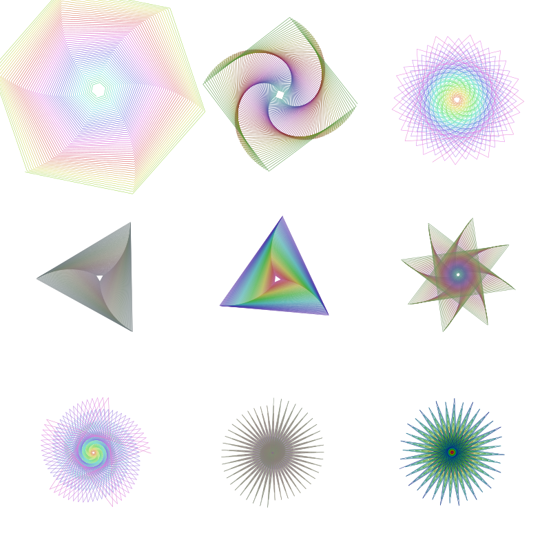
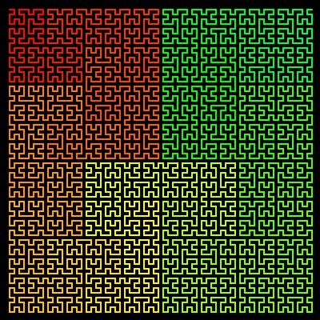

```@meta
DocTestSetup = quote
    using Luxor, Colors
    end
```
# Turtle graphics

Some simple "turtle graphics" functions are included. Functions to control the turtle begin with a capital letter: Forward, Turn, Circle, Orientation, Towards, Rectangle, Pendown, Penup, Pencolor, Penwidth, and Reposition, and so on, and angles are specified in degrees.

```@example
using Luxor, Colors
Drawing(600, 400, "../assets/figures/turtles.png")  
origin()  
background("midnightblue")  

🐢 = Turtle() # you can type the turtle emoji with \:turtle:
Pencolor(🐢, "cyan")
Penwidth(🐢, 1.5)
n = 5
for i in 1:400
    global n
    Forward(🐢, n)
    Turn(🐢, 89.5)
    HueShift(🐢)
    n += 0.75
end
fontsize(20)
Message(🐢, "finished")
finish()  
nothing # hide
```


The turtle commands expect a reference to a turtle as the first argument (it doesn't have to be a turtle emoji!), and you can have any number of turtles active at a time.

```@example
using Luxor, Colors # hide
Drawing(800, 800, "../assets/figures/manyturtles.svg") # hide
origin() # hide
background("white") # hide
quantity = 9
turtles = [Turtle(O, true, 2π * rand(), (rand(), rand(), 0.5)...) for i in 1:quantity]
Reposition.(turtles, first.(collect(Tiler(800, 800, 3, 3))))
n = 10
Penwidth.(turtles, 0.5)
for i in 1:300
    global n
    Forward.(turtles, n)
    HueShift.(turtles)
    Turn.(turtles, [60.1, 89.5, 110, 119.9, 120.1, 135.1, 145.1, 176, 190])
    n += 0.5
end
finish() # hide  
nothing # hide
```



A turtle graphics approach lends itself well to recursive programming. This short recursive function draws a Hilbert curve.

```@example
using Luxor, Colors # hide
Drawing(400, 400, "../assets/figures/hilbertturtle.svg") # hide
origin() # hide
background("black") # hide

function hilbert(t::Turtle, level, angle, lengthstep)
    level == 0 && return

    HueShift(t, 0.1)

    Turn(t, angle)
    hilbert(t, level-1, -angle, lengthstep)

    Forward(t, lengthstep)
    Turn(t, -angle)
    hilbert(t, level-1, angle, lengthstep)

    Forward(t, lengthstep)
    hilbert(t, level-1, angle, lengthstep)

    Turn(t, -angle)
    Forward(t, lengthstep)
    hilbert(t, level-1, -angle, lengthstep)

    Turn(t, angle)
end

@draw begin
background("black")
setline(2)
setlinecap("round")

hilbert(Turtle(first(BoundingBox()) + (12, 12), true, 0, (1, 0, 0)),
        6,  # level
        90, # turn angle, in degrees
        6   # steplength
        )
end
nothing # hide
```



|List of words the turtle knows|
|:---|
|Turtle|
|Forward|
|Turn|
|Circle|
|HueShift|
|Message|
|Orientation|
|Towards|
|Randomize_saturation|
|Rectangle|
|Pen_opacity_random|
|Pendown|
|Penup|
|Pencolor|
|Penwidth|
|Point|
|Pop|
|Push|
|Reposition|
