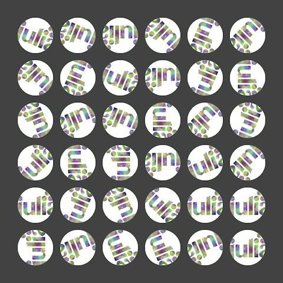

# Images

There is some limited support for placing PNG images on the drawing. First, load a PNG image using `readpng(filename)`.

```@docs
readpng
```

Then use `placeimage()` to place a loaded PNG image by its top left corner at point `x/y` or `pt`.

```@docs
placeimage
```

```julia
img = readpng(filename)
placeimage(img, xpos, ypos)
placeimage(img, pt::Point)
placeimage(img, xpos, ypos, 0.5) # use alpha transparency of 0.5
placeimage(img, pt::Point, 0.5)

img = readpng("figures/julia-logo-mask.png")
w = img.width
h = img.height
placeimage(img, -w/2, -h/2) # centered at point
```

You can clip images. The following script repeatedly places an image using a circle to define a clipping path:



```julia
using Luxor

width, height = 4000, 4000
margin = 500

Drawing(width, height, "/tmp/cairo-image.pdf")
origin()
background("grey25")

setline(5)
sethue("green")

image = readpng("figures/julia-logo-mask.png")
w = image.width
h = image.height

x = (-width/2) + margin
y = (-height/2) + margin

for i in 1:36
    circle(x, y, 250, :stroke)
    circle(x, y, 250, :clip)
    gsave()
    translate(x, y)
    scale(.95, .95)
    rotate(rand(0.0:pi/8:2pi))

    placeimage(image, -w/2, -h/2)

    grestore()
    clipreset()
    x += 600
    if x > width/2
        x = (-width/2) + margin
        y += 600
    end
end

finish()
preview()
```
