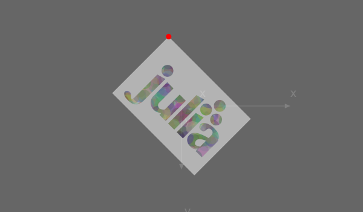

# Images

There is some limited support for placing PNG images on the drawing. First, load a PNG image using `readpng(filename)`.

Then use `placeimage()` to place it by its top left corner at point `x/y` or `pt`. Access the image's dimensions with `.width` and `.height`.

```@example
using Luxor # hide
Drawing(600, 350, "../figures/images.png") # hide
origin() # hide
background("grey40") # hide
img = readpng("../figures/julia-logo-mask.png")
w = img.width
h = img.height
axes()
scale(0.3, 0.3)
rotate(pi/4)
placeimage(img, -w/2, -h/2, .5)
sethue("red")
circle(-w/2, -h/2, 15, :fill)
finish() # hide
nothing # hide
```


```@docs
readpng
placeimage
```

You can clip images. The following script repeatedly places the image using a circle to define a clipping path:


```julia
using Luxor

width, height = 4000, 4000
margin = 500

fname = "/tmp/test-image.pdf"
Drawing(width, height, fname)
origin()
background("grey25")

setline(5)
sethue("green")

image = readpng(dirname(@__FILE__) * "/../docs/figures/julia-logo-mask.png")

w = image.width
h = image.height

pagetiles = Tiler(width, height, 7, 9)
tw = pagetiles.tilewidth/2
for (pos, n) in pagetiles
    circle(pos, tw, :stroke)
    circle(pos, tw, :clip)
    gsave()
    translate(pos)
    scale(.95, .95)
    rotate(rand(0.0:pi/8:2pi))
    placeimage(image, -w/2, -h/2)
    grestore()
    clipreset()
end

finish()
nothing # hides
```
