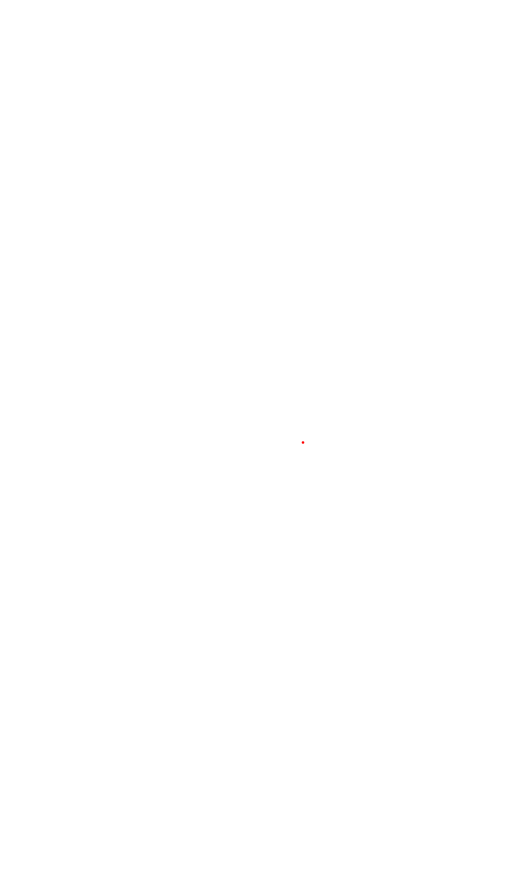

# Images

## Placing images

There is some limited support for placing PNG images on the drawing. First, load a PNG image using `readpng(filename)`.

Then use `placeimage()` to place it by its top left corner at point `x/y` or `pt`. Access the image's dimensions with `.width` and `.height`.

```@example
using Luxor # hide
Drawing(600, 350, "assets/figures/images.png") # hide
origin() # hide
background("grey40") # hide
img = readpng("assets/figures/julia-logo-mask.png")
w = img.width
h = img.height
axes()
scale(0.3, 0.3)
rotate(pi/4)
placeimage(img, -w/2, -h/2, .5)
sethue("red")
circle(-w/2, -h/2, 15, :fill)
finish() # hide
nothing # hide
```


```@docs
readpng
placeimage
```

## Clipping images

You can clip images. The following script repeatedly places the image using a circle to define a clipping path:


```julia
using Luxor

width, height = 4000, 4000
margin = 500

fname = "/tmp/test-image.pdf"
Drawing(width, height, fname)
origin()
background("grey25")

setline(5)
sethue("green")

image = readpng(dirname(@__FILE__) * "assets/figures/julia-logo-mask.png")

w = image.width
h = image.height

pagetiles = Tiler(width, height, 7, 9)
tw = pagetiles.tilewidth/2
for (pos, n) in pagetiles
    circle(pos, tw, :stroke)
    circle(pos, tw, :clip)
    gsave()
    translate(pos)
    scale(.95, .95)
    rotate(rand(0.0:pi/8:2pi))
    placeimage(image, -w/2, -h/2)
    grestore()
    clipreset()
end

finish()
```

## Drawing on images

You sometimes want to draw over images, for example to annotate them with text or vector graphics. The things to be aware of are mostly to do with coordinates and transforms.

In this example, we'll annotate a PNG file with some text and graphics.

```@example
using Luxor # hide

image = readpng(assets/figures/julia-logo-mask.png")

w = image.width
h = image.height

# create a drawing surface of the same size

fname = "assets/figures/drawing_on_images.png"
Drawing(w, h, fname)

# place the image on the Drawing - it's positioned by its top/left corner

placeimage(image, 0, 0)

# now you can annotate the image. The (0/0) is at the top left.

sethue("red")
fontsize(20)
circle(5, 5, 2, :fill)
text("(5/5)", Point(25, 25), halign=:center)

arrow(Point(w/2, 50), Point(0, 50))
arrow(Point(w/2, 50), Point(w, 50))
text("width $w", Point(w/2, 70), halign=:center)

# to divide up the image into rectangular areas, temporarily position the axes at the center:

gsave()
setline(0.2)
sethue("green")
fontsize(12)
translate(w/2, h/2)
tiles = Tiler(w, h, 16, 10, margin=0)
for (pos, n) in tiles
    box(pos, tiles.tilewidth, tiles.tileheight, :stroke)
    text(string(n), pos, halign=:center)
end
grestore()

# If you want coordinates to be relative to the bottom left corner of the image, transform:

translate(0, h)

# and reflect in the x-axis

transform([1 0 0 -1 0 0])

# now 0/0 is at the bottom left corner, and 100/100 is up and to the right.

sethue("blue")
arrow(O, Point(100, 100))

# However, don't use text while flipped, because it's reversed:

text("I'm in reverse!", w/2, h/2)

finish() # hide
nothing # hide
```


