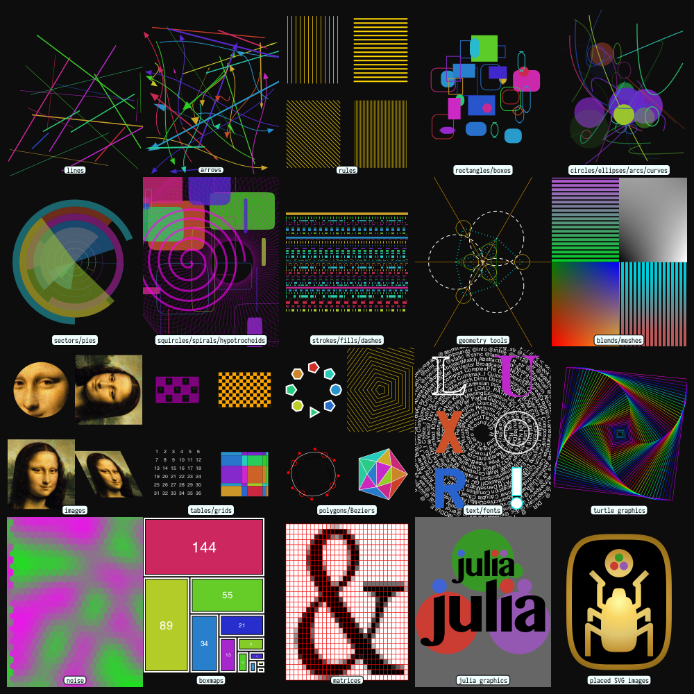

```@meta
DocTestSetup = quote
    using Luxor, Dates, Colors
end
```

# Introduction to Luxor

Luxor is a Julia package for drawing simple static vector graphics. It provides basic drawing functions and utilities for working with shapes, polygons, clipping masks, PNG and SVG images, turtle graphics, and simple animations.



The focus of Luxor is on simplicity and ease of use: it should be easier to use than plain [Cairo.jl](https://github.com/JuliaLang/Cairo.jl), with shorter names, fewer underscores, default contexts, and simplified functions.

Luxor is thoroughly procedural and static: your code issues a sequence of simple graphics 'commands' until you've completed a drawing, then the results are saved into a PDF, PNG, SVG, or EPS file.

There are some Luxor-related videos on [YouTube](https://www.youtube.com/channel/UCfd52kTA5JpzOEItSqXLQxg), and some Luxor-related blog posts at [cormullion.github.io/](https://cormullion.github.io/).

Luxor isn't interactive: for interactive graphics, look at [Pluto.jl](https://github.com/fonsp/Pluto.jl), [Makie](https://github.com/JuliaPlots/Makie.jl), and [Javis](https://github.com/wikunia/Javis.jl).

Please submit issues and pull requests on [GitHub](https://github.com/JuliaGraphics/Luxor.jl). Original version by [cormullion](https://github.com/cormullion), much improved with contributions from the Julia community.

## Installation and basic usage

Install the package using the package manager:

```
] add Luxor
```

Cairo.jl and Colors.jl will be installed if necessary.

To use Luxor, type:

```
using Luxor
```

To test:

```
julia> @svg juliacircles()
```

or

```
julia> @png juliacircles()
```

which should create a graphic file and possibly also display and/or open it, depending on your environment.

## Documentation

This documentation was built using [Documenter.jl](https://github.com/JuliaDocs).

```@example
using Dates # hide
println("Documentation built $(Dates.now()) with Julia $(VERSION)") # hide
```
