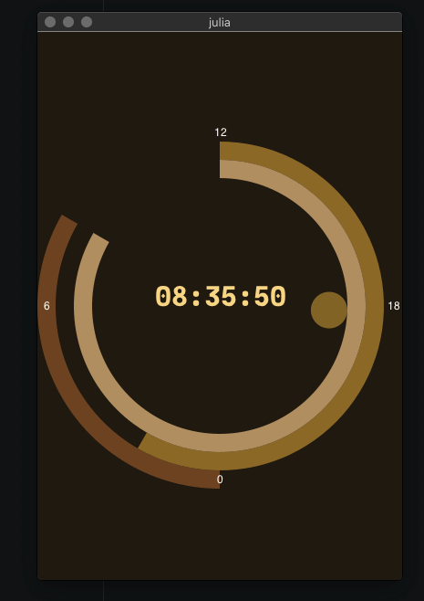

# Live graphics and snapshots

## Live graphics

With the help of an external appication to manage windows, it's possible to use Luxor to create continuously changing graphics in a window.

### The `@play` macro

This example uses the [MiniFB](https://github.com/aviks/MiniFB.jl) package, which you can add using `] add MiniFB`.

The file `play.jl` defines a simple macro, `@play`, which continuously evaluates and draws the graphics in a window. For example, this code:

```
using Luxor

include(dirname(pathof(Luxor)) * "/play.jl")

let θ = 0
    @play 400 400 begin
    #
        background("black")
        sethue("white")
        rotate(θ)
        hypotrochoid(200, 110, 37, :stroke)
        θ += π/120
        sleep(0.01)
    #
    end
end
```

draws a continuously rotating hypotrochoid.

### Clock

This code also imports the `@play` macro.

The call to `sleep()` reduces the CPU time, and allows other processes to run, but the millisecond
animation will be less smooth as a result.



```
using Luxor, Colors, Dates, ColorSchemes

include(dirname(pathof(Luxor)) * "/play.jl")

function clock(cscheme=ColorSchemes.leonardo)
    @play 400 600 begin

        # background
        sethue(get(cscheme, .0))
        paint()

        # 24hour sector
        fontsize(30)
        sethue(get(cscheme, .2))
        h = Dates.hour(now())
        sector(O, 180, 200, π/2, π/2 + rescale(h, 0, 24, 0, 2pi), :fill)

        @layer begin
            fontsize(12)
            sethue("white")
            @. text(["0", "6", "12", "18"], polar(190, [i * π/2 for i in 1:4]),
                halign=:center,
                valign=:middle)
        end

        # minute sector
        sethue(get(cscheme, .4))
        m = Dates.minute(now())
        sector(O, 160, 180, 3π/2, 3π/2 + rescale(m, 0, 60, 0, 2pi), :fill)

        # second sector
        sethue(get(cscheme, .6))
        s = Dates.second(now())
        sector(O, 140, 160, 3π/2, 3π/2 + rescale(s, 0, 60, 0, 2pi), :fill)

        # millisecond indicator
        @layer begin
            setopacity(0.5)
            sethue(get(cscheme, .8))
            ms = Dates.value(Dates.Millisecond(Dates.now()))
            circle(polar(120, 3π/2 + rescale(ms, 0, 1000, 0, 2pi)), 20, :fill)
        end

        # central text
        fontface("JuliaMono-Black")
        sethue(get(cscheme, 1.0))
        text(Dates.format(Dates.now(), "HH:MM:SS"), halign=:center)

        sleep(0.05)
    end
end

clock(ColorSchemes.klimt)
```

## Snapshots

A _snapshot_ is a view of the current Luxor drawing in its current state, before it's been closed via `finish()`. You can take a snapshot, then continue drawing on the current drawing.

!!! note

    You can take a snapshot only for drawings created using the `:rec` (recording) format.

The following code exports a series of snapshots made with `snapshot()`, showing the state of the computation for different values of the `stepby` parameter. (This image is a composite of all the snapshots.)


```
using Luxor, ColorSchemes, Colors

function julia(z, c, maxiter::Int64)
    for n = 1:maxiter
        abs(z) > 2 ? (return n) : z = z^3 + c
    end
    return maxiter
end

function drawjulia(c::Complex, pwidth, pheight;
        klo = 0.0,
        khi = 1.0,
        cpos = Point(0, 0),
        w = 4,
        stepby=1,
        maxiterations = 300)
    xmin = cpos.x - w/2; ymin = cpos.y - w/2
    xmax = cpos.x + w/2; ymax = cpos.y + w/2
    lo = 10; hi = 2
    for col = -pwidth/2:stepby:pwidth/2
        for row = -pheight/2:stepby:pheight/2
            imagex = rescale(col, -pwidth/2, pwidth/2, xmin, xmax)
            imagey = rescale(row, -pheight/2, pheight/2, ymin, ymax)
            pixelcolor = julia(complex(imagex, imagey), c, maxiterations)
            if pixelcolor > hi
                hi = pixelcolor
            end
            if pixelcolor < lo
                lo = pixelcolor
            end
            s = rescale(pixelcolor, klo, khi)
            a = slope(Point(row, col), O)
            h, sa, l = getfield.(convert(HSL, get(ColorSchemes.inferno, s)), 1:3)
            sethue(HSL(mod(180 + 360 * a/2π, 360), sa , 2l))
            box(Point(row, -col), stepby,  stepby, :fillstroke)
        end
    end
    sethue("white")
    text("$(stepby)", boxbottomcenter(BoundingBox()) + (0, -20), halign=:center)
    snapshot(fname = "/tmp/temp-$(stepby).png")
    return lo, hi
end

function main()
    w = h = 500
    Drawing(w, h, :rec)
    fontsize(20)
    fontface("JuliaMono-Bold")
    origin()
    circle(O, w/2, :clip)
    for s in vcat(50:-5:1,1)
        l, h = drawjulia(-0.5368 + 0.0923im, w, w, maxiterations = 250,
            w=3, stepby=s, klo=1, khi=100)
    end
    finish()
    preview()
end

main()
```

```@docs
snapshot
```
