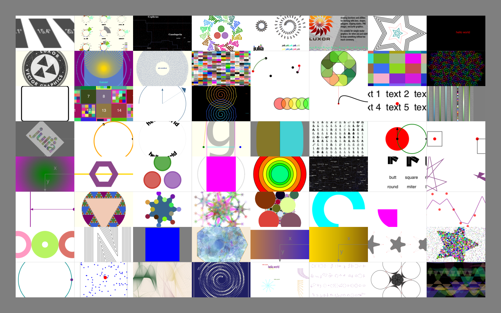
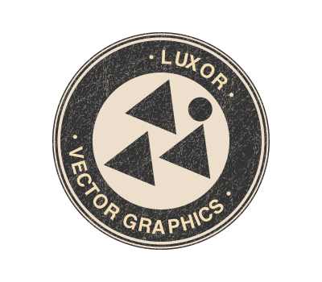

# More examples

A good place to look for examples (sometimes not very exciting or well-written examples, I'll admit), is in the `Luxor/test` directory.



## An early test


```julia
using Luxor
Drawing(1200, 1400, "basic-test.png") # or PDF/SVG filename for PDF or SVG
origin()
background("purple")
setopacity(0.7)                      # opacity from 0 to 1
sethue(0.3,0.7,0.9)                  # sethue sets the color but doesn't change the opacity
setline(20)                          # line width

rect(-400,-400,800,800, :fill)       # or :stroke, :fillstroke, :clip
randomhue()
circle(0, 0, 460, :stroke)
circle(0,-200,400,:clip)             # a circular clipping mask above the x axis
sethue("gold")
setopacity(0.7)
setline(10)
for i in 0:pi/36:2pi - pi/36
    move(0, 0)
    line(cos(i) * 600, sin(i) * 600 )
    stroke()
end
clipreset()                           # finish clipping/masking
fontsize(60)
setcolor("turquoise")
fontface("Optima-ExtraBlack")
textwidth = textextents("Luxor")[5]
textcentred("Luxor", 0, currentdrawing.height/2 - 400)
fontsize(18)
fontface("Avenir-Black")

# text on curve starting at angle 0 rads centered on origin with radius 550
textcurve("THIS IS TEXT ON A CURVE " ^ 14, 0, 550, O)
finish()
preview() # on macOS, opens in Preview
```

## Illustrating this document

This documentation was built with [Documenter.jl](https://github.com/JuliaDocs/Documenter.jl), which is an amazingly powerful and flexible documentation generator written in Julia. The illustrations are mostly created when the documentation is generated, the source of the image being stored in the Markdown document and processed on the fly:

The Markdown markup looks like this:

```
    ```@example
    using Luxor # hide
    Drawing(600, 250, "../figures/polysmooth-pathological.png") # hide
    origin() # hide
    background("white") # hide
    setopacity(0.75) # hide
    srand(42) # hide
    setline(1) # hide
    p = star(O, 60, 5, 0.35, 0, vertices=true)
    setdash("dot")
    sethue("red")
    prettypoly(p, close=true, :stroke)
    setdash("solid")
    sethue("black")
    polysmooth(p, 40, :fill, debug=true)
    finish() # hide
    ```

    

```

and it looks like this in the final document:

```@example
using Luxor # hide
Drawing(600, 250, "../figures/polysmoothy.png") # hide
origin() # hide
background("white") # hide
setopacity(0.75) # hide
srand(42) # hide
setline(1) # hide
p = star(O, 60, 5, 0.35, 0, vertices=true)
setdash("dot")
sethue("red")
prettypoly(p, close=true, :stroke)
setdash("solid")
sethue("black")
polysmooth(p, 40, :fill, debug=true)
finish() # hide
nothing # hide
```


## Luxor logo

In this example, the color scheme is mirrored so that the lighter colors are at the top of the circle.


```
using Luxor, ColorSchemes

function spiral(colscheme)
  circle(0, 0, 90, :clip)
  for theta in pi/2 - pi/8:pi/8: (19 * pi)/8 # start at the bottom
    sethue(colorscheme(colscheme, rescale(theta, pi/2, (19 * pi)/8, 0, 1)))
    gsave()
    rotate(theta)
    move(5,0)
    curve(Point(40, 40), Point(50, -40), Point(80, 30))
    closepath()
    fill()
    grestore()
  end
  clipreset()
end

width = 225  # pts
height = 225 # pts
Drawing(width, height, "/tmp/logo.png")
origin()
background("white")
scale(1.3, 1.3)
colscheme = loadcolorscheme("solarcolors")
colschememirror = vcat(colscheme, reverse(colscheme))
spiral(colschememirror)
finish()
```

## Why turtles?

An interesting application for turtle-style graphics is for drawing Lindenmayer systems (l-systems). Here's an example of how a complex pattern can emerge from a simple set of rules, taken from [Lindenmayer.jl](https://github.com/cormullion/Lindenmayer.jl):


The definition of this figure is:
```
penrose = LSystem(Dict("X"  =>  "PM++QM----YM[-PM----XM]++t",
                       "Y"  => "+PM--QM[---XM--YM]+t",
                       "P"  => "-XM++YM[+++PM++QM]-t",
                       "Q"  => "--PM++++XM[+QM++++YM]--YMt",
                       "M"  => "F",
                       "F"  => ""),
                  "1[Y]++[Y]++[Y]++[Y]++[Y]")
```

where some of the characters—eg "F", "+", "-", and "t"—issue turtle control commands, and others—"X,", "Y", "P", and "Q"—refer to specific components of the design. The execution of the l-system involves replacing every occurrence in the drawing code of every dictionary key with the matching values.

## Text on curves


```@example
using Luxor # hide
Drawing(400, 350, "../figures/textcurvecenteredexample.png") # hide
origin() # hide
background("ivory") # hide
rotate(pi/12)
fontsize(24)
fontface("Futura-Bold")
sethue("gray20")
setline(3)

circle(O, 130, :stroke)
circle(O, 135, :stroke)
circle(O, 125, :fill)
sethue("gray90")
circle(O, 85, :fill)

textcurvecentered("- LUXOR -", -pi/2, 100, O, clockwise=true, letter_spacing=5, baselineshift = -4)
textcurvecentered("- VECTOR GRAPHICS -", pi/2, 100, O, clockwise=false, letter_spacing=5, baselineshift = -15)

sethue("gray20")
map(pt -> star(pt, 40, 3, 0.5, -pi/2, :fill), ngon(O, 40, 3, 0, vertices=true))

sethue("gray95")
circle(O.x + 30, O.y - 55, 15, :fill)

# cheap texture
sethue("ivory")
setline(0.2)
setdash("dotdotdashed")
for i in 1:500
    line(randompoint(Point(-200, -350), Point(200, 350)),
         randompoint(Point(-200, -350), Point(200, 350)),
         :stroke)
end
finish() # hide
nothing # hide
```



# Index
