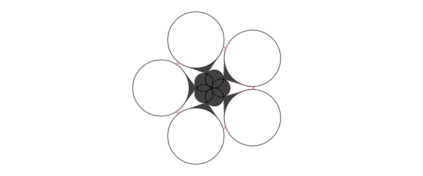
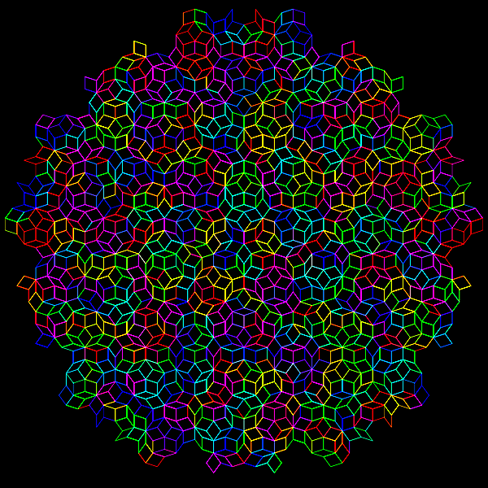
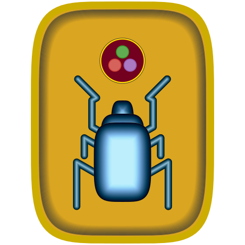

```@meta
DocTestSetup = quote
    using Luxor, Colors
end
```

# More examples

One place to look for examples is the `Luxor/test` directory.


## Illustrating this document

This documentation was built with [Documenter.jl](https://github.com/JuliaDocs/Documenter.jl), which is an amazingly powerful and flexible documentation generator written in Julia. The illustrations are mostly created when the HTML pages are built: the Julia source for the image is stored in the Markdown source document, and the code to create the images runs each time the documentation is generated.

The Markdown markup looks like this:

`````
```@example
using Luxor, Random # hide
Drawing(600, 250, "assets/figures/polysmooth-pathological.png") # hide
origin() # hide
background("white") # hide
setopacity(0.75) # hide
Random.seed!(42) # hide
setline(1) # hide
p = star(O, 60, 5, 0.35, 0, vertices=true)
setdash("dot")
sethue("red")
prettypoly(p, close=true, :stroke)
setdash("solid")
sethue("black")
polysmooth(p, 40, :fill, debug=true)
finish() # hide
```


`````

and after you run Documenter's build process the HTML output looks like this:

```@example
using Luxor, Random # hide
Drawing(600, 250, "assets/figures/polysmoothy.png") # hide
origin() # hide
background("white") # hide
setopacity(0.75) # hide
Random.seed!(42) # hide
setline(1) # hide
p = star(O, 60, 5, 0.35, 0, vertices=true)
setdash("dot")
sethue("red")
prettypoly(p, close=true, :stroke)
setdash("solid")
sethue("black")
polysmooth(p, 40, :fill, debug=true)
finish() # hide
nothing # hide
```



## Why turtles?

An interesting application for turtle-style graphics is for drawing Lindenmayer systems (l-systems). Here's an example of how a complex pattern can emerge from a simple set of rules, taken from [Lindenmayer.jl](https://github.com/cormullion/Lindenmayer.jl):



The definition of this figure is:

```
penrose = LSystem(Dict("X"  =>  "PM++QM----YM[-PM----XM]++t",
                       "Y"  => "+PM--QM[---XM--YM]+t",
                       "P"  => "-XM++YM[+++PM++QM]-t",
                       "Q"  => "--PM++++XM[+QM++++YM]--YMt",
                       "M"  => "F",
                       "F"  => ""),
                  "1[Y]++[Y]++[Y]++[Y]++[Y]")
```

where some of the characters—eg "F", "+", "-", and "t"—issue turtle control commands, and others—"X,", "Y", "P", and "Q"—refer to specific components of the design. The execution of the l-system involves replacing every occurrence in the drawing code of every dictionary key with the matching values.

## Strange

It's usually better to draw fractals and similar images using pixels and image processing tools. But just for fun it's an interesting experiment to render a strange attractor image using vector drawing rather than placing pixels. This version uses about 600,000 circular dots (which is why it's better to target PNG rather than SVG or PDF for this example!).

```@example
using Luxor, Colors
function strange(dotsize, w=800.0)
    xmin = -2.0; xmax = 2.0; ymin= -2.0; ymax = 2.0
    Drawing(w, w, "assets/figures/strange-vector.png")
    origin()
    background("white")
    xinc = w/(xmax - xmin)
    yinc = w/(ymax - ymin)
    # control parameters
    a = 2.24; b = 0.43; c = -0.65; d = -2.43; e1 = 1.0
    x = y = z = 0.0
    wover2 = w/2
    for j in 1:w
        for i in 1:w
            xx = sin(a * y) - z  *  cos(b * x)
            yy = z * sin(c * x) - cos(d * y)
            zz = e1 * sin(x)
            x = xx; y = yy; z = zz
            if xx < xmax && xx > xmin && yy < ymax && yy > ymin
                xpos = rescale(xx, xmin, xmax, -wover2, wover2) # scale to range
                ypos = rescale(yy, ymin, ymax, -wover2, wover2) # scale to range
                rcolor = rescale(xx, -1, 1, 0.0, .7)
                gcolor = rescale(yy, -1, 1, 0.2, .5)
                bcolor = rescale(zz, -1, 1, 0.3, .8)
                setcolor(convert(Colors.HSV, Colors.RGB(rcolor, gcolor, bcolor)))
                circle(Point(xpos, ypos), dotsize, :fill)
            end
        end
    end
    finish()
end

strange(.3, 800)
nothing # hide
```


## More animations

[](https://youtu.be/1FA2FgJU6dM)

Most of the animations on [this YouTube channel](https://www.youtube.com/channel/UCfd52kTA5JpzOEItSqXLQxg) are made with Luxor.

## The Luxor logo

```@example
using Luxor, Colors

function multistrokepath(lightness, chroma, hue)
    # takes the current path and multistrokes it
    @layer begin
        for n in 1:2:15
            sethue(LCHab(5n, chroma, hue))
            setline(rescale(n, 1, 15, 15, 1))
            strokepreserve()
        end
    end
end

function multifillpath(lightness, chroma, hue)
    # takes the current path and multifills it
    @layer begin
        p = pathtopoly()[1]
        for n in 0:2:40
            sethue(LCHab(3n, chroma + n/2, hue))
            setopacity(rescale(n, 1, 40, 1, 0.1))
            poly(offsetpoly(p, -n), :fill, close=true)
        end
    end
end

function scarab(pos)
    @layer begin
        translate(pos)
        setline(15)
        setlinecap("round")
        setlinejoin("round")
        #legs
        @layer begin
            for i in 1:2
                # right front leg
                move(O)
                rline.((polar(80, -π/6),
                polar(60, -π/2),
                polar(12, -5π/6),
                polar(60, -π/4)))
                #middle leg
                move(0, 35)
                rline.((
                polar(100, -π/6),
                polar(40, π/2)))
                #back leg
                move(0, 100)
                rline.((polar(120, -π/6),
                polar(100, π/2)))
                multistrokepath(50, 20, 240)
                # other side
                transform([-1 0 0 1 0 0])
            end
            # body
            @layer begin
                squircle(Point(0, -25), 26, 75, :fillpreserve)
                multifillpath(60, 20, 260)            

                squircle(Point(0, 0), 50, 70, :fillpreserve)
                multifillpath(60, 20, 260)

                squircle(Point(0, 40), 65, 90, :fillpreserve)
                multifillpath(60, 20, 260)                
            end
        end
    end
end

function draw()
    Drawing(500, 500, "assets/figures/luxor-logo.png")
    origin()
    background(1, 1, 1, 0)
    setopacity(1.0)
    width = 180
    height= 240
    # cartouche
    @layer begin
        setcolor("goldenrod")
        squircle(O, width, height, rt=0.4, :fill)
    end

    sethue("gold3")
    setline(14)
    squircle(O, width, height, rt=0.4, :stroke)

    # interior shadow
    @layer begin
        sethue("grey20")
        setline(2)
        for n in 10:30
            setopacity(rescale(n, 10, 30, 0.5, 0.0))
            squircle(O, width-n, height-n, rt=0.4, :stroke)
        end
    end

    # draw scarab
    scale(0.9)
    translate(0, 50)
    scarab(O)

    # julia/sun
    @layer begin
        translate(0, -190)
        sethue("grey20")
        circle(O, 52, :fill)
        sethue("gold")
        circle(O, 51, :fill)
        sethue(LCHab(20, 55, 15))
        circle(O, 48, :fill)
        juliacircles(20)
    end

    clipreset()
    finish()
end

draw()
```


