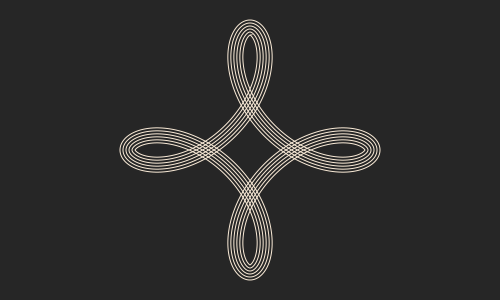
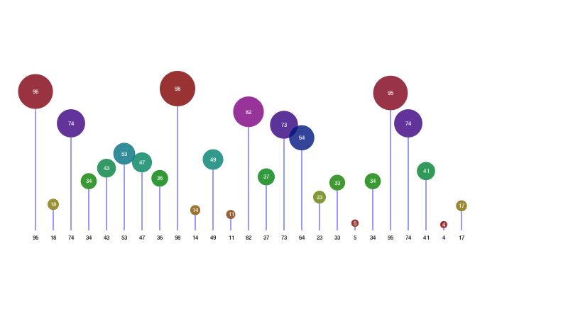

```@meta
DocTestSetup = quote
    using Luxor, Colors, Random
    end
```
# More graphics

## Julia logos

A couple of functions in Luxor provide you with instant access to the Julia logo, and the three colored circles:

```@example
using Luxor, Random # hide
Drawing(750, 250, "assets/figures/julia-logo.png")  # hide
Random.seed!(42) # hide
origin()  # hide
background("white") # hide

for (pos, n) in Tiler(750, 250, 1, 2)
    gsave()
    translate(pos - Point(150, 100))
    if n == 1
        julialogo()
    elseif n == 2
        julialogo(action=:clip)
        for i in 1:500
            gsave()
            translate(rand(0:400), rand(0:250))
            juliacircles(10)
            grestore()
        end
        clipreset()
    end
    grestore()
end
finish() # hide
nothing # hide
```


```@docs
julialogo
juliacircles
```

## Hypotrochoids

`hypotrochoid()` makes hypotrochoids. The result is a polygon. You can either draw it directly, or pass it on for further polygon fun, as here, which uses `offsetpoly()` to trace round it a few times.

```@example
using Luxor # hide
Drawing(500, 300, "assets/figures/hypotrochoid.png")  # hide
origin()
background("grey15")
sethue("antiquewhite")
setline(1)
p = hypotrochoid(100, 25, 55, :stroke, stepby=0.01, vertices=true)
for i in 0:3:15
    poly(offsetpoly(p, i), :stroke, close=true)
end
finish() # hide
nothing # hide
```



There's a matching `epitrochoid()` function.

```@docs
hypotrochoid
epitrochoid
```

## Cropmarks

If you want cropmarks (aka trim marks), use the `cropmarks()` function, supplying the centerpoint, followed by the width and height:

    cropmarks(O, 1200, 1600)
    cropmarks(O, paper_sizes["A0"]...)

```@example
using Luxor # hide
Drawing(700, 250, "assets/figures/cropmarks.png")  # hide
origin() # hide
background("white") # hide
sethue("red")
box(O, 150, 150, :stroke)
cropmarks(O, 150, 150)
finish() # hide
nothing # hide
```


```@docs
cropmarks
```

## Bars

For simple bars, use the `bars()` function, supplying an array of numbers:

```@example
using Luxor # hide
Drawing(800, 420, "assets/figures/bars.png")  # hide
origin() # hide
background("white") # hide
fontsize(7)
sethue("black")
translate(-350, 0) # hide
v = rand(-100:100, 25)
bars(v)
finish() # hide
nothing # hide
```


To change the way the bars and labels are drawn, define some functions and pass them as keyword arguments to `bars()`:

```@example
using Luxor, Colors, Random # hide
Drawing(800, 450, "assets/figures/bars1.png")  # hide
Random.seed!(2) # hide
origin() # hide
background("white") # hide
setopacity(0.8) # hide
fontsize(8) # hide
fontface("Helvetica-Bold") # hide
sethue("black") # hide
translate(-350, 100) # hide

function mybarfunction(low::Point, high::Point, value;
    extremes=[0, 1], barnumber=0, bartotal=0)
    @layer begin
        sethue(Colors.HSB(rescale(value, extremes[1], extremes[2], 0, 360), 1.0, 0.5))
        csize = rescale(value, extremes[1], extremes[2], 5, 25)
        circle(high, csize, :fill)
        setline(1)
        sethue("blue")
        line(Point(low.x, 0), high + (0, csize), :stroke)
        sethue("white")
        text(string(value), high, halign=:center, valign=:middle)
    end
end

function mylabelfunction(low::Point, high::Point, value;
    extremes=[0, 1], barnumber=0, bartotal=0)
    @layer begin
        translate(low)
        text(string(value), O + (0, 10), halign=:center, valign=:middle)
    end
end

v = rand(1:100, 25)
bars(v, xwidth=25, barfunction=mybarfunction, labelfunction=mylabelfunction)

finish() # hide
nothing # hide
```



```@docs
bars
```

## Box maps

The `boxmap()` function divides a rectangular area into a sorted arrangement of smaller boxes or tiles based on the values of elements in an array.

This example uses the Fibonacci sequence to determine the area of the boxes. Notice that the values are sorted in reverse, and are scaled to fit in the available area.

```@example
using Luxor, Colors, Random # hide
Drawing(800, 450, "assets/figures/boxmap.png")  # hide
Random.seed!(13) # hide
origin() # hide
background("white") # hide

fib = [1, 1, 2, 3, 5, 8, 13, 21, 34, 55, 89, 144]

# make a boxmap and store the tiles
tiles = boxmap(fib, BoundingBox()[1], 800, 450)

for (n, t) in enumerate(tiles)
    randomhue()
    bb = BoundingBox(t)
    sethue("black")
    box(bb - 5, :stroke)

    randomhue()
    box(bb - 8, :fill)

    # text labels
    sethue("white")

    # rescale text to fit better
    fontsize(boxwidth(bb) > boxheight(bb) ? boxheight(bb)/4 : boxwidth(bb)/4)
    text(string(sort(fib, rev=true)[n]),
        midpoint(bb[1], bb[2]),
        halign=:center,
            valign=:middle)
end

finish() # hide
nothing # hide
```


```@docs
boxmap
```
