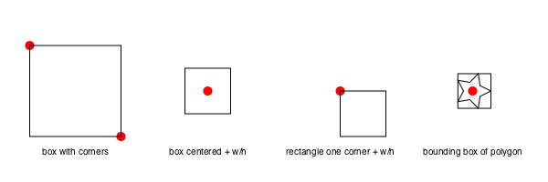
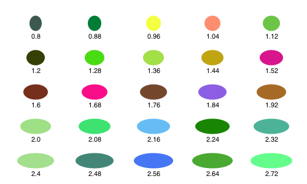
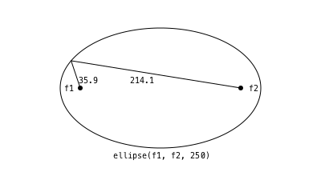
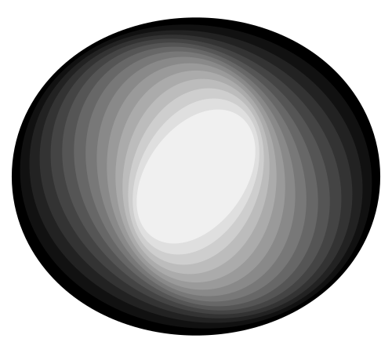
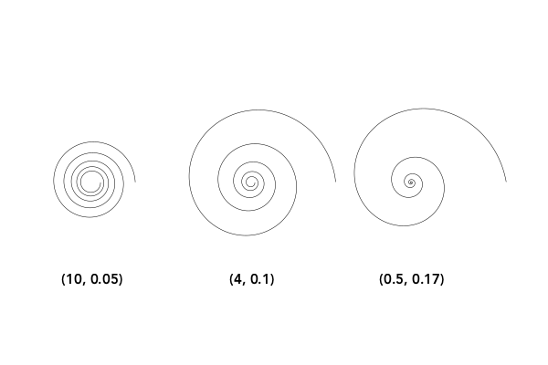
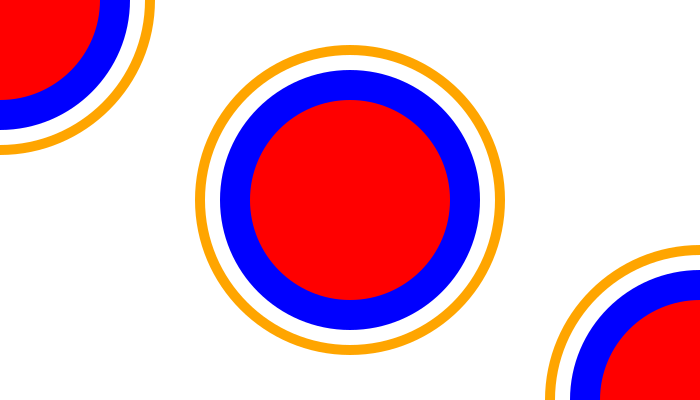
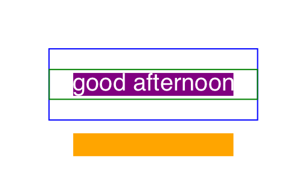
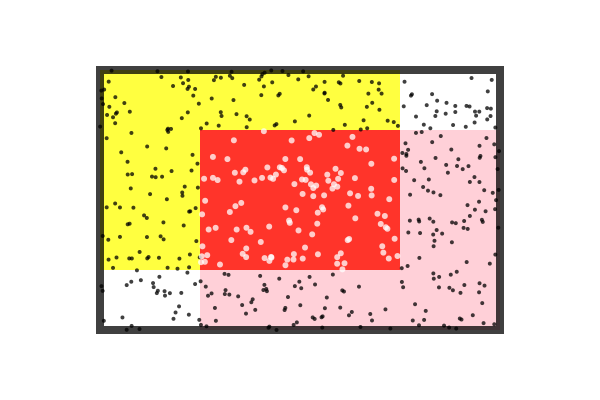
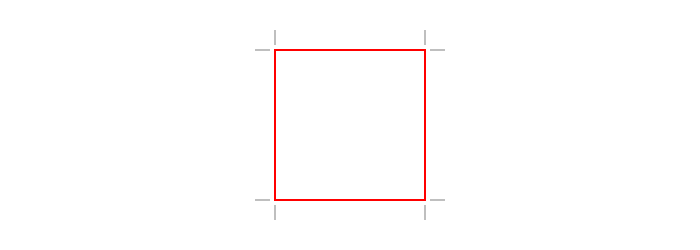
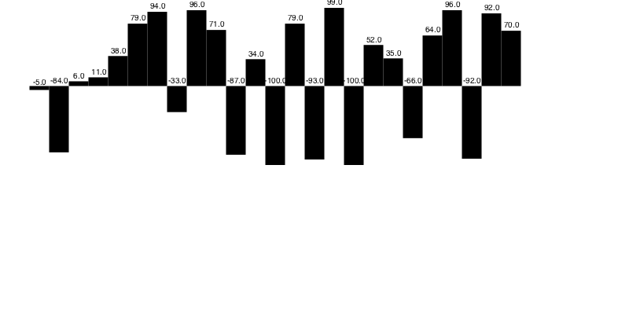

# Simple graphics

In Luxor, there are different ways of working with graphical items. Some, such as lines, rectangles and circles, are drawn immediately (ie placed on the drawing and then "forgotten"). Others can be constructed and then converted to lists of points for further processing. For these, watch out for a `vertices=true` option.

## Rectangles and boxes

The simple rectangle and box shapes can be made in different ways.

```@example
using Luxor # hide
Drawing(400, 220, "assets/figures/basicrects.png") # hide
background("white") # hide
origin() # hide
axes()
sethue("red")
rect(O, 100, 100, :stroke)
sethue("blue")
box(O, 100, 100, :stroke)
finish() # hide
nothing # hide
```


`rect()` rectangles are positioned by a corner, but a box made with `box()` can either be defined by its center and dimensions, or by two opposite corners.



If you want the coordinates of the corners of a box, rather than draw one immediately, use:

```julia
box(centerpoint, width, height, vertices=true)
```

or

```julia
box(corner1,  corner2, vertices=true)
```    

```@docs
rect
box
```

For regular polygons, see the next section on Polygons.

## Circles and ellipses

There are various ways to make circles, including by center and radius, or passing through two points:

```@example
using Luxor # hide
Drawing(400, 200, "assets/figures/circles.png") # hide
background("white") # hide
origin() # hide
setline(2) # hide
p1 = O
p2 = Point(100, 0)
sethue("red")
circle(p1, 40, :fill)
sethue("green")
circle(p1, p2, :stroke)
sethue("black")
arrow(O, Point(0, -40))
map(p -> circle(p, 4, :fill), [p1, p2])
finish() # hide
nothing # hide
```


Or passing through three points. The `center3pts()` function returns the center position and radius of a circle passing through three points:

```@example
using Luxor # hide
Drawing(400, 200, "assets/figures/center3.png") # hide
background("white") # hide
origin() # hide
setline(3) # hide
sethue("black")
p1 = Point(0, -50)
p2 = Point(100, 0)
p3 = Point(0, 65)
map(p -> circle(p, 4, :fill), [p1, p2, p3])
sethue("orange")
circle(center3pts(p1, p2, p3)..., :stroke)
finish() # hide
nothing # hide
```


```@docs
circle
center3pts
```

With `ellipse()` you can place ellipses (and circles) by defining the center point and the width and height.

```@example
using Luxor # hide
Drawing(500, 300, "assets/figures/ellipses.png") # hide
background("white") # hide
fontsize(11) # hide
srand(1) # hide
origin() # hide
tiles = Tiler(500, 300, 5, 5)
width = 20
height = 25
for (pos, n) in tiles
    randomhue()
    ellipse(pos, width, height, :fill)
    sethue("black")
    label = string(round(width/height, 2))
    textcentered(label, pos.x, pos.y + 25)
    width += 2
end
finish() # hide
nothing # hide
```



`ellipse()` can also construct polygons that are approximations to ellipses. You supply two focal points and a length which is the sum of the distances of a point on the perimeter to the two focii.

```@example
using Luxor # hide
Drawing(400, 220, "assets/figures/ellipses_1.png") # hide
origin() # hide
background("white") # hide

srand(42) # hide
sethue("black") # hide
setline(1) # hide
fontface("Menlo")

f1 = Point(-100, 0)
f2 = Point(100, 0)

circle.([f1, f2], 3, :fill)

epoly = ellipse(f1, f2, 250, vertices=true)
poly(epoly, :stroke,  close=true)

pt = epoly[rand(1:end)]

poly([f1, pt, f2], :stroke)

label("f1", :W, f1, offset=10)
label("f2", :E, f2, offset=10)

label(string(round(norm(f1, pt), 1)), :SE, midpoint(f1, pt))
label(string(round(norm(pt, f2), 1)), :SW, midpoint(pt, f2))

label("ellipse(f1, f2, 250)", :S, Point(0, 75))

finish() # hide
nothing # hide
```



The advantage of this method is that there's a `vertices=true|false` option, allowing further scope for polygon manipulation.

```@example
using Luxor # hide
Drawing(500, 450, "assets/figures/ellipses_2.png") # hide
origin() # hide
background("white") # hide
sethue("gray30") # hide
setline(1) # hide
f1 = Point(-100, 0)
f2 = Point(100, 0)
ellipsepoly = ellipse(f1, f2, 170, :none, vertices=true)
[ begin
    setgray(rescale(c, 150, 1, 0, 1))
    poly(offsetpoly(ellipsepoly, c), close=true, :fill);
    rotate(pi/20)
  end
     for c in 150:-10:1 ]
finish() # hide
nothing # hide
```



```@docs
ellipse
```

`circlepath()` constructs a circular path from Bézier curves, which allows you to use circles as paths.

```@example
using Luxor # hide
Drawing(600, 250, "assets/figures/circle-path.png") # hide
origin() # hide
background("white") # hide
sethue("black") # hide
setline(4)
tiles = Tiler(600, 250, 1, 5)
for (pos, n) in tiles
    randomhue()
    circlepath(pos, tiles.tilewidth/2, :path)
    newsubpath()
    circlepath(pos, rand(5:tiles.tilewidth/2 - 1), :fill, reversepath=true)
end
finish() # hide
nothing # hide
```


```@docs
circlepath
```

## More curved shapes: sectors, spirals, and squircles

A sector (technically an "annular sector") has an inner and outer radius, as well as start and end angles.

```@example
using Luxor # hide
Drawing(600, 200, "assets/figures/sector.png") # hide
background("white") # hide
origin() # hide
sethue("tomato")
sector(50, 90, pi/2, 0, :fill)
sethue("olive")
sector(Point(O.x + 200, O.y), 50, 90, 0, pi/2, :fill)
finish() # hide
nothing # hide
```


You can also supply a value for a corner radius. The same sector is drawn but with rounded corners.

```@example
using Luxor # hide
Drawing(600, 200, "assets/figures/sectorrounded.png") # hide
background("white") # hide
origin() # hide
sethue("tomato")
sector(50, 90, pi/2, 0, 15, :fill)
sethue("olive")
sector(Point(O.x + 200, O.y), 50, 90, 0, pi/2, 15, :fill)
finish() # hide
nothing # hide
```


```@docs
sector
```

A pie (or wedge) has start and end angles.

```@example
using Luxor # hide
Drawing(400, 300, "assets/figures/pie.png") # hide
background("white") # hide
origin() # hide
sethue("magenta") # hide
pie(0, 0, 100, pi/2, pi, :fill)
finish() # hide
nothing # hide
```


```@docs
pie
```

To construct spirals, use the `spiral()` function. These can be drawn directly, or used as polygons. The default is to draw Archimedes (non-logarithmic) spirals.

```@example
using Luxor # hide
Drawing(600, 300, "assets/figures/spiral.png") # hide
background("white") # hide
origin() # hide
sethue("black") # hide
setline(.5) # hide
fontface("Avenir-Heavy") # hide
fontsize(15) # hide

spiraldata = [
  (-2, "Lituus",      50),
  (-1, "Hyperbolic", 100),
  ( 1, "Archimedes",   1),
  ( 2, "Fermat",       5)]

grid = GridRect(O - (200, 0), 130, 50)

for aspiral in spiraldata
    @layer begin
        translate(nextgridpoint(grid))
        spiral(last(aspiral), first(aspiral), period=20pi, :stroke)
        label(aspiral[2], :S, offset=100)
    end
end

finish() # hide
nothing # hide
```


Use the `log=true` option to draw logarithmic (Bernoulli or Fibonacci) spirals.

```@example
using Luxor # hide
Drawing(600, 400, "assets/figures/spiral-log.png") # hide
background("white") # hide
origin() # hide
setline(.5) # hide
sethue("black") # hide
fontface("Avenir-Heavy") # hide
fontsize(15) # hide

spiraldata = [
    (10,  0.05),
    (4,   0.10),
    (0.5, 0.17)]

grid = GridRect(O - (200, 0), 175, 50)
for aspiral in spiraldata
    @layer begin
        translate(nextgridpoint(grid))
        spiral(first(aspiral), last(aspiral), log=true, period=10pi, :stroke)
        label(string(aspiral), :S, offset=100)
    end
end

finish() # hide
nothing # hide
```
Modify the `stepby` and `period` parameters to taste, or collect the vertices for further processing.



```@docs
spiral
```

A *squircle* is a cross between a square and a circle. You can adjust the squariness and circularity of it to taste by supplying a value for the root (keyword `rt`):

```@example
using Luxor # hide
Drawing(600, 250, "assets/figures/squircle.png") # hide
background("white") # hide
origin() # hide
fontsize(20) # hide
setline(2)
tiles = Tiler(600, 250, 1, 3)
for (pos, n) in tiles
    sethue("lavender")
    squircle(pos, 80, 80, rt=[0.3, 0.5, 0.7][n], :fillpreserve)
    sethue("grey20")
    strokepath()
    textcentered("rt = $([0.3, 0.5, 0.7][n])", pos)
end
finish() # hide
nothing # hide
```


```@docs
squircle
```

To draw a simple rounded rectangle, supply a corner radius:

```@example
using Luxor # hide
Drawing(600, 250, "assets/figures/round-rect-1.png") # hide
origin() # hide
background("white") # hide
sethue("black") # hide
setline(4)
box(O, 200, 150, 10, :stroke)
finish() # hide
nothing # hide
```


Or you could smooth the corners of a box, like so:

```@example
using Luxor # hide
Drawing(600, 250, "assets/figures/round-rect.png") # hide
origin() # hide
background("white") # hide
sethue("black") # hide
setline(4)
polysmooth(box(O, 200, 150, vertices=true), 10, :stroke)
finish() # hide
nothing # hide
```


## Paths and positions

A path is a sequence of lines and curves. You can add lines and curves to the current path, then use `closepath()` to join the last point to the first.

A path can have subpaths, created with` newsubpath()`, which can form holes.

There is a 'current position' which you can set with `move()`, and can use implicitly in functions like `line()`, `rline()`, `text()`, `arc()` and `curve()`.

```@docs
move
rmove
newpath
newsubpath
closepath
```

## Lines

Use `line()` and `rline()` to draw straight lines. `line(pt1, pt2, action)` draws a line between two points. `line(pt)` adds a line to the current path going from the current position to the point. `rline(pt)` adds a line relative to the current position.

```@docs
line
rline
```

You can use `rule()` to draw a line across the entire drawing through a point, at an angle to the current x-axis.

```@example
using Luxor # hide
Drawing(700, 200, "assets/figures/rule.png") # hide
background("white") # hide
sethue("black") # hide
setline(1) # hide

y = 10
for x in logspace(0, 2.75, 40)
    circle(Point(x, y), 2, :fill)
    rule(Point(x, y), -pi/2)
    y += 2
end

finish() # hide
nothing # hide
```


```@docs
rule
```

## Arcs and curves

There are a few standard arc-drawing commands, such as `curve()`, `arc()`, `carc()`, and `arc2r()`. Because these are often used when building complex paths, they usually add arc sections to the current path. To construct a sequence of lines and arcs, use the `:path` action.

`curve()` constructs Bézier curves from control points:

```@example
using Luxor # hide
Drawing(600, 275, "assets/figures/curve.png") # hide
origin() # hide
background("white") # hide

sethue("black") # hide

setline(.5)
pt1 = Point(0, -125)
pt2 = Point(200, 125)
pt3 = Point(200, -125)

label.(string.(["O", "control point 1", "control point 2", "control point 3"]),
    :e,
    [O, pt1, pt2, pt3])

sethue("red")
map(p -> circle(p, 4, :fill), [O, pt1, pt2, pt3])

line(O, pt1, :stroke)
line(pt2, pt3, :stroke)

sethue("black")
setline(3)

# start a path
move(O)
curve(pt1, pt2, pt3) #  add to current path
strokepath()

finish()  # hide
nothing # hide
```


`arc2r()` draws a circular arc centered at a point that passes through two other points:

```@example
using Luxor # hide
Drawing(700, 200, "assets/figures/arc2r.png") # hide
origin() # hide
srand(42) # hide
background("white") # hide
tiles = Tiler(700, 200, 1, 6)
for (pos, n) in tiles
    c1, pt2, pt3 = ngon(pos, rand(10:50), 3, rand(0:pi/12:2pi), vertices=true)
    sethue("black")
    map(pt -> circle(pt, 4, :fill), [c1, pt3])
    sethue("red")
    circle(pt2, 4, :fill)
    randomhue()
    arc2r(c1, pt2, pt3, :stroke)
end
finish() # hide
nothing # hide
```


```@docs
arc
arc2r
carc
carc2r
curve
```

## Geometry tools ##

You can find the midpoint between two points using `midpoint()`.

The following code places a small pentagon (using `ngon()`) at the midpoint of each side of a larger pentagon:

```@example
using Luxor # hide
Drawing(700, 220, "assets/figures/midpoint.png") # hide
origin() # hide
background("white") # hide
sethue("red")
ngon(O, 100, 5, 0, :stroke)

sethue("darkgreen")
p5 = ngon(O, 100, 5, 0, vertices=true)

for i in eachindex(p5)
    pt1 = p5[mod1(i, 5)]
    pt2 = p5[mod1(i + 1, 5)]
    ngon(midpoint(pt1, pt2), 20, 5, 0, :fill)
end
finish() # hide
nothing # hide
```


A more general function, `between()`, finds for a value `x` between 0 and 1 the corresponding point on a line defined by two points. So `midpoint(p1, p2)` and `between(p1, p2, 0.5)` should return the same point.

```@example
using Luxor # hide
Drawing(700, 150, "assets/figures/betweenpoint.png") # hide
origin() # hide
background("white") # hide
sethue("red")
p1 = Point(-150, 0)
p2 = Point(150, 40)
line(p1, p2)
strokepath()
for i in -0.5:0.1:1.5
    randomhue()
    circle(between(p1, p2, i), 5, :fill)
end
finish() # hide
nothing # hide
```


Values less than 0.0 and greater than 1.0 appear to work well too, placing the point on the line if extended.

```@docs
midpoint
between
```

`center3pts()` finds the radius and center point of a circle passing through three points which you can then use with functions such as `circle()` or `arc2r()`.

`intersection()` finds the intersection of two lines.

```@example
using Luxor # hide
Drawing(700, 220, "assets/figures/intersection.png") # hide
background("white") # hide
origin() # hide

sethue("black")
P1, P2, P3, P4 = ngon(O, 100, 5, vertices=true)
label.(["P1", "P2", "P3", "P4"], :N, [P1, P2, P3, P4])
line(P1, P2, :stroke)
line(P4, P3, :stroke)

flag, ip =  intersection(P1, P2, P4, P3)
if flag
    circle(ip, 5, :fill)
end

finish() # hide
nothing # hide
```


Notice that the order in which the points define the lines is important (P1 to P2, P4 to P3). The `collinearintersect=true` option may also help.

`intersectionlinecircle()` finds the intersection of a line and a circle. There can be 0, 1, or 2 intersection points.

```@example
using Luxor # hide
Drawing(700, 220, "assets/figures/intersection_line_circle.png") # hide
origin() # hide
background("white") # hide
sethue("chocolate2") # hide
l1 = Point(-100.0, -75.0)
l2 = Point(300.0, 100.0)
rad = 100
cpoint = Point(0, 0)
line(l1, l2, :stroke)
sethue("darkgreen") # hide
circle(cpoint, rad, :stroke)
nints, ip1, ip2 =  intersectionlinecircle(l1, l2, cpoint, rad)
sethue("black")
if nints == 2
    circle(ip1, 8, :stroke)
    circle(ip2, 8, :stroke)
end
finish() # hide
nothing # hide
```


`intersection2circles()` finds the area of the intersection of two circles, and `intersectioncirclecircle()` finds the points where they cross.

This example shows the areas of two circles, and the area of their intersection.

```@example
using Luxor # hide
Drawing(700, 310, "assets/figures/intersection2circles.png") # hide
origin() # hide
background("white") # hide
fontsize(14) # hide
sethue("black") # hide

c1 = (O, 150)
c2 = (O + (100, 0), 150)

circle(c1... , :stroke)
circle(c2... , :stroke)

sethue("purple")
circle(c1... , :clip)
circle(c2... , :fill)
clipreset()

sethue("black")

text(string(150^2 * pi |> round), c1[1] - (125, 0))
text(string(150^2 * pi |> round), c2[1] + (100, 0))
sethue("white")
text(string(intersection2circles(c1..., c2...) |> round),
     midpoint(c1[1], c2[1]), halign=:center)

sethue("red")
flag, C, D = intersectioncirclecircle(c1..., c2...)
if flag
    circle.([C, D], 5, :fill)
end
finish() # hide
nothing # hide
```


```@docs
intersection
intersectionlinecircle
intersection2circles
intersectioncirclecircle
boundingboxesintersect
ispointonline
```

`getnearestpointonline()` finds perpendiculars.

```@example
using Luxor # hide
Drawing(700, 200, "assets/figures/perpendicular.png") # hide
origin() # hide
background("white") # hide
sethue("darkmagenta") # hide
end1, end2, pt3 = ngon(O, 100, 3, vertices=true)
map(pt -> circle(pt, 5, :fill), [end1, end2, pt3])
line(end1, end2, :stroke)
arrow(pt3, getnearestpointonline(end1, end2, pt3))
finish() # hide
nothing # hide
```


```@docs
getnearestpointonline
pointlinedistance
slope
perpendicular
@polar
polar
```

## Arrows

You can draw lines or arcs with arrows at the end with `arrow()`. For straight arrows, supply the start and end points. For arrows as circular arcs, you provide center, radius, and start and finish angles. You can optionally provide dimensions for the `arrowheadlength` and `arrowheadangle` of the tip of the arrow (angle in radians between side and center). The default line weight is 1.0, equivalent to `setline(1)`), but you can specify another.

```@example
using Luxor # hide
Drawing(400, 250, "assets/figures/arrow.png") # hide
background("white") # hide
origin() # hide
sethue("steelblue4") # hide
setline(2) # hide
arrow(O, Point(0, -65))
arrow(O, Point(100, -65), arrowheadlength=20, arrowheadangle=pi/4, linewidth=.3)
arrow(O, 100, pi, pi/2, arrowheadlength=25,   arrowheadangle=pi/12, linewidth=1.25)
finish() # hide
nothing # hide
```


```@docs
arrow
```

## Julia graphics

A couple of functions in Luxor provide you with instant access to the Julia logo, and the three colored circles:

```@example
using Luxor # hide
Drawing(750, 250, "assets/figures/julia-logo.png")  # hide
srand(42) # hide
origin()  # hide
background("white") # hide

for (pos, n) in Tiler(750, 250, 1, 2)
    gsave()
    translate(pos - Point(150, 100))
    if n == 1
        julialogo()
    elseif n == 2
        julialogo(action=:clip)
        for i in 1:500
            gsave()
            translate(rand(0:400), rand(0:250))
            juliacircles(10)
            grestore()
        end
        clipreset()
    end
    grestore()
end
finish() # hide
nothing # hide
```


```@docs
julialogo
juliacircles
```

## Bounding boxes

The `BoundingBox` type allows you to use rectangular extents to organize and interact with the 2D drawing area. A `BoundingBox` instance returns two points, the opposite corners of a bounding box.

`BoundingBox()` without arguments defines an extent that encloses the drawing (assuming that the origin is at the center of the drawing—see `origin()`).

This example draws circles at three points: at two of the drawing's corners and the midway point between them:

```@example
using Luxor # hide
Drawing(700, 400, "assets/figures/bbox.png") # hide
background("white") # hide

origin()

bb = BoundingBox()
setline(10)
sethue("orange")

circle(bb[1], 150, :stroke) # first corner

circle(bb[2], 150, :stroke) # second corner

circle(midpoint(bb...), 150, :stroke) # midpoint

sethue("blue")
circle.([bb[1], midpoint(bb[1:2]), bb[2]], 130, :fill)

sethue("red")
circle.([first(bb), midpoint(bb...), last(bb)], 100, :fill)

finish() # hide
nothing # hide
```



You can make a BoundingBox from two points, a text string, an existing polygon, or by modifying an existing one.

```@example
using Luxor # hide
Drawing(400, 200, "assets/figures/bboxpoly.png") # hide
background("white") # hide
origin() # hide

p = star(O, 100, 5, 0.1, pi/3.3, vertices=true)
sethue("antiquewhite")
box(BoundingBox(p), :fill)

sethue("black")
poly(p, :stroke, close=true)

finish() # hide
nothing # hide
```


The bounding box objects can be passed to `box()` or `poly()` to be drawn.

You can also do some arithmetic on bounding boxes. In the next example, the text's bounding box is filled with yellow, increased by 20 units (blue), scaled by 1.3 (green), and shifted by `(0, 100)` (orange).

```@example
using Luxor # hide
Drawing(500, 300, "assets/figures/bbox2.png") # hide
background("white") # hide
origin() # hide

translate(-130,0)
fontsize(40)
str = "good afternoon"
sethue("yellow")
box(BoundingBox(str), :fill)
sethue("black")
text(str)

sethue("blue")
modbox = BoundingBox(str) + 40 # add 20 units to all sides
poly(modbox, :stroke, close=true)

sethue("green")
modbox = BoundingBox(str) * 1.3
poly(modbox, :stroke, close=true)

sethue("orange")
modbox = BoundingBox(str) + (0, 100)
poly(modbox, :fill, close=true)

finish() # hide
nothing # hide
```



You can find the union and intersection of BoundingBoxes, and also find whether a point lies inside one. The following code creates, shrinks, and shifts two bounding boxes (colored yellow and pink), and then draws: their union (a bounding box that includes both), in black outline; and their intersection (a bounding box of their common areas), in red. Then some random points are created and drawn differently depending on whether they're inside the intersection or outside.

```@example
using Luxor # hide
Drawing(600, 400, "assets/figures/bbox3.png") # hide
background("white") # hide
srand(42) # hide

origin()
setopacity(0.75)
setline(8)

bbox1 = BoundingBox()/2 - (50, 30)
sethue("yellow")
box(bbox1, :fill)

bbox2 = BoundingBox()/2  + (50, 30)
sethue("pink")
box(bbox2, :fill)

sethue("black")
box(bbox1 + bbox2, :stroke)

sethue("red")
bothboxes = intersectboundingboxes(bbox1, bbox2)
box(bothboxes, :fill)

for i in 1:500
    pt = randompoint(bbox1 + bbox2...)
    if isinside(pt, bothboxes)
        sethue("white")
        circle(pt, 3, :fill)
    else
        sethue("black")
        circle(pt, 2, :fill)
    end
end

finish() # hide
nothing # hide
```



```@docs
BoundingBox
boxaspectratio
boxdiagonal
boxwidth
boxheight
intersectboundingboxes
boxtop
boxbottom
```

## Miscellaneous

### Hypotrochoids

`hypotrochoid()` makes hypotrochoids. The result is a polygon. You can either draw it directly, or pass it on for further polygon fun, as here, which uses `offsetpoly()` to trace round it a few times.

```@example
using Luxor # hide
Drawing(500, 300, "assets/figures/hypotrochoid.png")  # hide
origin()
background("grey15")
sethue("antiquewhite")
setline(1)
p = hypotrochoid(100, 25, 55, :stroke, stepby=0.01, vertices=true)
for i in 0:3:15
    poly(offsetpoly(p, i), :stroke, close=true)
end
finish() # hide
nothing # hide
```


There's a matching `epitrochoid()` function.

```@docs
hypotrochoid
epitrochoid
```

### Cropmarks

If you want cropmarks (aka trim marks), use the `cropmarks()` function, supplying the centerpoint, followed by the width and height:

    cropmarks(O, 1200, 1600)
    cropmarks(O, paper_sizes["A0"]...)

```@example
using Luxor # hide
Drawing(700, 250, "assets/figures/cropmarks.png")  # hide
origin() # hide
background("white") # hide
sethue("red")
box(O, 150, 150, :stroke)
cropmarks(O, 150, 150)
finish() # hide
nothing # hide
```



```@docs
cropmarks
```

### Bars

For simple bars, use the `bars()` function, supplying an array of numbers:

```@example
using Luxor # hide
Drawing(800, 420, "assets/figures/bars.png")  # hide
origin() # hide
background("white") # hide
fontsize(7)
sethue("black")
translate(-350, 0) # hide
v = rand(-100:100, 25)
bars(v)
finish() # hide
nothing # hide
```



To change the way the bars and labels are drawn, define some functions and pass them as keyword arguments to `bars()`:

```@example
using Luxor, Colors # hide
Drawing(800, 450, "assets/figures/bars1.png")  # hide
srand(2) # hide
origin() # hide
background("white") # hide
setopacity(0.8) # hide
fontsize(8) # hide
fontface("Helvetica-Bold") # hide
sethue("black") # hide
translate(-350, 100) # hide

function mybarfunction(low::Point, high::Point, value;
    extremes=[0, 1], barnumber=0, bartotal=0)
    @layer begin
        sethue(Colors.HSB(rescale(value, extremes[1], extremes[2], 0, 360), 1.0, 0.5))
        csize = rescale(value, extremes[1], extremes[2], 5, 25)
        circle(high, csize, :fill)
        setline(1)
        sethue("blue")
        line(Point(low.x, 0), high + (0, csize), :stroke)
        sethue("white")
        text(string(value), high, halign=:center, valign=:middle)
    end
end

function mylabelfunction(low::Point, high::Point, value;
    extremes=[0, 1], barnumber=0, bartotal=0)
    @layer begin
        translate(low)
        text(string(value), O + (0, 10), halign=:center, valign=:middle)
    end
end

v = rand(1:100, 25)
bars(v, xwidth=25, barfunction=mybarfunction, labelfunction=mylabelfunction)

finish() # hide
nothing # hide
```


```@docs
bars
```
