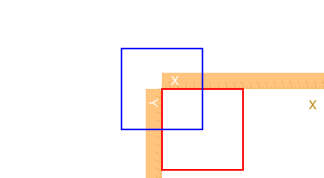
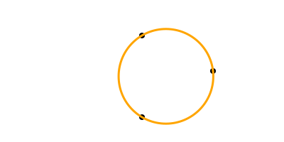
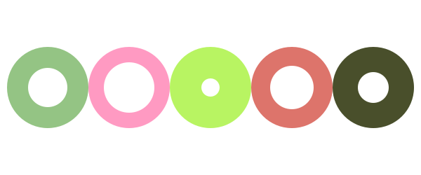
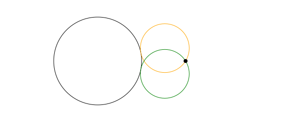
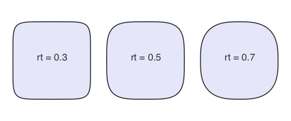

```@meta
DocTestSetup = quote
    using Luxor, Colors, Random
    end
```
# Simple graphics

In Luxor, there are different ways of working with graphical items. You can either draw them immediately (ie place them on the drawing, and they're then fixed). Or you can construct geometric objects as lists of points for further processing. Watch out for a `vertices=true` option, which returns coordinate data rather than draws a shape.

## Rectangles and boxes

The simple rectangle and box shapes can be made in different ways.

```@example
using Luxor # hide
Drawing(400, 220, "assets/figures/basicrects.png") # hide
background("white") # hide
origin() # hide
rulers()
sethue("red")
rect(O, 100, 100, :stroke)
sethue("blue")
box(O, 100, 100, :stroke)
finish() # hide
nothing # hide
```



`rect()` rectangles are positioned by a corner, but a box made with `box()` can either be defined by its center and dimensions, or by two opposite corners.


If you want the coordinates of the corners of a box, rather than draw one immediately, use:

```julia
box(centerpoint, width, height, vertices=true)
```

or

```julia
box(corner1,  corner2, vertices=true)
```    

`box` is also able to draw some of the other Luxor objects, such as BoundingBoxes and Table cells.

```@docs
rect
box
```

For regular polygons, triangles, pentagons, and so on, see the next section on Polygons.

## Circles and ellipses

There are various ways to make circles, including by center and radius, or passing through two points:

```@example
using Luxor # hide
Drawing(400, 200, "assets/figures/circles.png") # hide
background("white") # hide
origin() # hide
setline(2) # hide
p1 = O
p2 = Point(100, 0)
sethue("red")
circle(p1, 40, :fill)
sethue("green")
circle(p1, p2, :stroke)
sethue("black")
arrow(O, Point(0, -40))
map(p -> circle(p, 4, :fill), [p1, p2])
finish() # hide
nothing # hide
```


Or passing through three points. The `center3pts()` function returns the center position and radius of a circle passing through three points:

```@example
using Luxor, Random # hide
Drawing(400, 200, "assets/figures/center3.png") # hide
background("white") # hide
origin() # hide
setline(3) # hide
sethue("black")
p1 = Point(0, -50)
p2 = Point(100, 0)
p3 = Point(0, 65)
map(p -> circle(p, 4, :fill), [p1, p2, p3])
sethue("orange")
circle(center3pts(p1, p2, p3)..., :stroke)
finish() # hide
nothing # hide
```



```@docs
circle
center3pts
```

With `ellipse()` you can place ellipses and circles by defining the center point and the width and height.

```@example
using Luxor, Random # hide
Drawing(500, 300, "assets/figures/ellipses.png") # hide
background("white") # hide
fontsize(11) # hide
Random.seed!(1) # hide
origin() # hide
tiles = Tiler(500, 300, 5, 5)
width = 20
height = 25
for (pos, n) in tiles
    global width, height
    randomhue()
    ellipse(pos, width, height, :fill)
    sethue("black")
    label = string(round(width/height, digits=2))
    textcentered(label, pos.x, pos.y + 25)
    width += 2
end
finish() # hide
nothing # hide
```


`ellipse()` can also construct polygons that are approximations to ellipses. You supply two focal points and a length which is the sum of the distances of a point on the perimeter to the two focii.

```@example
using Luxor, Random # hide
Drawing(400, 220, "assets/figures/ellipses_1.png") # hide
origin() # hide
background("white") # hide

Random.seed!(42) # hide
sethue("black") # hide
setline(1) # hide
fontface("Menlo")

f1 = Point(-100, 0)
f2 = Point(100, 0)

circle.([f1, f2], 3, :fill)

epoly = ellipse(f1, f2, 250, vertices=true)
poly(epoly, :stroke,  close=true)

pt = epoly[rand(1:end)]

poly([f1, pt, f2], :stroke)

label("f1", :W, f1, offset=10)
label("f2", :E, f2, offset=10)

label(string(round(distance(f1, pt), digits=1)), :SE, midpoint(f1, pt))
label(string(round(distance(pt, f2), digits=1)), :SW, midpoint(pt, f2))

label("ellipse(f1, f2, 250)", :S, Point(0, 75))

finish() # hide
nothing # hide
```


The advantage of this method is that there's a `vertices=true` option, allowing further scope for polygon manipulation.

```@example
using Luxor # hide
Drawing(500, 450, "assets/figures/ellipses_2.png") # hide
origin() # hide
background("white") # hide
sethue("gray30") # hide
setline(1) # hide
f1 = Point(-100, 0)
f2 = Point(100, 0)
ellipsepoly = ellipse(f1, f2, 170, :none, vertices=true)
[ begin
    setgray(rescale(c, 150, 1, 0, 1))
    poly(offsetpoly(ellipsepoly, c), close=true, :fill);
    rotate(pi/20)
  end
     for c in 150:-10:1 ]
finish() # hide
nothing # hide
```


```@docs
ellipse
```

`circlepath()` constructs a circular path from Bézier curves, which allows you to use circles as paths.

```@example
using Luxor # hide
Drawing(600, 250, "assets/figures/circle-path.png") # hide
origin() # hide
background("white") # hide
sethue("black") # hide
setline(4)
tiles = Tiler(600, 250, 1, 5)
for (pos, n) in tiles
    randomhue()
    circlepath(pos, tiles.tilewidth/2, :path)
    newsubpath()
    circlepath(pos, rand(5:tiles.tilewidth/2 - 1), :fill, reversepath=true)
end
finish() # hide
nothing # hide
```



```@docs
circlepath
```

### Circles and tangents

Functions to make circles that are tangential to other circles include:

- `circletangent2circles()` makes circles of a particular radius tangential to two circles
- `circlepointtangent()` makes circles of a particular radius passing through a point and tangential to another circle

These functions can return 0, 1, or 2 points (since there are often two solutions to a specific geometric layout).

`circletangent2circles()` takes the required radius and two existing circles:

```@example
using Luxor # hide
Drawing(600, 250, "assets/figures/circle-tangents.png") # hide
origin() # hide
background("white") # hide
sethue("black") # hide
setline(1) # hide

circle1 = (Point(-100, 0), 90)
circle(circle1..., :stroke)
circle2 = (Point(100, 0), 90)
circle(circle2..., :stroke)

requiredradius = 25
ncandidates, p1, p2 = circletangent2circles(requiredradius, circle1..., circle2...)

if ncandidates==2
    sethue("orange")
    circle(p1, requiredradius, :fill)
    sethue("green")
    circle(p2, requiredradius, :fill)
    sethue("purple")
    circle(p1, requiredradius, :stroke)
    circle(p2, requiredradius, :stroke)
end

# the circles are 10 apart, so there should be just one circle
# that fits there

requiredradius = 10
ncandidates, p1, p2 = circletangent2circles(requiredradius, circle1..., circle2...)

if ncandidates==1
    sethue("blue")
    circle(p1, requiredradius, :fill)
    sethue("cyan")
    circle(p1, requiredradius, :stroke)
end

finish() # hide
nothing # hide
```


`circlepointtangent()` looks for circles of a specified radius that pass through a point and are tangential to a circle. There are usually two candidates.

```@example
using Luxor # hide
Drawing(600, 250, "assets/figures/circle-point-tangent.png") # hide
origin() # hide
background("white") # hide
sethue("black") # hide
setline(1) # hide

circle1 = (Point(-100, 0), 90)
circle(circle1..., :stroke)

requiredradius = 50
requiredpassthrough = O + (80, 0)
ncandidates, p1, p2 = circlepointtangent(requiredpassthrough, requiredradius, circle1...)

if ncandidates==2
    sethue("orange")
    circle(p1, requiredradius, :stroke)
    sethue("green")
    circle(p2, requiredradius, :stroke)
end

sethue("black")
circle(requiredpassthrough, 4, :fill)

finish() # hide
nothing # hide
```




```@docs
circletangent2circles
circlepointtangent
```

## More curved shapes: sectors, spirals, and squircles

A sector (technically an "annular sector") has an inner and outer radius, as well as start and end angles.

```@example
using Luxor # hide
Drawing(600, 200, "assets/figures/sector.png") # hide
background("white") # hide
origin() # hide
sethue("tomato")
sector(50, 90, pi/2, 0, :fill)
sethue("olive")
sector(Point(O.x + 200, O.y), 50, 90, 0, pi/2, :fill)
finish() # hide
nothing # hide
```


You can also supply a value for a corner radius. The same sector is drawn but with rounded corners.

```@example
using Luxor # hide
Drawing(600, 200, "assets/figures/sectorrounded.png") # hide
background("white") # hide
origin() # hide
sethue("tomato")
sector(50, 90, pi/2, 0, 15, :fill)
sethue("olive")
sector(Point(O.x + 200, O.y), 50, 90, 0, pi/2, 15, :fill)
finish() # hide
nothing # hide
```


```@docs
sector
```

A pie (or wedge) has start and end angles.

```@example
using Luxor # hide
Drawing(400, 300, "assets/figures/pie.png") # hide
background("white") # hide
origin() # hide
sethue("magenta") # hide
pie(0, 0, 100, pi/2, pi, :fill)
finish() # hide
nothing # hide
```


```@docs
pie
```

To construct spirals, use the `spiral()` function. These can be drawn directly, or used as polygons. The default is to draw Archimedean (non-logarithmic) spirals.

```@example
using Luxor # hide
Drawing(600, 300, "assets/figures/spiral.png") # hide
background("white") # hide
origin() # hide
sethue("black") # hide
setline(.5) # hide
fontface("Avenir-Heavy") # hide
fontsize(15) # hide

spiraldata = [
  (-2, "Lituus",      50),
  (-1, "Hyperbolic", 100),
  ( 1, "Archimedes",   1),
  ( 2, "Fermat",       5)]

grid = GridRect(O - (200, 0), 130, 50)

for aspiral in spiraldata
    @layer begin
        translate(nextgridpoint(grid))
        spiral(last(aspiral), first(aspiral), period=20pi, :stroke)
        label(aspiral[2], :S, offset=100)
    end
end

finish() # hide
nothing # hide
```


Use the `log=true` option to draw logarithmic (Bernoulli or Fibonacci) spirals.

```@example
using Luxor # hide
Drawing(600, 400, "assets/figures/spiral-log.png") # hide
background("white") # hide
origin() # hide
setline(.5) # hide
sethue("black") # hide
fontface("Avenir-Heavy") # hide
fontsize(15) # hide

spiraldata = [
    (10,  0.05),
    (4,   0.10),
    (0.5, 0.17)]

grid = GridRect(O - (200, 0), 175, 50)
for aspiral in spiraldata
    @layer begin
        translate(nextgridpoint(grid))
        spiral(first(aspiral), last(aspiral), log=true, period=10pi, :stroke)
        label(string(aspiral), :S, offset=100)
    end
end

finish() # hide
nothing # hide
```

Modify the `stepby` and `period` parameters to taste, or collect the vertices for further processing.


```@docs
spiral
```

A *squircle* is a cross between a square and a circle. You can adjust the squariness and circularity of it to taste by supplying a value for the root (keyword `rt`):

```@example
using Luxor # hide
Drawing(600, 250, "assets/figures/squircle.png") # hide
background("white") # hide
origin() # hide
fontsize(20) # hide
setline(2)
tiles = Tiler(600, 250, 1, 3)
for (pos, n) in tiles
    sethue("lavender")
    squircle(pos, 80, 80, rt=[0.3, 0.5, 0.7][n], :fillpreserve)
    sethue("grey20")
    strokepath()
    textcentered("rt = $([0.3, 0.5, 0.7][n])", pos)
end
finish() # hide
nothing # hide
```



```@docs
squircle
```

To draw a simple rounded rectangle, supply a corner radius:

```@example
using Luxor # hide
Drawing(600, 250, "assets/figures/round-rect-1.png") # hide
origin() # hide
background("white") # hide
sethue("black") # hide
setline(4)
box(O, 200, 150, 10, :stroke)
finish() # hide
nothing # hide
```


Or you could smooth the corners of a box, like so:

```@example
using Luxor # hide
Drawing(600, 250, "assets/figures/round-rect.png") # hide
origin() # hide
background("white") # hide
sethue("black") # hide
setline(4)
polysmooth(box(O, 200, 150, vertices=true), 10, :stroke)
finish() # hide
nothing # hide
```


## Paths and positions

A path is a sequence of lines and curves. You can add lines and curves to the current path, then use `closepath()` to join the last point to the first.

A path can have subpaths, created with` newsubpath()`, which can form holes.

There is a 'current position' which you can set with `move()`, and can use implicitly in functions like `line()`, `rline()`, `text()`, `arc()` and `curve()`.

```@docs
move
rmove
newpath
newsubpath
closepath
```

## Lines

Use `line()` and `rline()` to draw straight lines. `line(pt1, pt2, action)` draws a line between two points. `line(pt)` adds a line to the current path going from the current position to the point. `rline(pt)` adds a line relative to the current position.

```@docs
line
rline
```

You can use `rule()` to draw a line through a point, optionally at an angle to the current x-axis.

```@example
using Luxor # hide
Drawing(700, 200, "assets/figures/rule.png") # hide
background("white") # hide
sethue("black") # hide
setline(0.5) # hide
y = 10
for x in 10 .^ range(0, length=100, stop=3)
    global y
    circle(Point(x, y), 2, :fill)
    rule(Point(x, y), -pi/2, boundingbox=BoundingBox(centered=false))
    y += 2
end

finish() # hide
nothing # hide
```


Use the `boundingbox` keyword argument to crop the ruled lines with a BoundingBox.

```@example
using Luxor # hide
Drawing(700, 200, "assets/figures/rulebbox.png") # hide
origin()
background("white") # hide
sethue("black") # hide
setline(0.75) # hide
box(BoundingBox() * 0.9, :stroke)
for x in 10 .^ range(0, length=100, stop=3)
    rule(Point(x, 0), pi/2,  boundingbox=BoundingBox() * 0.9)
    rule(Point(-x, 0), pi/2, boundingbox=BoundingBox() * 0.9)
end
finish() # hide
```


```@docs
rule
```

## Arcs and curves

There are a few standard arc-drawing commands, such as `curve()`, `arc()`, `carc()`, and `arc2r()`. Because these are often used when building complex paths, they usually add arc sections to the current path. To construct a sequence of lines and arcs, use the `:path` action, followed by a final `:stroke` or similar.

`curve()` constructs Bézier curves from control points:

```@example
using Luxor # hide
Drawing(600, 275, "assets/figures/curve.png") # hide
origin() # hide
background("white") # hide

sethue("black") # hide

setline(.5)
pt1 = Point(0, -125)
pt2 = Point(200, 125)
pt3 = Point(200, -125)

label.(string.(["O", "control point 1", "control point 2", "control point 3"]),
    :e,
    [O, pt1, pt2, pt3])

sethue("red")
map(p -> circle(p, 4, :fill), [O, pt1, pt2, pt3])

line(O, pt1, :stroke)
line(pt2, pt3, :stroke)

sethue("black")
setline(3)

# start a path
move(O)
curve(pt1, pt2, pt3) #  add to current path
strokepath()

finish()  # hide
nothing # hide
```


`arc2r()` draws a circular arc centered at a point that passes through two other points:

```@example
using Luxor, Random # hide
Drawing(700, 200, "assets/figures/arc2r.png") # hide
origin() # hide
Random.seed!(42) # hide
background("white") # hide
tiles = Tiler(700, 200, 1, 6)
for (pos, n) in tiles
    c1, pt2, pt3 = ngon(pos, rand(10:50), 3, rand(0:pi/12:2pi), vertices=true)
    sethue("black")
    map(pt -> circle(pt, 4, :fill), [c1, pt3])
    sethue("red")
    circle(pt2, 4, :fill)
    randomhue()
    arc2r(c1, pt2, pt3, :stroke)
end
finish() # hide
nothing # hide
```


```@docs
arc
arc2r
carc
carc2r
curve
```
