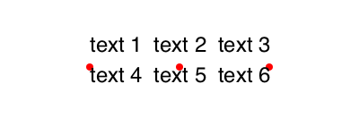
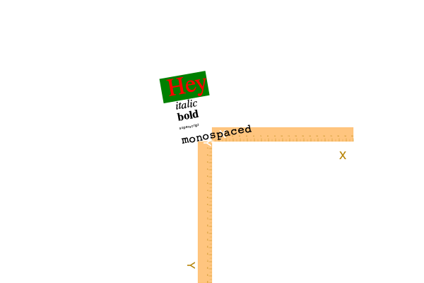
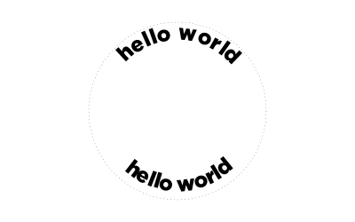

# Text and fonts

## A tale of two APIs

There are two ways to draw text in Luxor. You can use either the so-called 'toy' API or the 'pro' API.

Both have their advantages and disadvantages, and, given that trying to write anything definitive about font usage on three very different operating systems is an impossibility, trial and error will eventually lead to code patterns that work for you, if not other people.

#### The Toy API

Use:
- `text(string, [position])` to place text at a position, otherwise at `0/0`, and optionally specify the horizontal and vertical alignment
- `fontface(fontname)` to specify the fontname
- `fontsize(fontsize)` to specify the fontsize in points

```@example
using Luxor # hide
Drawing(600, 100, "assets/figures/toy-text-example.png") # hide
origin() # hide
background("white") # hide
sethue("black") # hide
fontsize(18)
fontface("Georgia-Bold")
text("Georgia is a serif typeface designed in 1993 by Matthew Carter.", halign=:center)
finish() # hide
nothing # hide
```


#### The Pro API

Use:

- `setfont(fontname, fontsize)` to specify the fontname and size in points
- `settext(text, [position])` to place the text at a position, and optionally specify horizontal and vertical alignment, rotation (in degrees counterclockwise), and the presence of any Pango-flavored markup.

```@example
using Luxor # hide
Drawing(600, 100, "assets/figures/pro-text-example.png") # hide
origin() # hide
background("white") # hide
sethue("black") # hide
setfont("Georgia Bold", 18)
settext("Georgia is a serif typeface designed in 1993 by Matthew Carter.", halign="center")
finish() # hide
nothing # hide
```


## Specifying the font ("Toy" API)

Use `fontface(fontname)` to choose a font, and `fontsize(n)` to set the font size in points.

```@docs
fontface
fontsize
```

## Specifying the font ("Pro" API)

To select a font in the Pro text API, use `setfont()` and supply both the font name and a size.

```@docs
setfont
```

## Placing text ("Toy" API)

Use `text()` to place text.

```@example
using Luxor # hide
Drawing(400, 150, "assets/figures/text-placement.png") # hide
origin() # hide
background("white") # hide
fontsize(80) # hide
sethue("black") # hide
pt1 = Point(-100, 0)
pt2 = Point(0, 0)
pt3 = Point(100, 0)
sethue("black")
text("1",  pt1, halign=:left,   valign = :bottom)
text("2",  pt2, halign=:center, valign = :bottom)
text("3",  pt3, halign=:right,  valign = :bottom)
text("4",  pt1, halign=:left,   valign = :top)
text("5 ", pt2, halign=:center, valign = :top)
text("6",  pt3, halign=:right,  valign = :top)
sethue("red")
map(p -> circle(p, 4, :fill), [pt1, pt2, pt3])
finish() # hide
nothing # hide
```



```@docs
text
```

## Placing text ("Pro" API)

Use `settext()` to place text. You can include some pseudo-HTML markup.

```@example
using Luxor # hide
Drawing(400, 150, "assets/figures/pro-text-placement.png") # hide
origin() # hide
background("white") # hide
axes()
sethue("black")
settext("<span font='26' background ='green' foreground='red'> Hey</span>
    <i>italic</i> <b>bold</b> <sup>superscript</sup>
    <tt>monospaced</tt>",
    halign="center",
    markup=true,
    angle=10)
finish() # hide
nothing # hide
```



```@docs
settext
```

## Notes on fonts

On macOS, the fontname required by the Toy API's `fontface()` should be the PostScript name of a currently activated font. You can find this out using, for example, the FontBook application.

On macOS, a list of currently activated fonts can be found (after a while) with the shell command:

    system_profiler SPFontsDataType

Fonts currently activated by a Font Manager can be found and used by the Toy API but not by the Pro API (at least on my macOS computer currently).

On macOS, you can obtain a list of fonts that `fontconfig` considers are installed and available for use (via the Pro Text API with `setfont()`) using the shell command:

    fc-list | cut -f 2 -d ":"

although typically this lists only those fonts in `/System/Library/Fonts` and `/Library/Fonts`, and not `~/Library/Fonts`.

(There is a Julia interface to `fontconfig` at [Fontconfig.jl](https://github.com/JuliaGraphics/Fontconfig.jl).)

In the Pro API, the default font is Times Roman (on macOS). In the Toy API, the default font is Helvetica (on macOS).

Cairo (and hence Luxor) doesn't support emoji currently. 😢

## Text to paths

`textpath()` converts the text into graphic paths suitable for further manipulation.

```@docs
textpath
```

## Font dimensions ("toy" API)

The `textextents(str)` function gets an array of dimensions of the string `str`, given the current font.


The green dot is the text placement point and reference point for the font, the yellow circle shows the text block's x and y bearings, and the blue dot shows the advance point where the next character should be placed.

```@docs
textextents
```

## Text on a curve

Use `textcurve(str)` to draw a string `str` on a circular arc or spiral.


```julia
using Luxor
Drawing(1800, 1800, "/tmp/text-spiral.png")
origin()
background("ivory")
fontsize(18)
fontface("LucidaSansUnicode")
sethue("royalblue4")
textstring = join(names(Base), " ")
textcurve("this spiral contains every word in julia names(Base): " * textstring,
    -pi/2,
    800, 0, 0,
    spiral_in_out_shift = -18.0,
    letter_spacing = 0,
    spiral_ring_step = 0)
fontsize(35)
fontface("Agenda-Black")
textcentered("julia names(Base)", 0, 0)
finish()
preview()
```

For shorter strings, `textcurvecentered()` tries to place the text on a circular arc by its center point.

```@example
using Luxor # hide
Drawing(400, 250, "assets/figures/text-centered.png") # hide
origin() # hide
background("white") # hide
background("white") # hide
fontface("Arial-Black")
fontsize(24) # hide
sethue("black") # hide
setdash("dot") # hide
setline(0.25) # hide
circle(O, 100, :stroke)
textcurvecentered("hello world", -pi/2, 100, O;
    clockwise = true,
    letter_spacing = 0,
    baselineshift = -20
    )
textcurvecentered("hello world", pi/2, 100, O;
    clockwise = false,
    letter_spacing = 0,
    baselineshift = 10
    )
finish() # hide
nothing # hide
```



```@docs
textcurve
textcurvecentered
```

## Text clipping

You can use newly-created text paths as a clipping region - here the text paths are filled with names of randomly chosen Julia functions:


```julia
using Luxor

currentwidth = 1250 # pts
currentheight = 800 # pts
Drawing(currentwidth, currentheight, "/tmp/text-path-clipping.png")

origin()
background("darkslategray3")

fontsize(600)                             # big fontsize to use for clipping
fontface("Agenda-Black")
str = "julia"                             # string to be clipped
w, h = textextents(str)[3:4]              # get width and height

translate(-(currentwidth/2) + 50, -(currentheight/2) + h)

textpath(str)                             # make text into a path
setline(3)
setcolor("black")
fillpreserve()                            # fill but keep
clip()                                    # and use for clipping region

fontface("Monaco")
fontsize(10)
namelist = map(x->string(x), names(Base)) # get list of function names in Base.

x = -20
y = -h
while y < currentheight
    sethue(rand(7:10)/10, rand(7:10)/10, rand(7:10)/10)
    s = namelist[rand(1:end)]
    text(s, x, y)
    se = textextents(s)
    x += se[5]                            # move to the right
    if x > w
       x = -20                            # next row
       y += 10
    end
end

finish()
preview()
```
