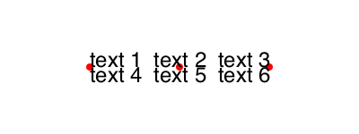
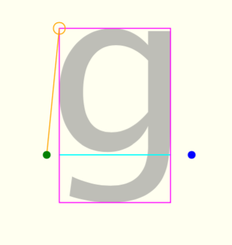
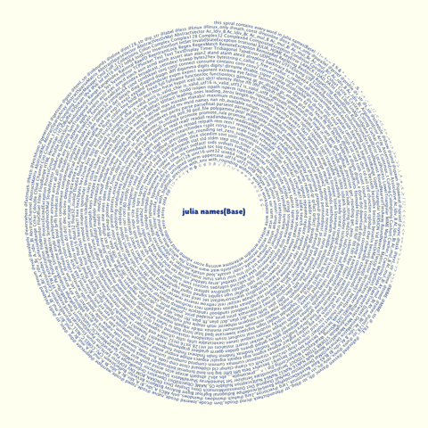

# Text and fonts

## Placing text

Use `text()` to place text.

```@example
using Luxor # hide
Drawing(400, 150, "../figures/text-placement.png") # hide
origin() # hide
background("white") # hide
fontsize(24) # hide
sethue("black") # hide
pt1 = Point(-100, 0)
pt2 = Point(0, 0)
pt3 = Point(100, 0)
sethue("red")
map(p -> circle(p, 4, :fill), [pt1, pt2, pt3])
sethue("black")
text("text 1",  pt1, halign=:left,   valign = :bottom)
text("text 2",  pt2, halign=:center, valign = :bottom)
text("text 3",  pt3, halign=:right,  valign = :bottom)
text("text 4",  pt1, halign=:left,   valign = :top)
text("text 5 ", pt2, halign=:center, valign = :top)
text("text 6",  pt3, halign=:right,  valign = :top)
finish() # hide
```



```@docs
text
```

`textpath()` converts the text into a graphic path suitable for further styling.

```@docs
textpath
```

Luxor uses what's called the "toy" text interface in Cairo.

## Fonts

Use `fontface(fontname)` to choose a font, and `fontsize(n)` to set the font size in points.

The `textextents(str)` function gets an array of dimensions of the string `str`, given the current font.



The green dot is the text placement point and reference point for the font, the yellow circle shows the text block's x and y bearings, and the blue dot shows the advance point where the next character should be placed.

```@docs
fontface
fontsize
textextents
```

## Text on a curve

Use `textcurve(str)` to draw a string `str` on a circular arc or spiral.



```julia
using Luxor
Drawing(1800, 1800, "/tmp/text-spiral.png")
origin()
background("ivory")
fontsize(18)
fontface("LucidaSansUnicode")
sethue("royalblue4")
textstring = join(names(Base), " ")
textcurve("this spiral contains every word in julia names(Base): " * textstring, -pi/2,
  800, 0, 0,
  spiral_in_out_shift = -18.0,
  letter_spacing = 0,
  spiral_ring_step = 0)

fontsize(35)
fontface("Agenda-Black")
textcentred("julia names(Base)", 0, 0)
finish()
preview()
```

```@docs
textcurve
```

## Text clipping

You can use newly-created text paths as a clipping region - here the text paths are filled with names of randomly chosen Julia functions:


```julia
using Luxor

currentwidth = 1250 # pts
currentheight = 800 # pts
Drawing(currentwidth, currentheight, "/tmp/text-path-clipping.png")

origin()
background("darkslategray3")

fontsize(600)                             # big fontsize to use for clipping
fontface("Agenda-Black")
str = "julia"                             # string to be clipped
w, h = textextents(str)[3:4]              # get width and height

translate(-(currentwidth/2) + 50, -(currentheight/2) + h)

textpath(str)                             # make text into a path
setline(3)
setcolor("black")
fillpreserve()                            # fill but keep
clip()                                    # and use for clipping region

fontface("Monaco")
fontsize(10)
namelist = map(x->string(x), names(Base)) # get list of function names in Base.

x = -20
y = -h
while y < currentheight
    sethue(rand(7:10)/10, rand(7:10)/10, rand(7:10)/10)
    s = namelist[rand(1:end)]
    text(s, x, y)
    se = textextents(s)
    x += se[5]                            # move to the right
    if x > w
       x = -20                            # next row
       y += 10
    end
end

finish()
preview()
```
