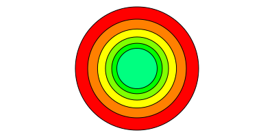
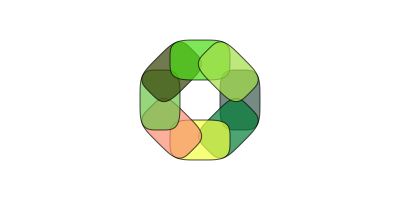

# Transforms and matrices

For basic transformations of the drawing space, use `scale(sx, sy)`, `rotate(a)`, and `translate(tx, ty)`. You can use `origin()` to return to the document's original state, with the axes in the center.

`translate()` shifts the current 0/0 point by the specified amounts in x and y. It's relative and cumulative, rather than absolute:

```@example
using Luxor, Colors # hide
Drawing(400, 200, "figures/translate.png") # hide
background("white") # hide
srand(1) # hide
setline(1) # hide
origin()
for i in range(0, 30, 6)
    sethue(HSV(i, 1, 1)) # from Colors
    setopacity(0.5)
    circle(0, 0, 20, :fillpreserve)
    setcolor("black")
    stroke()
    translate(25, 0)
end
finish() # hide
nothing # hide
```


`scale()` scales the current workspace by the specified amounts in x and y. Again, it's relative to the current scale, not to the document's original.

```@example
using Luxor, Colors # hide
Drawing(400, 200, "figures/scale.png") # hide
background("white") # hide
srand(1) # hide
setline(1) # hide
origin()
for i in range(0, 30, 6)
    sethue(HSV(i, 1, 1)) # from Colors
    circle(0, 0, 90, :fillpreserve)
    setcolor("black")
    stroke()
    scale(0.8, 0.8)
end
finish() # hide
nothing # hide
```



`rotate()` rotates the current workspace by the specifed amount about the current 0/0 point. It's relative to the previous rotation, not to the document's original.

```@example
using Luxor # hide
Drawing(400, 200, "figures/rotate.png") # hide
background("white") # hide
srand(1) # hide
setline(1) # hide
origin()
setopacity(0.7) # hide
for i in 1:8
    randomhue()
    squircle(Point(40, 0), 20, 30, :fillpreserve)
    sethue("black")
    stroke()
    rotate(pi/4)
end
finish() # hide
nothing # hide
```



```@docs
scale
rotate
translate
```

The current matrix is a six element array, perhaps like this:

```
[1, 0, 0, 1, 0, 0]
```

`transform(a)` transforms the current workspace by 'multiplying' the current matrix with matrix `a`. For example, `transform([1, 0, xskew, 1, 50, 0])` skews the current matrix by `xskew` radians and moves it 50 in x and 0 in y.

```@example
using Luxor # hide
fname = "figures/transform.png" # hide
pagewidth, pageheight = 450, 100 # hide
Drawing(pagewidth, pageheight, fname) # hide
origin() # hide
background("white") # hide
translate(-200, 0) # hide

function boxtext(p, t)
    sethue("grey30")
    box(p, 30, 50, :fill)
    sethue("white")
    textcentred(t, p)
end

for i in 0:5
    xskew = tand(i * 5.0)
    transform([1, 0, xskew, 1, 50, 0])
    boxtext(O, string(round(rad2deg(xskew), 1), "°"))
end

finish() # hide
nothing # hide
```


`getmatrix()` gets the current matrix, `setmatrix(a)` sets the matrix to array `a`.

```@docs
getmatrix
setmatrix
transform
crossproduct
blendmatrix
rotationmatrix
scalingmatrix
translationmatrix
cairotojuliamatrix
juliatocairomatrix
getscale
gettranslation
getrotation
```
