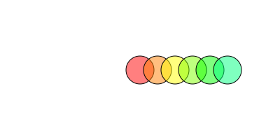

# Transforms and matrices

For basic transformations of the drawing space, use `scale(sx, sy)`, `rotate(a)`, and `translate(tx, ty)`.

`translate()` shifts the current 0/0 point by the specified amounts in x and y. It's relative and cumulative, rather than absolute:

```@example
using Luxor, Colors # hide
Drawing(400, 200, "../figures/translate.png") # hide
background("white") # hide
srand(1) # hide
setline(0.1) # hide
origin()
for i in range(0, 30, 6)
  sethue(Colors.HSV(i, 1, 1))
  setopacity(0.5)
  circle(0, 0, 20, :fillpreserve)
  setcolor("black")
  stroke()
  translate(25, 0)
end
finish() # hide
```


`scale()` scales the current workspace by the specified amounts in x and y. Again, it's relative to the current scale, not to the document's original.

```@example
using Luxor, Colors # hide
Drawing(400, 200, "../figures/scale.png") # hide
background("white") # hide
srand(1) # hide
setline(0.1) # hide
origin()
for i in range(0, 30, 6)
  sethue(Colors.HSV(i, 1, 1))
  circle(0, 0, 90, :fillpreserve)
  setcolor("black")
  stroke()
  scale(0.8, 0.8)
end
finish() # hide
```


`rotate()` rotates the current workspace by the specifed amount about the current 0/0 point. It's relative to the previous rotation, not to the document's original.

```@example
using Luxor, Colors # hide
Drawing(400, 200, "../figures/rotate.png") # hide
background("white") # hide
srand(1) # hide
setline(1) # hide
origin()
setopacity(0.7) # hide
for i in 1:8
  randomhue()
  squircle(Point(40, 0), 20, 30, :fillpreserve)
  sethue("black")
  stroke()
  rotate(pi/4)
end
finish() # hide
```


```@docs
scale
rotate
translate
```

The current matrix is a six element array, perhaps like this:

```
[1, 0, 0, 1, 0, 0]
```

`getmatrix()` gets the current matrix, `setmatrix(a)` sets the matrix to array `a`, and  `transform(a)` transforms the current matrix by 'multiplying' it with matrix `a`.

```@docs
getmatrix
setmatrix
transform
```
