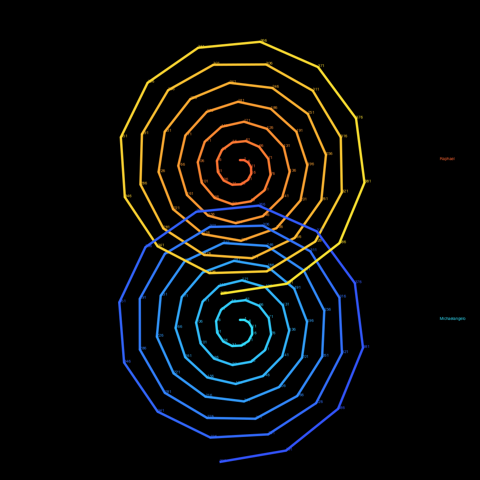

```@meta
DocTestSetup = quote
    using Luxor, Colors
    end
```
# Turtle graphics

Some simple "turtle graphics" functions are included. Functions to control the turtle begin with a capital letter: Forward, Turn, Circle, Orientation, Rectangle, Pendown, Penup, Pencolor, Penwidth, and Reposition, and so on, and angles are specified in degrees.

```@example
using Luxor, Colors
Drawing(600, 400, "assets/figures/turtles.png")  
origin()  
background("midnightblue")  

🐢 = Turtle() # you can type the turtle emoji with \:turtle:
Pencolor(🐢, "cyan")
Penwidth(🐢, 1.5)
global n = 5
for i in 1:400
    Forward(🐢, n)
    Turn(🐢, 89.5)
    HueShift(🐢)
    n += 0.75
end
fontsize(20)
Message(🐢, "finished")
finish()  
nothing # hide
```



The turtle commands expect a reference to a turtle as the first argument (it doesn't have to be a turtle emoji!), and you can have any number of turtles active at a time.

```@example
using Luxor, Colors # hide
Drawing(800, 800, "assets/figures/manyturtles.png") # hide
origin() # hide
background("white") # hide
quantity = 9
turtles = [Turtle(O, true, 2pi * rand(), (rand(), rand(), 0.5)...) for i in 1:quantity]
Reposition.(turtles, first.(collect(Tiler(800, 800, 3, 3))))
global n = 10
Penwidth.(turtles, 0.5)
for i in 1:300
    Forward.(turtles, n)
    HueShift.(turtles)
    Turn.(turtles, [60.1, 89.5, 110, 119.9, 120.1, 135.1, 145.1, 176, 190])
    n += 0.5
end
finish() # hide  
nothing # hide
```


```@docs
Turtle
Forward
Turn
Circle
HueShift
Message
Orientation
Randomize_saturation
Rectangle
Pen_opacity_random
Pendown
Penup
Pencolor
Penwidth
Point
Pop
Push
Reposition
```
