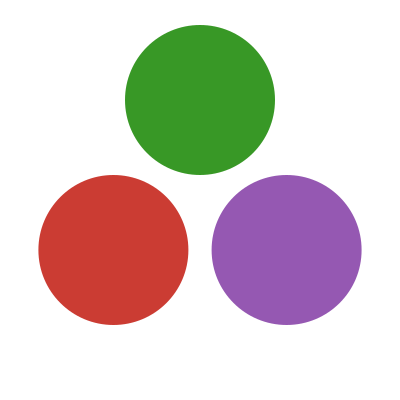

# Make simple animations

Luxor.jl can help you build simple animations, by assembling
a series of PNG images into an animated GIF.

!!! note

    To make richer or more complex animations, you should use [Javis.jl](https://github.com/Wikunia/Javis.jl).

## A Julia spinner

The first thing to do is to create a `Movie` object. This acts as a useful object that we can pass from function to function.

```julia
using Luxor
mymovie = Movie(400, 400, "mymovie")
```

The resulting animation will be 400 × 400 pixels.

To make the graphics, define a function called `frame()` (it doesn't have to be called that, but it's a good name) which accepts two arguments, a Scene object, and a framenumber (integer).

A movie consists of one or more scenes. A scene is an object which determines how many drawings should be made into a sequence and what function should be used to make them. The framenumber lets you keep track of where you are in a scene.

Here's a simple `frame` function which creates a drawing.

```julia
function frame(scene::Scene, framenumber::Int64)
    background("white")
    norm_framenumber = rescale(framenumber,
        scene.framerange.start,
        scene.framerange.stop,
        0, 1)
    rotate(norm_framenumber * 2π)
    juliacircles(100)
end
```

This function is responsible for drawing all the graphics
for a single frame. The incoming frame number is converted
(normalized) to lie between 0 and 1 - ie. between the first
frame and the last frame of the scene. It's multiplied by 2π
and used as input to `rotate`.

So as the framenumber goes from 1 to `n`, each drawing will
be rotated by an increasing angle from 0 to 2π. For example,
for a scene with 60 frames, framenumber 30 will set a
rotation value of about `2π * 0.5`.

The Scene object has details about the number of frames for this scene, the number of times the `frame` function is called.

To actually build the animation, the [`animate`](@ref) function takes an array of one or more scenes and builds a GIF.

```julia
animate(mymovie,
        [
            Scene(mymovie, frame, 1:60)
        ],
    creategif=true,
    pathname="juliaspinner.gif")
```



Obviously, if you increase the range from 1:60 to, say,
1:300, you'll generate 300 drawings rather than 60, and the
rotation will take longer and will be much
smoother. Unless, of course, you change the framerate to be
something other than the default `30`.

## Combining scenes

In the next example, we'll construct an animation that uses different scenes.

Consider this animation, showing the sun's position for each hour of a 24 hour day. (It's only a model...)


Again, start by creating a movie, a useful handle that we can pass from function to function. We'll specify 24 frames for the entire animation.

```
sun24demo = Movie(400, 400, "sun24", 0:23)
```

We'll define a simple `backgroundfunction` function that draws a
background that will be used for all frames (since animated
GIFs like constant backgrounds):

```
function backgroundfunction(scene::Scene, framenumber)
    background("black")
end
```

A `nightskyfunction` draws the night sky, covering the entire drawing:

```
function nightskyfunction(scene::Scene, framenumber)
    sethue("midnightblue")
    box(O, 400, 400, :fill)
end
```

A `dayskyfunction` draws the daytime sky:

```
function dayskyfunction(scene::Scene, framenumber)
    sethue("skyblue")
    box(O, 400, 400, :fill)
end
```

The `sunfunction` draws a sun at 24 positions during the day. Since the framenumber will be a number between 0 and 23, this can be easily converted to lie between 0 and 2π.

```
function sunfunction(scene::Scene, framenumber)
    t = rescale(framenumber, 0, 23, 2pi, 0)
    gsave()
        sethue("yellow")
        circle(polar(150, t), 20, :fill)
    grestore()
end
```

And finally, tere's a `groundfunction` that draws the ground, the lower half of the drawing:

```
function groundfunction(scene::Scene, framenumber)
    gsave()
    sethue("brown")
    box(Point(O.x, O.y + 100), 400, 200, :fill)
    grestore()
    sethue("white")
end
```

To combine these together, we'll define a group of Scenes
that make up the movie. The scenes specify which functions
are to be used, and for which frames:

```
backdrop  = Scene(sun24demo, backgroundfunction, 0:23)   # every frame
nightsky  = Scene(sun24demo, nightskyfunction, 0:6)      # midnight to 06:00
nightsky1 = Scene(sun24demo, nightskyfunction, 17:23)    # 17:00 to 23:00
daysky    = Scene(sun24demo, dayskyfunction, 5:19)       # 05:00 to 19:00
sun       = Scene(sun24demo, sunfunction, 6:18)          # 06:00 to 18:00
ground    = Scene(sun24demo, groundfunction, 0:23)       # every frame
```

Finally, the `animate` function scans all the scenes in the
scenelist for the  movie, and calls the specified functions for each
frame to build the animation:

```
animate(sun24demo, [
   backdrop, nightsky, nightsky1, daysky, sun, ground
   ],
   framerate=5,
   creategif=true)
```


Notice that for some frames, such as frame 0, 1, or 23, three of the functions are called: for others, such as 7 and 8, four or more functions are called.

## An alternative

As this is a very simple example, there is of course an easier wayto make this particular animation.

We can use the incoming framenumber, rescaled, as the master
parameter that determines the position and appearance of all
the graphics.

```
function frame(scene, framenumber)
    background("black")
    n   = rescale(framenumber, scene.framerange.start, scene.framerange.stop, 0, 1)
    n2π = rescale(n, 0, 1, 0, 2π)
    sethue(n, 0.5, 0.5)
    box(BoundingBox(), :fill)
    if 0.25 < n < 0.75
        sethue("yellow")
        circle(polar(150, n2π + π/2), 20, :fill)
    end
    if n < 0.25 || n > 0.75
        sethue("white")
        circle(polar(150, n2π + π/2), 20, :fill)
    end
end
```
